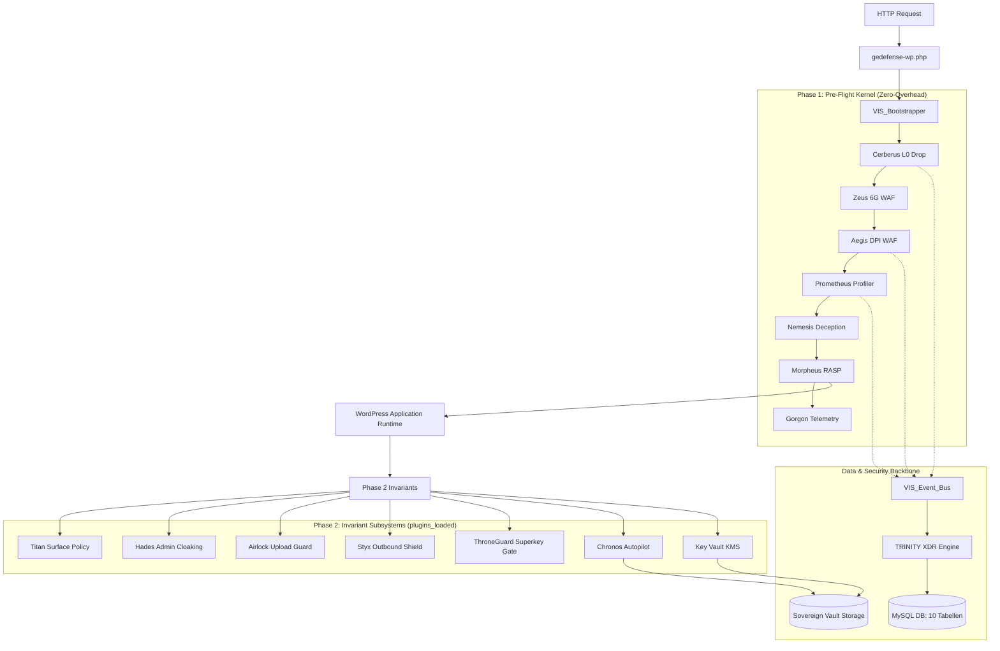
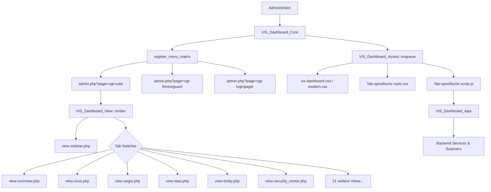
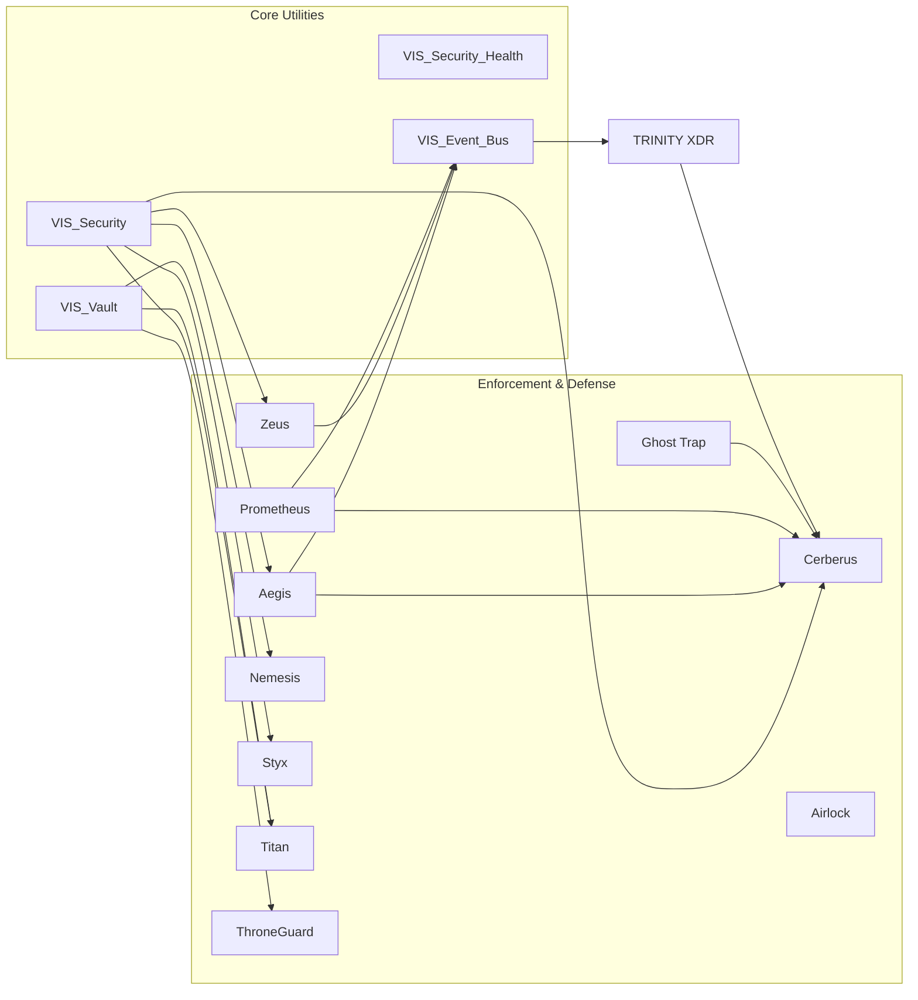
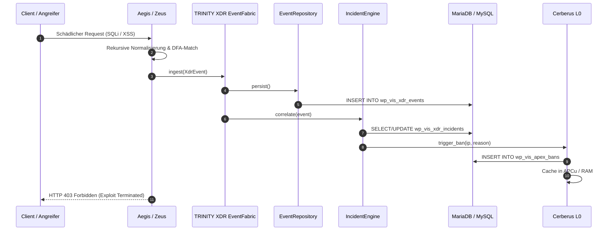

# Architecture

## Architekturindex
- [Systemübersicht](#systemübersicht)
- [1. Globaler Architekturbaum](#1-globaler-architekturbaum)
- [2. Dateien einer Architektur zuordnen](#2-dateien-einer-architektur-zuordnen)
- [3. Modul-Dokumentation](#3-modul-dokumentation)
  - [Modul: Cerberus (L0 Perimeter Guard)](#modul-cerberus-l0-perimeter-guard)
  - [Modul: Zeus (6G Pre-Boot WAF)](#modul-zeus-6g-pre-boot-waf)
  - [Modul: Aegis (Deep Packet Inspection WAF)](#modul-aegis-deep-packet-inspection-waf)
  - [Modul: Prometheus (Behavioral Profiler & Heuristics)](#modul-prometheus-behavioral-profiler--heuristics)
  - [Modul: Nemesis (Asymmetric Cyber Deception Grid)](#modul-nemesis-asymmetric-cyber-deception-grid)
  - [Modul: Morpheus (RASP Hypervisor & Execution Sandbox)](#modul-morpheus-rasp-hypervisor--execution-sandbox)
  - [Modul: Gorgon (Encrypted Mesh Sync & Nexus Uplink)](#modul-gorgon-encrypted-mesh-sync--nexus-uplink)
  - [Modul: Hades (Admin Cloaking & 404 Mimicry)](#modul-hades-admin-cloaking--404-mimicry)
  - [Modul: Airlock (Ingress Polyglot & Upload Sanitizer)](#modul-airlock-ingress-polyglot--upload-sanitizer)
  - [Modul: Ghost Trap (Dynamic Decoy Honeypots)](#modul-ghost-trap-dynamic-decoy-honeypots)
  - [Modul: Styx (Zero-Trust Egress Whitelist Guard)](#modul-styx-zero-trust-egress-whitelist-guard)
  - [Modul: Titan (Surface Policy Compiler & Browser Confinement)](#modul-titan-surface-policy-compiler--browser-confinement)
  - [Modul: ThroneGuard (Master-Role Privilege Separation)](#modul-throneguard-master-role-privilege-separation)
  - [Modul: LoginPager (Zero-Trust Login Surface)](#modul-loginpager-zero-trust-login-surface)
  - [Modul: Chronos (Autonomous Background Integrity Daemon)](#modul-chronos-autonomous-background-integrity-daemon)
  - [Modul: Secure Downloads (Attested Storage & Verifiable Links)](#modul-secure-downloads-attested-storage--verifiable-links)
  - [Modul: Key Vault (Authenticated AES-256-GCM KMS)](#modul-key-vault-authenticated-aes-256-gcm-kms)
  - [Modul: Oracle (12-Vector Security Audit Engine)](#modul-oracle-12-vector-security-audit-engine)
  - [Modul: Filesystem Guard (Permission & CHMOD Invariant Auditor)](#modul-filesystem-guard-permission--chmod-invariant-auditor)
  - [Modul: Kernel Sentinel (Runtime Invariant Monitor)](#modul-kernel-sentinel-runtime-invariant-monitor)
  - [Subsystem: TRINITY XDR Fabric](#subsystem-trinity-xdr-fabric)
  - [Subsystem: Scanner & Malware Engine](#subsystem-scanner--malware-engine)
  - [Dynamisches Add-On: Vision Legal Pro (VLP)](#dynamisches-add-on-vision-legal-pro-vlp)
  - [Dynamisches Add-On: VisionGaia SEO Architect](#dynamisches-add-on-visiongaia-seo-architect)
  - [Dynamisches Add-On: VisionGaia Builder](#dynamisches-add-on-visiongaia-builder)
- [4. Dashboard detailliert dokumentieren](#4-dashboard-detailliert-dokumentieren)
  - [Dashboard → Overview (Kontrollzentrum)](#dashboard--overview-kontrollzentrum)
  - [Dashboard → Thread (Bedrohungsmatrix)](#dashboard--thread-bedrohungsmatrix)
  - [Dashboard → Oracle (Orakel Scanner)](#dashboard--oracle-orakel-scanner)
  - [Dashboard → Integrity (Integritäts-Monitor)](#dashboard--integrity-integritäts-monitor)
  - [Dashboard → Security Center (Sicherheitszentrale)](#dashboard--security-center-sicherheitszentrale)
  - [Dashboard → Trinity (TRINITY XDR)](#dashboard--trinity-trinity-xdr)
  - [Dashboard → Zeus (Zeus Defender)](#dashboard--zeus-zeus-defender)
  - [Dashboard → Aegis (AEGIS Firewall)](#dashboard--aegis-aegis-firewall)
  - [Dashboard → Prometheus (Prometheus Engine)](#dashboard--prometheus-prometheus-engine)
  - [Dashboard → Cerberus (Cerberus IP-Sperre)](#dashboard--cerberus-cerberus-ip-sperre)
  - [Dashboard → Airlock (Airlock Schleuse)](#dashboard--airlock-airlock-schleuse)
  - [Dashboard → Nemesis (Nemesis Täuschung)](#dashboard--nemesis-nemesis-täuschung)
  - [Dashboard → Ghost Trap (Ghost Honigtopf)](#dashboard--ghost-trap-ghost-honigtopf)
  - [Dashboard → Hades (Hades Stealth)](#dashboard--hades-hades-stealth)
  - [Dashboard → Morpheus (Morpheus Sandbox)](#dashboard--morpheus-morpheus-sandbox)
  - [Dashboard → Titan (Titan Härtung)](#dashboard--titan-titan-härtung)
  - [Dashboard → Kernel (Kernel Uplink)](#dashboard--kernel-kernel-uplink)
  - [Dashboard → Styx (Styx Controller)](#dashboard--styx-styx-controller)
  - [Dashboard → Chronos (Chronos Autopilot)](#dashboard--chronos-chronos-autopilot)
  - [Dashboard → VLP (Datenschutz & Shadow-Net)](#dashboard--vlp-datenschutz--shadow-net)
  - [Dashboard → Filesystem (Datensicherheit)](#dashboard--filesystem-datensicherheit)
  - [Dashboard → Vault (Schlüssel-Tresor)](#dashboard--vault-schlüssel-tresor)
  - [Dashboard → ThroneGuard (ThroneGuard)](#dashboard--throneguard-throneguard)
  - [Dashboard → LoginPager (LoginPager)](#dashboard--loginpager-loginpager)
  - [Dashboard → Downloads (Sichere Downloads)](#dashboard--downloads-sichere-downloads)
  - [Dashboard → Modules (Add-On Verwaltung)](#dashboard--modules-add-on-verwaltung)
  - [Dashboard → Setup Wizard (Einrichtungsassistent)](#dashboard--setup-wizard-einrichtungsassistent)
  - [Dashboard → XDR (Lagebild & Incident Deep Dive)](#dashboard--xdr-lagebild--incident-deep-dive)
  - [Dashboard → Gorgon (Neural Sync Matrix)](#dashboard--gorgon-neural-sync-matrix)
- [5. CSS / UI Architektur](#5-css--ui-architektur)
- [6. API Architektur](#6-api-architektur)
- [7. Datenflüsse](#7-datenflüsse)
- [8. Shared / Core Dateien](#8-shared--core-dateien)
- [9. Architektur-Relationen (Mermaid-Diagramme)](#9-architektur-relationen-mermaid-diagramme)
- [10. Dateireferenzen](#10-dateireferenzen)
- [11. Architektur-Auffälligkeiten](#11-architektur-auffälligkeiten)

---

# Systemübersicht

**GeDefense WP - Open Core** (`VisionGaia\GeDefense`) ist ein kompromissloses, autonomes Web-Sicherheits- und Integritätsbetriebssystem für WordPress, implementiert als vollwertiges Standard-WordPress-Plugin (`wp-content/plugins/gedefense-wp-core/`).

Das System folgt einer strikten **Multi-Phase Ignition Pipeline**:
1. **Phase 1: Perimeter Lockdown (Pre-Flight Kernel)**
   - Startet synchron beim Laden der Haupt-Plugin-Datei `gedefense-wp.php` während des WordPress-Plugin-Ladezyklus.
   - Initialisiert die XDR-Event-Fabric, Mount des Dateidownload-Managers und I18n-Matrix.
   - **Cerberus (Priority 0)**: O(1) Memory-Lookup für gebannte IPs via APCu/Object-Cache. Bei Match: sofortiger HTTP 403 Abbruch in < 0.1ms.
   - **AEGIS (Priority 1)**: Deep Packet Inspection WAF zur Normalisierung und Abwehr von SQLi, XSS, RCE, LFI und deserialisierten Angriffen.
   - **Striking Queue (Priority 2-N)**: Zeus (6G Pre-Boot WAF), Prometheus (Behavioral Profiling), Nemesis (Asymmetric Deception), Morpheus (RASP Hypervisor) und Gorgon (Telemetry Mesh).
2. **Phase 2: Invariant & Hardening Subsystems**
   - Klinkt sich über den Standard-Hook `plugins_loaded` (Priority 10) ein (bzw. führt Phase 2 unmittelbar aus, falls `plugins_loaded` bereits gefeuert hat).
   - Startet Compatibility Manager, Titan (Browser- & Oberflächen-Confinement), Hades (Admin-Tarnung), Airlock (Upload-Dateischleuse), Ghost Trap (Honigtöpfe), Chronos (Hintergrund-Daemon), Styx (Ausgehende Zero-Trust-Firewall), ThroneGuard (Admin-Rechte-Isolation), LoginPager, Key Vault, Integration Bus und die dynamische Add-On-Registry.
   - Initialisiert im Admin-Kontext (`is_admin()`) das **Dashboard-Subsystem** mit Glassmorphic UI, AJAX-Controllern und Export-Pipelines.
   - Verwendet Standard-WordPress-Lifecycle-Hooks: `register_activation_hook()` für die automatische Tabellenanlage (`VIS_Schema::enforce()`) und `register_deactivation_hook()` zur Bereinigung von Cron-Schedules und Flush der Rewrite-Rules.

**Kern-Design-Invariante**:
- **Zero External Dependencies**: Keine Composer-Pakete, keine CDNs (Google Fonts, unpkg, jsdelivr).
- **Fail-Closed**: Kritische Kernsubsysteme brechen bei Manipulation mit HTTP 503 ab, anstatt in einen ungesicherten Bypass zu verfallen.
- **VGT DIAMANT SUPREME Doktrin**: Strikte Trennung von Markup, Stylesheets und JavaScript. Zero Inline-Styles, Zero Inline-Scripts, Zero Inline-Event-Handler, Zero DOM-String-Sinks (`innerHTML`).

---

# 1. GLOBALER ARCHITEKTURBAUM

```text
GEDEFENSE WP - OPEN CORE (STANDARD WORDPRESS PLUGIN)
│
├── Entrypoints & Bootstrapping
│   ├── gedefense-wp.php                      (Standard Plugin Entrypoint, Lifecycle-Hooks, Konstanten)
│   ├── class-vis-bootstrapper.php            (Master Kernel Orchestrator: Phase 1 & 2 Ignition)
│   ├── class-vis-schema.php                  (DB-Schema Engine: 10 Tabellen, dbDelta, Vault Enforce)
│   └── class-vis-vault.php                   (Hardware/Software KMS: Libsodium secretbox & OpenSSL AES-256-GCM)
│
├── Core Infrastructure (includes/core/)
│   ├── class-namespace-compatibility.php    (Zentrales ABI & Legacy Symbol Aliasing)
│   ├── class-vis-security.php                (Zero-Trust Utilities: pinned_https, client_ip, jailed_path)
│   ├── class-vis-module-integrity.php        (Kryptographischer SHA-256 Merkle-Tree Invariant Checker)
│   ├── class-vis-module-registry.php         (Dynamischer Open-Core Add-On Hub für VLP, Builder & SEO)
│   ├── class-vis-i18n.php                    (Zero-Overhead Mehrsprachigkeitsmatrix DE / EN)
│   ├── class-vis-event-bus.php               (Standardisierter Security-Event Emitter & Legacy Logging ABI)
│   ├── class-vis-integration-bus.php         (Ereignis-Routing zwischen Sensoren und XDR)
│   ├── class-vis-security-health.php         (Host Environment Health & PHP / Server Invariant Prüfer)
│   ├── class-vis-security-center.php         (Zentrales Self-Test & Diagnostic Reporter Cockpit)
│   ├── class-vis-ai-gateway.php              (Isolierter Groq LLM API Transport Adapter mit Memory Bounds)
│   └── class-vis-trinity-grid.php            (Interlock Aggregator für Cerberus, Aegis, Prometheus, Nemesis)
│
├── Layer 0 - 7 Defense Modules (includes/modules/)
│   ├── cerberus/                             (L0 Perimeter Drop, O(1) Memory Lookup, OS Rule Exporter)
│   ├── zeus/                                 (Pre-Boot 6G WAF, Heuristic Sanitizer & Policy Compiler)
│   ├── aegis/                                (Deep Packet Inspection WAF, Recursive Token Normalizer)
│   ├── prometheus/                           (Kognitiver Verhaltens-Profiler, /24 Subnet Scoring, Webshell Heuristics)
│   ├── nemesis/                              (Asymmetrisches Deception Grid, Tarpits, Decoy Routing, Frontend Canaries)
│   ├── morpheus/                             (Runtime Application Self-Protection / RASP Stack Hypervisor)
│   ├── gorgon/                               (Verschlüsselte Node-Synchronisation, Peer-to-Peer Telemetrie Mesh)
│   ├── hades/                                (Admin Cloaking, Path Concealment & Authentische 404 Mimicry)
│   ├── airlock/                              (Ingress Upload Streaming Guard, Magic-Byte & Polyglot Scanner)
│   ├── trap/                                 (Ghost Trap: Dynamische Köderdateien & Sofortsperren)
│   ├── styx/                                 (Zero-Trust Egress Whitelist Guard, DNS Rebinding Schutz)
│   ├── titan/                                (Surface Policy Compiler, CSP, COOP/COEP, WP Hardening)
│   ├── throneguard/                          (Master/Admin Privilege Separation & Superkey Session Gate)
│   ├── loginpager/                           (Zero-Trust Lokale Login-Oberfläche & Branded Gateway)
│   ├── chronos/                              (Autonomer Hintergrund-Scheduler & File Integrity Daemon)
│   ├── downloads/                            (Secure Download Manager mit privaten SHA-256 geprüften Kopien)
│   ├── vault/                                (Schlüssel-Tresor mit AES-256-GCM & AAD-Salt Binding)
│   ├── oracle/                               (12-Vektoren Host & Schwachstellen-Audit-Engine)
│   ├── filesystem/                           (CHMOD Berechtigungs- & Dateisystem-Integritätsprüfer)
│   └── kernel/                               (Pre-Boot WAF Diagnostik & Low-Level Sentinel)
│
├── TRINITY XDR Subsystem (includes/xdr/)
│   ├── class-xdr-event-fabric.php            (Zentraler XDR Event Bus & Hook Ingestion)
│   ├── class-xdr-event.php                   (Typisiertes, unveränderliches XDR Security Event Model)
│   ├── class-xdr-event-repository.php        (Hochleistungs-Storage für XDR Events mit Deduplizierung)
│   ├── class-xdr-incident-engine.php         (Causal Incident Clustering & Attack Story Generator)
│   ├── class-xdr-policy-engine.php           (Regelbasierte deterministische Incident-Bewertung)
│   ├── class-xdr-response-engine.php         (Autonome, reversible Abwehrmaßnahmen & Rollbacks)
│   ├── class-xdr-evidence-store.php          (Kryptographische Merkle-Evidence Kette für Vorfälle)
│   ├── class-xdr-redactor.php                (DSGVO-konforme Bounded Maskierung sensibler Parameter)
│   └── class-xdr-request-context.php         (Deterministische Request- & Correlation-UUID Bindung)
│
├── Continuous Scanner & Malware Engine (includes/scanner/)
│   ├── class-vis-scanner-engine.php          (Paginierter, pfad-isolierter Merkle-Tree Scanner)
│   ├── class-vis-malware-engine.php          (Zero-Dependency Lexical Scanner für Airlock & Chronos)
│   ├── detectors/                            (Spezialisierte Erkennungsmodule für PHP, SVG, Archive, Polyglots)
│   ├── storage/class-vis-quarantine-store.php(Isolierter privater Quarantäne-Tresor für Bedrohungen)
│   └── value/                                (Typisierte Value Objects: Context, Budget, Finding, Verdict)
│
├── Command Dashboard UI (includes/dashboard/)
│   ├── class-vis-dashboard-core.php          (Menü-Registrierung: vgt-suite, vgt-throneguard, vgt-loginpager)
│   ├── class-vis-dashboard-view.php          (Master Glassmorphic Renderer & SVG Topbar Router)
│   ├── class-vis-dashboard-settings.php      (Whitelist-Validierung & Modul-Scoping der Konfiguration)
│   ├── class-vis-dashboard-assets.php        (Deterministische, bedingte Enqueue-Engine für CSS/JS)
│   ├── class-vis-dashboard-ajax.php          (Zentraler AJAX-Hub: Scanner, Zeus, Unban, Explorer, Add-Ons)
│   ├── class-vis-sentinel-export.php         (Pseudonymisierter Zero-Dependency JSON Telemetrie-Exporter)
│   └── views/                                (27 modulare Dashboard-Seiten + Sidebar + Sub-Views)
│
├── Dynamic Add-On Subsystems (Open-Core Modul-Hub)
│   ├── VLP/                                  (Vision Legal Pro: Shadow-Net, DSGVO Proxy, Lingua AI)
│   ├── VisionGaiaSEO/                        (VisionGaia SEO Architect: Schema, Redirects, Geo-Engine)
│   ├── builder/                              (VisionGaia PageBuilder: Elementor Migrator, Copilot)
│   ├── Bridge/                               (Universal Bridge Adapters, Contracts & Service Providers)
│   └── compatibility/                        (Third-Party WAF & Builder Bridges: AIOS, Elementor, Divi)
│
├── Assets (assets/)
│   ├── css/                                  (vis-dashboard.css, vis-dashboard-modern.css, vis-titan.css, etc.)
│   └── js/                                   (vis-dashboard.js, vis-scanner-client.js, vis-security-center.js, etc.)
│
├── Cryptographic Trust Anchors (integrity/)
│   └── module-manifest.json                  (SHA-256 Merkle-Digest-Matrix aller 27 Core-Komponenten)
│
└── Test- & Regressions-Suite (scripts/)
    └── 28 spezialisierte PHP-Testskripte (Liveness, WAF, XDR, Titan, Morpheus, Namespace, Manifest)
```

---

# 2. DATEIEN EINER ARCHITEKTUR ZUORDNEN

### 2.1 Bootstrapping & Kernel Entry
- `gedefense-wp.php`: Primärer Standard-Plugin Loader; prüft Double-Load Guards, deklariert globale Konstanten (`VIS_VERSION`, `VIS_MANIFEST_DIGEST`, `VIS_PRODUCT_NAME`, `VIS_PATH`, `VIS_URL`, `VIS_VAULT_DIR`), registriert Lifecycle-Hooks (`register_activation_hook`, `register_deactivation_hook`), erzwingt Phase 1 Pre-Flight und klinkt Phase 2 in `plugins_loaded` ein.
- `class-vis-bootstrapper.php`: Kernklasse `VIS_Bootstrapper`; steuert `engage_phase_1()` (Sovereign Temp Dir, XDR Boot, I18n, Cerberus, Trinity Grid, Aegis, Modul-Queue) und `engage_phase_2()` (Titan, Hades, Airlock, Chronos, Styx, ThroneGuard, Dashboard).
- `class-vis-schema.php`: Kernklasse `VIS_Schema`; deklariert Tabellen-Definitionen (`vis_apex_bans`, `vis_omega_logs`, `vis_oracle_patterns`, `vis_rate_limits`, `vis_xdr_events`, `vis_xdr_incidents`, `vis_xdr_incident_events`, `vis_xdr_responses`, `vis_xdr_evidence`, `vis_secure_downloads`) und erzwingt Dateirechte im Vault (0700/0600).
- `class-vis-vault.php`: Kernklasse `VIS_Vault`; implementiert Libsodium `sodium_crypto_secretbox` mit OpenSSL `aes-256-gcm` Fallback und HKDF-Schlüsselableitung aus Salt-Material.

### 2.2 Core Shared Infrastructure (`includes/core/`)
- `includes/core/class-namespace-compatibility.php`: `NamespaceCompatibility`; verwaltet Migrationen und Autoloading zwischen dem kanonischen Namespace `VisionGaia\GeDefense` und alten globalen Symbolen (`VIS_*`).
- `includes/core/class-vis-security.php`: `VIS_Security`; Basis-Sicherheitsprimitiven (`pinned_https_get` mit DNS-Rebinding-Schutz, `client_ip` mit Cloudflare-Validierung, `jailed_path`, `timing_safe_equals`).
- `includes/core/class-vis-module-integrity.php`: `VIS_Module_Integrity`; validiert Live-Hashes der Dateien gegen `integrity/module-manifest.json` und berechnet den Merkle-Root-Hash.
- `includes/core/class-vis-module-registry.php`: `VIS_Module_Registry`; dynamische Verwaltung von Add-On Modulen (VLP, Builder, SEO); prüft Aktivierungsstatus und Pfade.
- `includes/core/class-vis-i18n.php`: `VIS_I18n`; Lokalisierungs-Engine mit integriertem DE/EN-Wörterbuch ohne Gettext-Overhead.
- `includes/core/class-vis-event-bus.php`: `VIS_Event_Bus`; Standardisierter Event-Emitter für Sicherheitsereignisse; persistiert in `wp_vis_omega_logs` und leitet an TRINITY XDR weiter.
- `includes/core/class-vis-integration-bus.php`: `VIS_Integration_Bus`; Cross-Modul Nachrichtenbus zur synchronen Benachrichtigung von Sensoren über Angriffe.
- `includes/core/class-vis-security-health.php`: `VIS_Security_Health`; Invariantenprüfung des Hostsystems (OPcache, OpenSSL, Libsodium, CHMOD, Memory Limits).
- `includes/core/class-vis-security-center.php`: `VIS_Security_Center`; Diagnostik-Reporter und Aggregator von Systemstatus, Integritätsprüfungen und Protokollen.
- `includes/core/class-vis-ai-gateway.php`: `VIS_AI_Gateway`; Abstraktionsschicht für KI-Anfragen an Groq LLM mit strikter Speicherbegrenzung.
- `includes/core/class-vis-trinity-grid.php`: `VIS_Trinity_Grid`; Priming- und Interlock-Mechanismus für die 4 Pfeiler (Cerberus, Aegis, Prometheus, Nemesis).

### 2.3 Layer 0 - 7 Defense Modules (`includes/modules/`)
- **Cerberus**:
  - `includes/modules/cerberus/class-vis-cerberus.php`: `VIS_Cerberus`; O(1) Memory Drop, APCu IP-Cache, Export von Nginx/Apache/nftables Sperrlisten.
- **Zeus**:
  - `includes/modules/zeus/class-vis-zeus.php`: `VIS_Zeus`; WAF-Kernklasse.
  - `includes/modules/zeus/src/class-zeus-compiler.php`: Erzeugt atomare RegEx-DFAs.
  - `includes/modules/zeus/src/class-zeus-shield.php`: Pre-Boot Filterung gegen 6G/Author-Scan.
  - `includes/modules/zeus/src/class-zeus-blackbox.php`: Telemetrie-Puffer für Block-Entscheidungen.
  - `includes/modules/zeus/src/class-zeus-admission.php`: Token-basierte WAF-Bypass-Admission.
  - `includes/modules/zeus/src/class-zeus-benchmark.php`: Performance- und Latenzbenchmarking der WAF.
  - `includes/modules/zeus/src/class-zeus-budget.php`: CPU- und Zeitbudget-Wächter.
  - `includes/modules/zeus/src/class-zeus-contracts.php`: Schnittstellendefinitionen für WAF-Regeln.
  - `includes/modules/zeus/src/class-zeus-edge.php`: Edge-Regel-Compiler für Reverse Proxies.
  - `includes/modules/zeus/src/class-zeus-env.php`: Environment- und Host-Prüfungen.
  - `includes/modules/zeus/src/class-zeus-envelope.php`: Request-Envelope Kapselung.
  - `includes/modules/zeus/src/class-zeus-learning.php`: Heuristisches Anlernen legitimer Anfragen.
  - `includes/modules/zeus/src/class-zeus-policy-manager.php`: Verwaltung aktiver Richtlinien.
  - `includes/modules/zeus/src/class-zeus-vault-resolver.php`: Schlüsselauflösung für WAF-Tokens.
  - `includes/modules/zeus/src/class-zeus-xdr-bridge.php`: Brücke zur Ereigniseinspeisung in TRINITY XDR.
- **Aegis**:
  - `includes/modules/aegis/class-vis-aegis.php`: `VIS_Aegis`; Deep Packet Inspection Engine (DPI). Rekursive Token-Normalisierung für GET, POST, JSON, Multi-Part, Headers.
  - `includes/modules/aegis/class-vis-aegis-oracle.php`: `VIS_Aegis_Oracle`; Heuristischer Angriffsmuster-Analysator.
- **Prometheus**:
  - `includes/modules/prometheus/class-vis-prometheus.php`: `VIS_Prometheus`; Verhaltensprofiler, IP- und Subnetz-Scoring, Decay-Algorithmus, PHP-Webshell-Scanner.
- **Nemesis**:
  - `includes/modules/nemesis/class-vis-nemesis.php`: `VIS_Nemesis`; Asymmetrische Täuschung, Tarpits, Decoy-Routing, Frontend-HMAC-Canaries.
- **Morpheus**:
  - `includes/modules/morpheus/class-vis-morpheus.php`: `Vis_Morpheus`; RASP-Einstiegspunkt.
  - `includes/modules/morpheus/src/class-morpheus-hypervisor.php`: Hypervisor für Live-Stacktraces.
  - `includes/modules/morpheus/src/class-morpheus-path-jail.php`: PHP-Pfadisolation.
  - `includes/modules/morpheus/src/class-morpheus-tracer.php`: Execution-Tracer für Hook-Auditing.
  - `includes/modules/morpheus/src/class-morpheus-ui.php`: Dashboard-UI-Komponenten.
  - `includes/modules/morpheus/src/class-morpheus-dashboard.php`: AJAX-Handler für RASP-Freigaben.
  - `includes/modules/morpheus/src/class-morpheus-ai.php`: KI-gestützte Callstack-Analyse.
  - `includes/modules/morpheus/src/shields/class-morpheus-shield-db.php`: DML-Schutz für `wp_users`.
  - `includes/modules/morpheus/src/shields/class-morpheus-shield-network.php`: SSRF-Sperre für Cloud-Metadaten (`169.254.169.254`).
  - `includes/modules/morpheus/src/shields/class-morpheus-shield-state.php`: State-Verifikation.
- **Gorgon**:
  - `includes/modules/gorgon/class-vis-gorgon.php`: `Vis_Gorgon`; P2P Mesh-Knoten-Orchestrierung.
  - `includes/modules/gorgon/src/class-gorgon-sync-engine.php`: Synchronisations-Pipeline.
  - `includes/modules/gorgon/src/class-gorgon-harvester.php`: Sammelt lokale Sperrlisten & Bedrohungen.
  - `includes/modules/gorgon/src/class-gorgon-uplink.php`: Gesicherter HTTPS-Uplink zu Peer-Knoten.
  - `includes/modules/gorgon/src/class-gorgon-config.php`: Konfigurationsmodell für Mesh-Netzwerke.
  - `includes/modules/gorgon/src/class-vis-gorgon-ajax.php`: Spezifischer AJAX-Controller für Gorgon.
- **Hades**:
  - `includes/modules/hades/class-vis-hades.php`: `VIS_Hades`; Tarnung von `/wp-admin` und `wp-login.php`, kryptographische HMAC-Cookie-Gates, 404-Mimikry.
- **Airlock**:
  - `includes/modules/airlock/class-vis-airlock.php`: `VIS_Airlock`; Hook in `wp_handle_upload_prefilter`.
  - `includes/modules/airlock/src/class-airlock-scanner.php`: Magic-Bytes-Prüfung, Polyglot-Erkennung.
  - `includes/modules/airlock/src/class-airlock-sanitizer.php`: XML/SVG-Bereinigung gegen XSS/XXE.
  - `includes/modules/airlock/src/class-airlock-config.php`: Dateityp- & Größenrichtlinien.
- **Ghost Trap**:
  - `includes/modules/trap/class-vis-ghost-trap.php`: `VIS_Ghost_Trap`; Überwachung von Köderpfaden (`.env`, `.git`, `backup.sql`).
  - `includes/modules/trap/src/class-ghost-trap-engine.php`: Antwort-Generator und Bann-Trigger.
  - `includes/modules/trap/src/class-ghost-trap-authenticator.php`: Token-Prüfung für legitime Scans.
  - `includes/modules/trap/src/class-ghost-trap-config.php`: Köderlisten-Konfiguration.
- **Styx**:
  - `includes/modules/styx/class-vis-styx.php`: `VIS_Styx`; Klinkt sich in `pre_http_request` ein. Zero-Trust Egress-Whitelist, Abwehr von SSRF & DNS-Rebinding.
- **Titan**:
  - `includes/modules/titan/class-vis-titan.php`: `VIS_Titan`; Master-Härtungsklasse.
  - `includes/modules/titan/src/class-titan-surface-resolver.php`: Erkennt Kontext (Public, Login, Admin, REST, AJAX).
  - `includes/modules/titan/src/class-titan-policy-compiler.php`: Kompiliert CSP, Permissions-Policy, COOP, COEP, HSTS.
  - `includes/modules/titan/src/class-titan-policy-store.php`: Verwaltet und versioniert Sicherheitsrichtlinien.
  - `includes/modules/titan/src/class-titan-runtime.php`: Header-Injektion und Konfliktbeseitigung.
  - `includes/modules/titan/src/class-titan-violation-collector.php`: Sammelt CSP-Reports via REST-API.
  - `includes/modules/titan/src/class-titan-learning.php`: Heuristisches Anlernen von Domain-Ursprüngen.
  - `includes/modules/titan/src/class-titan-server-rules.php`: Exportiert Nginx- und Caddy-Header-Konfigurationen.
  - `includes/modules/titan/src/class-titan-login-gate.php`: Einmal-Token für den Login-Zugang.
  - `includes/modules/titan/src/class-titan-sandbox.php`: Isolierte Vorschau für aktive Inhalte.
  - `includes/modules/titan/src/class-titan-recovery.php`: WP-CLI Notfall-Wiederherstellung für CSP.
  - `includes/modules/titan/src/class-titan-assurance.php`: Prüft Sicherheitsstatus der Header.
- **ThroneGuard**:
  - `includes/modules/throneguard/class-vis-throne-guard.php`: `VIS_Throne_Guard`; Master-Administrator-Isolation, Entzug toxischer Super-Admin-Rechte, Fingerprint-gebundene Superkey-Sessions.
- **LoginPager**:
  - `includes/modules/loginpager/class-vis-loginpager.php`: `VIS_LoginPager`; Lokale Härtung und Gestaltung der Login-Seite (`login_enqueue_scripts`, `login_headerurl`).
- **Chronos**:
  - `includes/modules/chronos/class-vis-chronos.php`: `VIS_Chronos`; WP-Cron Autopilot.
  - `includes/modules/chronos/src/class-chronos-engine.php`: Führt periodische Dateisystem-Scans aus.
  - `includes/modules/chronos/src/class-chronos-scheduler.php`: Verwaltet Cron-Intervalle (`vis_hourly_scan_event`).
  - `includes/modules/chronos/src/class-chronos-alerter.php`: Versendet Alarm-E-Mails bei Integritätsbrüchen.
  - `includes/modules/chronos/src/class-chronos-config.php`: Schwellenwerte und Empfänger.
- **Secure Downloads**:
  - `includes/modules/downloads/class-secure-download-manager.php`: `DownloadManager`; Private, unveränderliche Dateikopien mit SHA-256 Integritätsnachweis und temporären Download-Routen.
- **Key Vault**:
  - `includes/modules/vault/class-vis-key-vault.php`: `VIS_Key_Vault`; Speichert sensible API-Keys (z.B. AIOS, Groq, Cloudflare) verschlüsselt mit AES-256-GCM und AAD-Binding.
- **Oracle**:
  - `includes/modules/oracle/class-vis-oracle.php`: `VIS_Oracle`; 12-Vektoren Audit-Engine zur Erkennung von Konfigurationsfehlern und Schwachstellen.
- **Filesystem Guard**:
  - `includes/modules/filesystem/class-vis-filesystem-guard.php`: `VIS_Filesystem_Guard`; Audit von CHMOD-Rechten auf `wp-config.php`, `.htaccess`, `/uploads/` und Kernverzeichnissen.
- **Kernel Sentinel**:
  - `includes/modules/kernel/class-vis-kernel-sentinel.php`: `VIS_Kernel_Sentinel`; Low-Level Überwachung von PHP-Limits und Boot-Integrität.

### 2.4 TRINITY XDR Subsystem (`includes/xdr/`)
- `class-xdr-event-fabric.php`: Zentraler Ingestion-Kanal für Sicherheitsereignisse aller Sensoren.
- `class-xdr-event.php`: Unveränderliches XDR-Sicherheitsereignis mit Severity, Kategorie und Actor-Hash.
- `class-xdr-event-repository.php`: CRUD und Suchoperationen auf `wp_vis_xdr_events`.
- `class-xdr-incident-engine.php`: Korreliert Einzeleffekte zu Angriffsvorfällen (`wp_vis_xdr_incidents`).
- `class-xdr-policy-engine.php`: Wendet dynamische Reaktionsrichtlinien auf Vorfälle an.
- `class-xdr-response-engine.php`: Führt automatisierte Gegenmaßnahmen (z.B. IP-Ban, Session-Kill) aus.
- `class-xdr-evidence-store.php`: Revisionssicherer Merkle-Evidence-Store in `wp_vis_xdr_evidence`.
- `class-xdr-redactor.php`: Entfernt Passwörter, Kreditkarten und sensible Daten aus Log-Einträgen.
- `class-xdr-request-context.php`: Generiert und bindet Request-UUIDs und Correlation-IDs.

### 2.5 Scanner & Malware Engine (`includes/scanner/`)
- `class-vis-scanner-engine.php`: Paginierter Dateiscanner für den gesamten Web-Root mit Baseline-Speicherung in `VIS_VAULT_DIR`.
- `class-vis-malware-engine.php`: Shared Detector Engine für syntaktische und heuristische Bedrohungsanalysen.
- `detectors/class-vis-php-lexical-detector.php`: Token-basierter AST-Scanner für Backdoors, Obfuskation und `eval()`.
- `detectors/class-vis-polyglot-detector.php`: Prüft Bilder und Archive auf eingebetteten PHP-Code.
- `detectors/class-vis-svg-xml-detector.php`: XML-Parser zur Erkennung von SVG-basiertem XSS und XXE.
- `detectors/class-vis-archive-detector.php`: Inspiziert ZIP-, TAR- und GZ-Archive auf verdächtige Inhalte.
- `detectors/class-vis-path-context-detector.php`: Kontextbezogene Pfad- und Namensmusterprüfung.
- `storage/class-vis-quarantine-store.php`: Isoliert infizierte Dateien in einem verschlüsselten Verzeichnis.
- `contracts/interface-vis-file-detector.php`: Standardisiertes Interface für alle File-Detectors.
- `value/class-vis-scan-budget.php`, `class-vis-scan-context.php`, `class-vis-scan-finding.php`, `class-vis-scan-verdict.php`: Typisierte Datenstrukturen für Scan-Läufe.

### 2.6 Command Dashboard (`includes/dashboard/`)
- `class-vis-dashboard-core.php`: Menü-Registrierung und Enqueue-Initialisierung.
- `class-vis-dashboard-view.php`: Layout-Rendering, SVG-Navigation und Tab-Router.
- `class-vis-dashboard-settings.php`: Verarbeitet Formularübertragungen mit Nonce- und Typenvalidierung.
- `class-vis-dashboard-assets.php`: Verwaltet die bedingte Enqueue-Logik für 27 Views und globale Assets.
- `class-vis-dashboard-ajax.php`: Zentraler Endpunkt für AJAX-Aktionen (`vis_run_scan`, `vis_approve_changes`, etc.).
- `class-vis-sentinel-export.php`: Erzeugt revisionssichere JSON-Exporte der Systemkonfiguration und Logs.
- `views/`:
  - `view-overview.php`: Kontrollzentrum & HUD.
  - `view-thread.php`: XDR Bedrohungsmatrix & Event-Log.
  - `view-oracle.php`: Orakel System-Diagnose.
  - `view-integrity.php`: Integritätsprüfer & Datei-Explorer.
  - `view-security_center.php`: Konsolidierte Sicherheitszentrale (Assurance, Systemstatus, Logs).
  - `view-systatus.php`: Host- & PHP-Infrastrukturdiagnose.
  - `view-logs.php`: Durchsuchbares Logbuch.
  - `view-trinity.php`: Interlock-Matrix der 4 Schutzschilde.
  - `view-zeus.php`: Zeus WAF Cockpit, Compiler & Benchmark.
  - `view-aegis.php`: AEGIS WAF Konfiguration & Ruleset.
  - `view-prometheus.php`: Prometheus Heuristik & Subnetz-Monitor.
  - `view-cerberus.php`: IP-Bannliste & Sperrverwaltung.
  - `view-airlock.php`: Upload-Filter-Konfiguration.
  - `view-nemesis.php`: Tarpit- & Honeytoken-Konfiguration.
  - `view-ghost_trap.php`: Köderdatei-Konfiguration.
  - `view-hades.php`: Admin-Tarnpfade & Cloaking.
  - `view-morpheus.php`: RASP Callstack-Inspector & Shields.
  - `view-titan.php`: Browser-Confinement & CSP Compiler.
  - `view-kernel.php`: Kernel-Status & Low-Level Parameter.
  - `view-styx.php`: Egress Outbound-Whitelist.
  - `view-chronos.php`: Hintergrund-Scanner Zeitplan & Alarm.
  - `view-vlp.php`: Datenschutz & Shadow-Net Konfiguration.
  - `view-filesystem.php`: Dateisystem-Berechtigungen.
  - `view-vault.php`: Krypto-Schlüsseltresor.
  - `view-throneguard.php`: Master-Admin Rechteverwaltung.
  - `view-loginpager.php`: Login-Oberflächen Designer.
  - `view-downloads.php`: Sichere Download-Dateien.
  - `view-modules.php`: Add-On Paketmanager.
  - `view-setup_wizard.php`: 7-Schritte Einrichtungsassistent.
  - `view-xdr.php`: Detailliertes XDR Incident-Lagebild.
  - `view-gorgon.php`: P2P-Mesh Status & Sync-Log.
  - `view-sidebar.php`: Globale Sidebar-Komponente.
  - `view-aios.php`: Legacy AIOS-Bridge-Status.
  - `view-myrmidon.php`: Legacy Myrmidon Device-Trust.

---

# 3. MODUL-DOKUMENTATION

---

## Modul: Cerberus (L0 Perimeter Guard)

### Zweck
Bietet einen kompromisslosen Layer-0 Perimeter-Schutz, der bösartige Anfragen in < 0.1ms verwirft, noch bevor WordPress die Datenbankverbindung öffnet oder Themes/Plugins lädt.

### Fähigkeiten
- O(1) Memory-Lookup gebannter IPs via APCu und Object-Cache.
- Sofortiger Abbruch mit HTTP 403 Forbidden und minimalem CPU-Overhead.
- Dynamische Bannung bei Schwellenwertüberschreitung durch Aegis, Zeus, Prometheus oder Ghost Trap.
- Automatischer Export nativer Webserver- und Firewall-Sperrregeln (`nginx_deny.conf`, `htaccess_deny.conf`, `nftables_drop.map`).

### Zugehörige Dateien
```text
Frontend / View:
- includes/dashboard/views/view-cerberus.php
- includes/dashboard/views/cerberus/script.js

Backend:
- includes/modules/cerberus/class-vis-cerberus.php

API:
- wp_ajax_vis_dashboard_unban_ip (in class-vis-dashboard-ajax.php)

Styles:
- includes/dashboard/views/cerberus/style.css

Datenbank:
- wp_vis_apex_bans

Konfiguration:
- Option 'vis_config' (Keys: cerberus_enabled, cerberus_autoban)

Tests:
- scripts/sentinel-threat-benchmark.php
```

### Dashboard-Integration
- **Seiten**: Dashboard → `cerberus`
- **Komponenten**: Bann-Tabelle mit Pagination, Entsperr-Modal, manuelle IP-Sperre, Webserver-Regel-Download.
- **Styles**: `cerberus/style.css`
- **APIs**: `wp_ajax_vis_dashboard_unban_ip`
- **Backend-Funktionen**: `VIS_Cerberus::instance()->unban_ip()`, `VIS_Cerberus::instance()->ban_ip()`
- **Daten**: Liste gebannter IPs, Grund, Zeitstempel, Request-URI.
- **Benutzeraktionen**: IP manuell sperren, IP entsperren, OS-Firewall-Regeln herunterladen.

### Abhängigkeiten
- Benötigt Core: `VIS_Security::client_ip()`
- Liest/Schreibt Tabelle: `wp_vis_apex_bans`
- Emittiert Events an: `VIS_Event_Bus`, `TRINITY XDR`

### Wird verwendet von
- `VIS_Bootstrapper::engage_phase_1()` (Priority 0)
- `VIS_Aegis` (Bann bei schwerem Exploit-Versuch)
- `VIS_Prometheus` (Bann bei Überschreiten des Bedrohungs-Scores)
- `VIS_Ghost_Trap` (Sofortiger Bann bei Zugriff auf Köderdateien)
- `VIS_Dashboard_Ajax` (Entsperrung über Admin UI)

---

## Modul: Zeus (6G Pre-Boot WAF)

### Zweck
Blockiert bösartige Anfragen (Malicious Query Strings, Bad Bots, Author Enumeration) auf Basis kompilierter deterministischer regulärer Ausdrücke (DFA) vor der Ausführung teurer PHP-Logik.

### Fähigkeiten
- Hochgeschwindigkeitsprüfung von Request-URI, User-Agent und Referer.
- Automatische Kompilierung von 6G/7G Signaturen in optimierte PHP-RegEx-Bäume (`Zeus_Compiler`).
- Admission-Token Generator für autorisierte Scanner.
- Latenz-Benchmarking und CPU-Budgetierung.
- Nahtlose Brücke zur Einspeisung von Block-Ereignissen in TRINITY XDR.

### Zugehörige Dateien
```text
Frontend / View:
- includes/dashboard/views/view-zeus.php
- includes/dashboard/views/zeus/script.js

Backend:
- includes/modules/zeus/class-vis-zeus.php
- includes/modules/zeus/src/class-zeus-compiler.php
- includes/modules/zeus/src/class-zeus-shield.php
- includes/modules/zeus/src/class-zeus-blackbox.php
- includes/modules/zeus/src/class-zeus-admission.php
- includes/modules/zeus/src/class-zeus-benchmark.php
- includes/modules/zeus/src/class-zeus-budget.php
- includes/modules/zeus/src/class-zeus-config-repository.php
- includes/modules/zeus/src/class-zeus-contracts.php
- includes/modules/zeus/src/class-zeus-edge.php
- includes/modules/zeus/src/class-zeus-env.php
- includes/modules/zeus/src/class-zeus-envelope.php
- includes/modules/zeus/src/class-zeus-learning.php
- includes/modules/zeus/src/class-zeus-policy-manager.php
- includes/modules/zeus/src/class-zeus-vault-resolver.php
- includes/modules/zeus/src/class-zeus-xdr-bridge.php

API:
- wp_ajax_vis_save_zeus_config
- wp_ajax_vis_zeus_run_benchmark
- wp_ajax_vis_zeus_run_self_test
- wp_ajax_vis_zeus_drain_blackbox
- wp_ajax_vis_zeus_restore_preset
- wp_ajax_vis_zeus_save_contract
- wp_ajax_vis_zeus_delete_contract
- wp_ajax_vis_zeus_generate_admission_token
- wp_ajax_vis_zeus_rollback_policy

Styles:
- includes/dashboard/views/zeus/style.css

Datenbank:
- Options: 'vis_zeus_config', 'vis_zeus_contracts'

Tests:
- scripts/zeus-env-regression.php
- scripts/zeus-live-waf-regression.php
- scripts/zeus-nextgen-regression.php
```

### Dashboard-Integration
- **Seiten**: Dashboard → `zeus`
- **Komponenten**: Telemetrie-Kacheln, Blackbox-Drain-Monitor, Benchmark-Runner, Admission-Token-Manager, Policy-Compiler-Matrix.
- **Styles**: `zeus/style.css`
- **APIs**: 9 dedizierte `vis_zeus_*` AJAX Endpunkte.
- **Backend-Funktionen**: `Zeus_Compiler::compile()`, `Zeus_Benchmark::run()`, `Zeus_Blackbox::drain()`
- **Daten**: Blockierungsstatistiken, Latenz in Mikrosekunden, aktive Regelsätze.
- **Benutzeraktionen**: WAF-Regeln schärfen/lockern, Benchmark ausführen, Notfall-Admission-Token erzeugen, Blackbox-Puffer leeren.

### Abhängigkeiten
- Benötigt Core: `VIS_Security`, `VIS_Vault` (Token-Signierung)
- Speist ein in: `TRINITY XDR` via `Zeus_Xdr_Bridge`
- Liest Tabelle: `wp_vis_rate_limits`

### Wird verwendet von
- `VIS_Bootstrapper::engage_phase_1()` (Priority 2)
- `VIS_Trinity_Grid` (Zustandsprüfung)

---

## Modul: Aegis (Deep Packet Inspection WAF)

### Zweck
Untersucht eingehende Nutzlasten (GET, POST, JSON, XML, HTTP-Header, Cookies) rekursiv bis zu 15 Ebenen tief gegen SQL-Injection, Cross-Site Scripting (XSS), Remote Code Execution (RCE), Local File Inclusion (LFI) und unsichere Deserialisierung.

### Fähigkeiten
- Zweiphasige Pipeline: Schnelles DFA-Signatur-Matching gefolgt von rekursiver Normalisierung (Auflösung von SQL-Kommentaren, Hex/Unicode-Homoglyphen, Quote-Slash-Slicing).
- Heuristische Vektor-Klassifizierung durch `VIS_Aegis_Oracle`.
- Konfigurierbare Whitelist für Admin-IPs und bekannte User-Agents.
- Nahtlose Triggerung von Cerberus-Banns bei kritischen Exploits.

### Zugehörige Dateien
```text
Frontend / View:
- includes/dashboard/views/view-aegis.php
- assets/js/vis-oracle-diagnostics.js

Backend:
- includes/modules/aegis/class-vis-aegis.php
- includes/modules/aegis/class-vis-aegis-oracle.php

API:
- wp_ajax_vis_oracle_ping (Diagnostik-Ping)

Styles:
- includes/dashboard/views/aegis/style.css

Datenbank:
- Options: 'vis_config' (Keys: aegis_enabled, aegis_mode, aegis_whitelist_ips, aegis_whitelist_uas)
- Logs in: 'wp_vis_omega_logs'

Tests:
- scripts/aegis-regression.php
- scripts/sentinel-threat-benchmark.php
```

### Dashboard-Integration
- **Seiten**: Dashboard → `aegis`
- **Komponenten**: Modus-Schalter (Monitor / Enforce / Aggressive), Whitelist-Editor für IPs und User-Agents, Live-Inspektions-Diagnose.
- **Styles**: `aegis/style.css`
- **APIs**: `vis_oracle_ping`
- **Backend-Funktionen**: `VIS_Aegis::inspect()`, `VIS_Aegis_Oracle::analyze()`
- **Daten**: Blockierungsmetriken, Angriffsvektoren, Whitelist-Konfiguration.
- **Benutzeraktionen**: Schutzmodus anpassen, Whitelists aktualisieren, Testangriffe gegen die WAF simulieren.

### Abhängigkeiten
- Benötigt Core: `VIS_Security::client_ip()`
- Löst aus: `VIS_Cerberus::ban_ip()`, `VIS_Event_Bus::log()`
- Kopplung mit: `VIS_Trinity_Grid`

### Wird verwendet von
- `VIS_Bootstrapper::engage_phase_1()` (Priority 1)

### AEGIS Oracle - KI 
- Anbindung an Groq
- OSS 20B Safeguard für Sicherheitschecks 
- [Datenblatt](https://console.groq.com/docs/model/openai/gpt-oss-safeguard-20b)

---

## Modul: Prometheus (Behavioral Profiler & Heuristics)

### Zweck
Überwacht das Verhalten von IP-Adressen und `/24`-Subnetzen in Echtzeit, akkumuliert Bedrohungs-Scores über Zeitfenster und wehrt brute-force Angriffe sowie Verhaltensanomalien ab.

### Fähigkeiten
- Dynamisches Scoring basierend auf Request-Frequenz, 404-Generierung und WAF-Treffern.
- Mathematischer Score-Decay (Abklingen harmloser Scores über Zeit).
- Erkennung bösartiger `/24` Subnetz-Clustering-Attacken.
- Integrierter PHP-Webshell-Signatur-Scanner für POST-Payloads.
- Atomare Sperrmechanismen via MySQL `GET_LOCK` gegen Race Conditions.

### Zugehörige Dateien
```text
Frontend / View:
- includes/dashboard/views/view-prometheus.php
- includes/dashboard/views/prometheus/script.js

Backend:
- includes/modules/prometheus/class-vis-prometheus.php

API:
- Verarbeitet Mutations über VIS_Dashboard_Settings

Styles:
- includes/dashboard/views/prometheus/style.css

Datenbank:
- Options: 'vis_config' (Keys: prometheus_enabled, prometheus_threshold, prometheus_whitelist_ips)
- Tabelle: 'wp_vis_omega_logs' (Subsystem Prometheus)

Tests:
- scripts/sentinel-threat-benchmark.php
```

### Dashboard-Integration
- **Seiten**: Dashboard → `prometheus`
- **Komponenten**: Anomalie-Tacho, Subnetz-Bedrohungsmatrix, Heuristik-Schwellenwert-Regler.
- **Styles**: `prometheus/style.css`
- **APIs**: Formular-Mutationen via Standard-Settings.
- **Backend-Funktionen**: `VIS_Prometheus::evaluate_request()`
- **Daten**: Aktuelle Risikobewertung des Hosts, geblockte Subnetze, Verhaltens-Scores.
- **Benutzeraktionen**: Sensitivitätsskalen einstellen, IP-Whitelists pflegen.

### Abhängigkeiten
- Benötigt Core: `VIS_Security::client_ip()`
- Ruft auf: `VIS_Cerberus::ban_ip()` bei Schwellenwert-Überschreitung

### Wird verwendet von
- `VIS_Bootstrapper::engage_phase_1()` (Priority 3)

---

## Modul: Nemesis (Asymmetric Cyber Deception Grid)

### Zweck
Erzeugt asymmetrische Kosten für Angreifer durch bounded Tarpits (Micro-Delays), gefälschte API-Antworten, manipulierte Statuscodes und Injektion kryptographischer Frontend-Tracking-Canaries.

### Fähigkeiten
- Bounded Delay Tarpits (ohne Erschöpfung von PHP-Worker-Threads).
- Täuschungs-Antworten (Fake-Exploit-Success) für Angreifer, während im Hintergrund Alarm ausgelöst wird.
- Injektion von Honeytokens (HMAC-SHA256 Canary Tokens) in HTML-Quelltexte.
- Strikt defensiver Ansatz: Keine "Hack-Back"-Payloads oder Response-Bomben (vollständig RFC- und gesetzeskonform).

### Zugehörige Dateien
```text
Frontend / View:
- includes/dashboard/views/view-nemesis.php
- includes/dashboard/views/nemesis/script.js

Backend:
- includes/modules/nemesis/class-vis-nemesis.php

API:
- Einstellungen über VIS_Dashboard_Settings

Styles:
- includes/dashboard/views/nemesis/style.css

Datenbank:
- Options: 'vis_config' (Keys: nemesis_enabled, nemesis_tarpit_delay, nemesis_fake_responses)

Tests:
- scripts/sentinel-threat-benchmark.php
```

### Dashboard-Integration
- **Seiten**: Dashboard → `nemesis`
- **Komponenten**: Deception-Grid Übersicht, Tarpit-Latenz-Konfigurator, Canary-Token Generator.
- **Styles**: `nemesis/style.css`
- **APIs**: Formular-Mutationen via Settings.
- **Backend-Funktionen**: `VIS_Nemesis::deploy_deception()`, `VIS_Nemesis::trap()`
- **Daten**: Anzahl getäuschter Scanner, aktive Honeytokens.
- **Benutzeraktionen**: Tarpit-Verzögerung anpassen, Fake-Routen aktivieren.

### Abhängigkeiten
- Benötigt Core: `VIS_Security`, `VIS_Vault`
- Meldet Vorfälle an: `TRINITY XDR`, `VIS_Cerberus`

### Wird verwendet von
- `VIS_Bootstrapper::engage_phase_1()` (Priority 4)

---

## Modul: Morpheus (RASP Hypervisor & Execution Sandbox)

### Zweck
Runtime Application Self-Protection (RASP): Überwacht zur Laufzeit dynamisch PHP-Aufrufstapel (Callstacks), isoliert die Datenbank vor unberechtigter Manipulation der `wp_users`-Tabelle und unterbindet Server-Side Request Forgery (SSRF) auf Cloud-Metadaten.

### Fähigkeiten
- Live-Stacktrace-Inspektion zur Validierung aufrufender Plugins und Skripte.
- Database-Shield: Fängt DML-Operationen (`UPDATE`, `DELETE`, `INSERT`) auf `wp_users` und `wp_usermeta` ab und erzwingt kryptographische Autorisierungstoken.
- Network-Shield: Sperrt ausgehende Requests an Cloud-Metadaten (`169.254.169.254`) und private IP-Bereiche.
- Filesystem-Jail: Verhindert unerlaubte Dateioperationen außerhalb des Webroots.
- KI-gestützte Callstack-Anomalieerkennung via Groq AI Gateway.

### Zugehörige Dateien
```text
Frontend / View:
- includes/dashboard/views/view-morpheus.php
- includes/dashboard/views/morpheus/script.js

Backend:
- includes/modules/morpheus/class-vis-morpheus.php
- includes/modules/morpheus/src/class-morpheus-hypervisor.php
- includes/modules/morpheus/src/class-morpheus-path-jail.php
- includes/modules/morpheus/src/class-morpheus-tracer.php
- includes/modules/morpheus/src/class-morpheus-ui.php
- includes/modules/morpheus/src/class-morpheus-dashboard.php
- includes/modules/morpheus/src/class-morpheus-ai.php
- includes/modules/morpheus/src/shields/class-morpheus-shield-db.php
- includes/modules/morpheus/src/shields/class-morpheus-shield-network.php
- includes/modules/morpheus/src/shields/class-morpheus-shield-state.php

API:
- wp_ajax_vgt_morpheus_trigger_ai
- wp_ajax_vgt_morpheus_reject_ai
- wp_ajax_vgt_morpheus_approve_ai
- wp_ajax_vgt_morpheus_delete_matrix
- wp_ajax_vgt_morpheus_toggle_strict

Styles:
- includes/dashboard/views/morpheus/style.css

Datenbank:
- Options: 'vgt_morpheus_audit_matrix', 'vis_config'

Tests:
- scripts/morpheus-regression.php
```

### Dashboard-Integration
- **Seiten**: Dashboard → `morpheus`
- **Komponenten**: RASP Hypervisor Status, Hook-Audit-Matrix, DML-Sperren-Monitor, KI-Stack-Analyse.
- **Styles**: `morpheus/style.css`
- **APIs**: 5 dedizierte AJAX-Endpunkte für RASP-Freigaben und KI-Trigger.
- **Backend-Funktionen**: `Vis_Morpheus::engage()`, `Morpheus_Shield_DB::intercept()`
- **Daten**: Auditierte PHP-Aufrufstapel, erkannte Injection-Versuche.
- **Benutzeraktionen**: Plugins in Audit-Matrix autorisieren/blockieren, Strict-Mode umschalten.

### Abhängigkeiten
- Benötigt Core: `VIS_AI_Gateway`, `VIS_Security`
- Integriert sich in: `$wpdb` Abfragefilter

### Wird verwendet von
- `VIS_Bootstrapper::engage_phase_1()` (Priority 5)

---

## Modul: Gorgon (Encrypted Mesh Sync & Nexus Uplink)

### Zweck
Ermöglicht dezentrale, kryptographisch abgesicherte Knoten-zu-Knoten-Synchronisation von IP-Sperrlisten und Bedrohungsintelligenz zwischen mehreren GeDefense-Instanzen.

### Fähigkeiten
- P2P-Mesh-Uplink mit HMAC-SHA256 Signaturprüfung.
- Automatischer Export und Import von Bedrohungsindikatoren (IOCs).
- Isolierter AJAX-Controller zur Vermeidung von Header-Kollisionen.

### Zugehörige Dateien
```text
Frontend / View:
- includes/dashboard/views/view-gorgon.php
- includes/dashboard/views/gorgon/script.js

Backend:
- includes/modules/gorgon/class-vis-gorgon.php
- includes/modules/gorgon/src/class-gorgon-sync-engine.php
- includes/modules/gorgon/src/class-gorgon-harvester.php
- includes/modules/gorgon/src/class-gorgon-uplink.php
- includes/modules/gorgon/src/class-gorgon-config.php
- includes/modules/gorgon/src/class-vis-gorgon-ajax.php

API:
- wp_ajax_vgt_gorgon_toggle
- wp_ajax_vgt_gorgon_update_config
- wp_ajax_vgt_gorgon_ping_nexus
- wp_ajax_vgt_gorgon_sync
- wp_ajax_vgt_gorgon_add_node
- wp_ajax_vgt_gorgon_remove_node

Styles:
- includes/dashboard/views/gorgon/style.css

Datenbank:
- Options: 'vis_config' (Keys: gorgon_enabled, gorgon_nexus_url, gorgon_api_key)

Tests:
- scripts/integration-regression.php
```

### Dashboard-Integration
- **Seiten**: Dashboard → `gorgon` (erreichbar über Tab-Direktlink)
- **Komponenten**: Nexus-Knoten-Status, Sync-Verlauf, Peer-Node-Verwaltung.
- **Styles**: `gorgon/style.css`
- **APIs**: 6 dedizierte `vgt_gorgon_*` AJAX-Routen.
- **Backend-Funktionen**: `Gorgon_Sync_Engine::sync()`, `Gorgon_Uplink::ping()`
- **Daten**: Verbundene Knoten, Latenz, getauschte IP-Banns.
- **Benutzeraktionen**: Knoten hinzufügen/löschen, Synchronisation manuell anstoßen.

### Abhängigkeiten
- Benötigt Core: `VIS_Security::pinned_https_get()`, `VIS_Vault`

### Wird verwendet von
- `VIS_Bootstrapper::engage_phase_1()` (Priority 6)

---

## Modul: Hades (Admin Cloaking & 404 Mimicry)

### Zweck
Tarnt administrative Pfade (`/wp-admin`, `wp-login.php`), blockiert unberechtigte Direktaufrufe mit täuschend echten Webserver-404-Seiten und autorisiert Administratoren nur über geheime GET-Parameter oder HMAC-gesicherte Cookies.

### Fähigkeiten
- Vollständiges Verbergen der Standard-Login-URL.
- Timing-fester HMAC-SHA256 Gate-Cookie-Check.
- Automatischer Fallback auf echte Apache/Nginx 404-Statuscodes bei unbefugtem Zugriff.
- Kompilierung nativer Webserver-Umschreibungsregeln für Nginx und Apache.

### Zugehörige Dateien
```text
Frontend / View:
- includes/dashboard/views/view-hades.php

Backend:
- includes/modules/hades/class-vis-hades.php

API:
- Mutationen via VIS_Dashboard_Settings

Styles:
- includes/dashboard/views/hades/style.css

Datenbank:
- Options: 'vis_config' (Keys: hades_enabled, hades_secret_param, hades_secret_value, hades_stealth_mode)

Tests:
- scripts/hades-shadow-net-regression.php
```

### Dashboard-Integration
- **Seiten**: Dashboard → `hades`
- **Komponenten**: Secret-URL Generator, Bypass-Link-Anzeige, Nginx/Apache Rewrite-Regel-Box.
- **Styles**: `hades/style.css`
- **APIs**: Konfigurationsspeicherung.
- **Backend-Funktionen**: `VIS_Hades::protect_admin()`, `VIS_Hades::get_nginx_rules()`
- **Daten**: Aktueller geheimer Schlüssel, autorisierte Admin-Sessions.
- **Benutzeraktionen**: Geheimen Parameter konfigurieren, Umschreibregeln kopieren.

### Abhängigkeiten
- Benötigt Core: `VIS_Security::validate_hades_gate()`

### Wird verwendet von
- `VIS_Bootstrapper::engage_phase_2()`

---

## Modul: Airlock (Ingress Polyglot & Upload Sanitizer)

### Zweck
Untersucht Datei-Uploads in Echtzeit über `wp_handle_upload_prefilter`, erkennt Polyglot-Dateien (z.B. PHP-Code in Bild-Headern) und neutralisiert SVG-XSS/XXE-Payloads.

### Fähigkeiten
- Prüfung echter MIME-Typen über Magic-Bytes (nicht via Dateiendung).
- Vollständiges XML-Parsing von SVG-Dateien zur Entfernung von `<script>`, `onload` und externen Entitäten (XXE).
- Erkennung eingebetteter PHP-Tags (`<?php`, `<?=`, `<script language="php">`) in Bilddateien.
- Automatische Quarantäne verdächtiger Uploads im isolierten Tresor.

### Zugehörige Dateien
```text
Frontend / View:
- includes/dashboard/views/view-airlock.php

Backend:
- includes/modules/airlock/class-vis-airlock.php
- includes/modules/airlock/src/class-airlock-scanner.php
- includes/modules/airlock/src/class-airlock-sanitizer.php
- includes/modules/airlock/src/class-airlock-config.php

API:
- Filter: 'wp_handle_upload_prefilter'

Styles:
- includes/dashboard/views/airlock/style.css

Datenbank:
- Options: 'vis_config' (Keys: airlock_enabled, airlock_quarantine_enabled, airlock_max_file_size)

Tests:
- scripts/malware-scanner-regression.php
```

### Dashboard-Integration
- **Seiten**: Dashboard → `airlock`
- **Komponenten**: Upload-Richtlinien-Tabelle, SVG-Schutz-Status, Quarantäne-Einstellungen.
- **Styles**: `airlock/style.css`
- **APIs**: Standard-Settings-Mutation.
- **Backend-Funktionen**: `VIS_Airlock_Scanner::scan_file()`, `VIS_Airlock_Sanitizer::sanitize_svg()`
- **Daten**: Blockierte Uploads, Quarantänestatus.
- **Benutzeraktionen**: Erlaubte Dateitypen definieren, Quarantäne aktivieren.

### Abhängigkeiten
- Verwendet Scanner: `VIS_Malware_Engine`, `VIS_Quarantine_Store`

### Wird verwendet von
- `VIS_Bootstrapper::engage_phase_2()`
- `VIS_Titan` (Prüfung von Upload-Zertifikaten)

---

## Modul: Ghost Trap (Dynamic Decoy Honeypots)

### Zweck
Platziert dynamische Köderdateien und Routen (`.env`, `.git/config`, `wp-config.php.bak`, `phpinfo.php`) auf der Website, die legitime Benutzer niemals anfordern, und bannt zugreifende Scanner sofort.

### Fähigkeiten
- Fängt Requests auf hochsensible Dateinamen ab.
- Löst sofortigen, permanenten Cerberus-Bann für die Angreifer-IP aus.
- Liefert täuschende, unbedenkliche Fake-Inhalte aus.
- Keine Belastung realer Dateien auf der Festplatte (rein virtuelles URL-Routing).

### Zugehörige Dateien
```text
Frontend / View:
- includes/dashboard/views/view-ghost_trap.php

Backend:
- includes/modules/trap/class-vis-ghost-trap.php
- includes/modules/trap/src/class-ghost-trap-engine.php
- includes/modules/trap/src/class-ghost-trap-authenticator.php
- includes/modules/trap/src/class-ghost-trap-config.php

API:
- Mutationen via VIS_Dashboard_Settings

Styles:
- includes/dashboard/views/ghost_trap/style.css

Datenbank:
- Options: 'vis_config' (Keys: ghost_trap_enabled, ghost_trap_exts)

Tests:
- scripts/ghost-trap-authentication-regression.php
```

### Dashboard-Integration
- **Seiten**: Dashboard → `ghost_trap`
- **Komponenten**: Köder-Matrix, Treffer-Statistik, Honeypot-Konfigurator.
- **Styles**: `ghost_trap/style.css`
- **Backend-Funktionen**: `Ghost_Trap_Engine::evaluate()`
- **Daten**: Anzahl ausgelöster Fallen, gebannte IPs.
- **Benutzeraktionen**: Zusätzliche Köderdateien hinzufügen.

### Abhängigkeiten
- Löst aus: `VIS_Cerberus::ban_ip()`, `TRINITY XDR`

### Wird verwendet von
- `VIS_Bootstrapper::engage_phase_2()`

---

## Modul: Styx (Zero-Trust Egress Whitelist Guard)

### Zweck
Überwacht alle vom Server ausgehenden HTTP- und HTTPS-Verbindungen (`pre_http_request`) und unterbindet Datenexfiltration, Command-and-Control (C2) Callbacks und DNS-Rebinding.

### Fähigkeiten
- Strikte Whitelist erlaubter Zieldomänen (WordPress.org Updates, GeDefense Nexus, lizenzierte APIs).
- Blockierung aller Verbindungen zu privaten IP-Bereichen (`10.0.0.0/8`, `172.16.0.0/12`, `192.168.0.0/16`, `127.0.0.1`, Cloud-Metadata).
- DNS-Rebinding-Verifikation vor dem Verbindungsaufbau.
- Konfigurierbarer Modus: Audit-Only (Logging) oder Enforce (aktive Blockierung).

### Zugehörige Dateien
```text
Frontend / View:
- includes/dashboard/views/view-styx.php
- includes/dashboard/views/styx/script.js

Backend:
- includes/modules/styx/class-vis-styx.php

API:
- Filter: 'pre_http_request'

Styles:
- includes/dashboard/views/styx/style.css

Datenbank:
- Options: 'vis_config' (Keys: styx_enabled, styx_mode, styx_whitelist)

Tests:
- scripts/sentinel-threat-benchmark.php
```

### Dashboard-Integration
- **Seiten**: Dashboard → `styx`
- **Komponenten**: Egress-Traffic-Monitor, Whitelist-Manager, Blockierungs-Log.
- **Styles**: `styx/style.css`
- **APIs**: Standard-Settings-Mutation.
- **Backend-Funktionen**: `VIS_Styx::intercept_request()`, `VIS_Styx::is_whitelisted()`
- **Daten**: Ausgehende HTTP-Anfragen, blockierte Exfiltrationsversuche.
- **Benutzeraktionen**: Externe Ziel-Domains freigeben, Modus umschalten.

### Abhängigkeiten
- Benötigt Core: `VIS_Security::validate_public_http_url()`
- Meldet Vorfälle an: `VIS_Event_Bus`, `TRINITY XDR`

### Wird verwendet von
- `VIS_Bootstrapper::engage_phase_2()`

---

## Modul: Titan (Surface Policy Compiler & Browser Confinement)

### Zweck
Umfassendes Härtungs- und Oberflächen-Schutzsystem. Kompiliert dynamische, kontextbezogene Sicherheitsrichtlinien für den Browser (CSP, Fetch Metadata, Permissions Policy, COOP, COEP, HSTS) und schützt sensible WordPress-Endpunkte (XML-RPC, REST-Author-Enumeration, User-Discovery).

### Fähigkeiten
- Kontext-Auflösung von 9 Oberflächen (`VIS_Titan_Surface_Resolver`): Public, Login, Admin, GeDefense Cockpit, REST, AJAX, Cron, Webhook, Active-Preview.
- Deterministischer Compiler für Content Security Policy (CSP Level 3), Strict-Transport-Security (HSTS) und Cross-Origin Policies.
- Striktes 5-Stufen Lifecycle-Modell: Candidate Validation → Report-Only → Eligibility Check → Enforce Confirmation → Rollback.
- Automatische Aufnahme von CSP-Verletzungsberichten über die interne REST-API `/wp-json/visiongaia/v1/titan/csp-report`.
- Native Server-Regel-Generierung für Nginx und Caddy.
- Integrierte WP-CLI Notfallwiederherstellung (`VIS_Titan_Recovery`).
- Abschaltung von XML-RPC, Author-Enumeration, XML-RPC-Honeypot, Emoji-Scripts und Versions-Fingerprints.

### Zugehörige Dateien
```text
Frontend / View:
- includes/dashboard/views/view-titan.php
- assets/js/vis-titan-command-center.js

Backend:
- includes/modules/titan/class-vis-titan.php
- includes/modules/titan/src/class-titan-surface-resolver.php
- includes/modules/titan/src/class-titan-policy-compiler.php
- includes/modules/titan/src/class-titan-policy-store.php
- includes/modules/titan/src/class-titan-runtime.php
- includes/modules/titan/src/class-titan-assurance.php
- includes/modules/titan/src/class-titan-learning.php
- includes/modules/titan/src/class-titan-violation-collector.php
- includes/modules/titan/src/class-titan-server-rules.php
- includes/modules/titan/src/class-titan-login-gate.php
- includes/modules/titan/src/class-titan-sandbox.php
- includes/modules/titan/src/class-titan-recovery.php

API:
- admin_post_vis_titan_policy_action
- admin_post_vis_titan_download_nginx
- admin_post_vis_titan_generate_gate_link
- admin_post_vis_titan_preview_link
- REST: POST /wp-json/visiongaia/v1/titan/csp-report

Styles:
- assets/css/vis-titan.css

Datenbank:
- Options: 'vis_config' (Titan Keys), 'vis_titan_policies', 'vis_titan_violations'

Tests:
- scripts/titan-regression.php
```

### Dashboard-Integration
- **Seiten**: Dashboard → `titan`
- **Komponenten**: Policy-Lifecycle Steuerung, CSP-Direktiven-Editor, Violations-Viewer, Server-Config-Download.
- **Styles**: `assets/css/vis-titan.css`
- **APIs**: `admin_post_vis_titan_policy_action`, REST Report Ingress.
- **Backend-Funktionen**: `VIS_Titan_Runtime::boot()`, `VIS_Titan_Policy_Compiler::compile()`
- **Daten**: Aktive Browser-Header, Report-Only-Treffer, blockierte Domain-Ursprünge.
- **Benutzeraktionen**: Richtlinien aktivieren/testen/zurückrollen, Server-Regeln laden.

### Abhängigkeiten
- Benötigt Core: `VIS_Security`
- Integriert mit: `Airlock` (Zertifikatsvalidierung)

### Wird verwendet von
- `VIS_Bootstrapper::engage_phase_2()`

---

## Modul: ThroneGuard (Master-Role Privilege Separation)

### Zweck
Trennt die Super-Administrator-Rolle (`Master`) strikt von herkömmlichen WordPress-Administratoren, entzieht normalen Administratoren riskante Fähigkeiten (Plugin-Installation, Dateibearbeitung) und sichert privilegierte Aktionen über kryptographische Superkey-Sessions ab.

### Fähigkeiten
- Etablierung einer Master-Rolle mit exklusiver Kontrolle über Sicherheitsmodule.
- Restriktion toxischer Fähigkeiten für normale Admins (`install_plugins`, `edit_plugins`, `edit_files`, `update_core`).
- Session-Superkey-Mechanismus mit zeitlicher Befristung und Hardware-/Fingerprint-Bindung.
- Unveränderliches Audit-Logging aller administrativen Privilegien-Aktivitäten.

### Zugehörige Dateien
```text
Frontend / View:
- includes/dashboard/views/view-throneguard.php
- includes/dashboard/views/throneguard/script.js

Backend:
- includes/modules/throneguard/class-vis-throne-guard.php

API:
- admin_post_vis_throneguard_claim
- admin_post_vis_throneguard_save
- admin_post_vis_throneguard_unlock
- wp_ajax_vis_throneguard_clear_logs

Styles:
- includes/dashboard/views/throneguard/style.css

Datenbank:
- Options: 'vis_throneguard_config', 'vis_throneguard_audit_log'

Tests:
- scripts/throneguard-loginpager-regression.php
```

### Dashboard-Integration
- **Seiten**: Dashboard → `throneguard` (auch eigenständiges Untermenü `vgt-throneguard`)
- **Komponenten**: Master-Claim Wizard, Rollen-Matrix, Superkey-Freischalt-Modal, Privilegien-Audit-Log.
- **Styles**: `throneguard/style.css`
- **APIs**: 3 Admin-Post Aktionen + 1 AJAX Clear Action.
- **Backend-Funktionen**: `VIS_Throne_Guard::handle_claim_master()`, `VIS_Throne_Guard::handle_unlock()`
- **Daten**: Master-User-ID, Superkey-Gültigkeit, Rollenberechtigungen.
- **Benutzeraktionen**: Master-Rolle beanspruchen, Administrator-Fähigkeiten beschränken, Superkey-Session entsperren.

### Abhängigkeiten
- Benötigt Core: `VIS_Vault`, `VIS_Security`

### Wird verwendet von
- `VIS_Bootstrapper::engage_phase_2()`
- `VIS_Dashboard_Core::register_menu_matrix()`

---

## Modul: LoginPager (Zero-Trust Login Surface)

### Zweck
Bietet eine vollständig lokale, gehärtete und optisch modernisierte Login-Oberfläche für WordPress mit responsiver Live-Vorschau im Admin-Bereich und null externen CDN-Abhängigkeiten.

### Fähigkeiten
- Modernes, glassmorphisches Design der Standard-Loginseite (`wp-login.php`).
- Protokoll-validierte Bild- und Logo-Einbindung (`safe_url()` mit HTTP/HTTPS Whitelist).
- Preset-Farbschemata: Cyber Cyan, Emerald Matrix, Purple Haze, Apex Gold, Crimson Core.
- Vollständige Unabhängigkeit von externen Schriftarten oder JavaScript-Frameworks.

### Zugehörige Dateien
```text
Frontend / View:
- includes/dashboard/views/view-loginpager.php
- assets/js/vis-loginpager-admin.js

Backend:
- includes/modules/loginpager/class-vis-loginpager.php

API:
- Mutationen via VIS_Dashboard_Settings

Styles:
- includes/dashboard/views/loginpager/style.css

Datenbank:
- Options: 'vis_config' (Keys: loginpager_enabled, loginpager_title, loginpager_subtitle, loginpager_bg_color, loginpager_accent, loginpager_bg_image, loginpager_logo)

Tests:
- scripts/throneguard-loginpager-regression.php
```

### Dashboard-Integration
- **Seiten**: Dashboard → `loginpager` (auch eigenständiges Untermenü `vgt-loginpager`)
- **Komponenten**: Dual-Column Customizer mit Live-Preview-Canvas, Color-Picker mit Hex-Synchronisation, Preset-Farb-Swatches.
- **Styles**: `loginpager/style.css`
- **APIs**: Formular-Mutationen via Standard-Settings.
- **Backend-Funktionen**: `VIS_LoginPager::render_login_page()`
- **Daten**: Design-Tokens, Logo-URLs, Branding-Texte.
- **Benutzeraktionen**: Farben, Hintergrundbilder und Titel anpassen und live in der Vorschau prüfen.

### Abhängigkeiten
- Benötigt Core: `VIS_Security`

### Wird verwendet von
- `VIS_Bootstrapper::engage_phase_2()`
- `VIS_Dashboard_Core::register_menu_matrix()`

---

## Modul: Chronos (Autonomous Background Integrity Daemon)

### Zweck
Führt autonome Hintergrundprüfungen des gesamten Dateisystems und der Systemkonfiguration über WP-Cron (`vis_hourly_scan_event`) aus und versendet Alarmbenachrichtigungen bei Manipulationen.

### Fähigkeiten
- Automatischer Start periodischer Integritäts- und Malware-Scans.
- Ressourcenschonende Ausführung mit CPU-Budgetierung.
- Versendung von Alarm-E-Mails bei Erkennung verdächtiger Modifikationen.
- Selbstheilung abgebrochener Scan-Zustände.

### Zugehörige Dateien
```text
Frontend / View:
- includes/dashboard/views/view-chronos.php

Backend:
- includes/modules/chronos/class-vis-chronos.php
- includes/modules/chronos/src/class-chronos-engine.php
- includes/modules/chronos/src/class-chronos-scheduler.php
- includes/modules/chronos/src/class-chronos-alerter.php
- includes/modules/chronos/src/class-chronos-config.php

API:
- Hook: 'vis_hourly_scan_event'

Styles:
- includes/dashboard/views/chronos/style.css

Datenbank:
- Options: 'vis_config' (Keys: chronos_enabled, chronos_frequency, chronos_email_recipient, chronos_email_body)

Tests:
- scripts/scanner-resumption-regression.php
```

### Dashboard-Integration
- **Seiten**: Dashboard → `chronos`
- **Komponenten**: Scheduler-Status, Cron-Intervall-Konfigurator, E-Mail-Alarm-Template-Editor.
- **Styles**: `chronos/style.css`
- **Backend-Funktionen**: `Chronos_Engine::run()`, `Chronos_Alerter::send_alert()`
- **Daten**: Zeitstempel des letzten Scans, geplante nächste Ausführung, Alarmempfänger.
- **Benutzeraktionen**: Scan-Frequenz einstellen, E-Mail-Empfänger und Vorlage bearbeiten.

### Abhängigkeiten
- Nutzt Subsystem: `VIS_Scanner_Engine_Omega`

### Wird verwendet von
- `VIS_Bootstrapper::engage_phase_2()`

---

## Modul: Secure Downloads (Attested Storage & Verifiable Links)

### Zweck
Ermöglicht den gesicherten Vertrieb von Mediendateien und Software-Builds über temporäre, kryptographisch attestierte GeDefense-Download-Links mit strikter Ratenbegrenzung und Schutz vor unberechtigter Direktverlinkung.

### Fähigkeiten
- Erstellt eine unveränderliche, isolierte Kopie der Datei im geschützten Speicher (`VIS_VAULT_DIR`).
- Berechnet und verifiziert den SHA-256 Hash bei jedem Download-Request.
- Serviert Dateien über `template_redirect` (-100) via URL `/?vis_download={public_id}` ohne Ausführung von PHP-Dateien.
- Ratenbegrenzung pro Download-ID zur Abwehr von DoS.
- Gezielte AEGIS-WAF-Freigabe nur für den validierten Download-Pfad.

### Zugehörige Dateien
```text
Frontend / View:
- includes/dashboard/views/view-downloads.php

Backend:
- includes/modules/downloads/class-secure-download-manager.php

API:
- Public URL: /?vis_download={public_id}
- admin_post_vis_download_register
- admin_post_vis_download_toggle
- admin_post_vis_download_delete

Styles:
- includes/dashboard/views/downloads/style.css

Datenbank:
- Tabelle: 'wp_vis_secure_downloads'

Tests:
- scripts/download-manager-regression.php
```

### Dashboard-Integration
- **Seiten**: Dashboard → `downloads`
- **Komponenten**: Registrierungs-Formular für Mediatheksdateien, Tabelle aller aktiven Downloads mit Klick-Kopier-Funktion.
- **Styles**: `downloads/style.css`
- **APIs**: 3 Admin-Post Aktionen für Registrierung, Aktivierung/Pausierung und Löschung.
- **Backend-Funktionen**: `DownloadManager::register()`, `DownloadManager::serve()`
- **Daten**: Dateiname, Integritätshash, Download-Zähler, GeDefense-Link.
- **Benutzeraktionen**: Datei schützen, Download-Link kopieren, Download pausieren/löschen.

### Abhängigkeiten
- Benötigt Core: `VIS_Schema`, `VIS_Security`
- Schreibt in Tabelle: `wp_vis_secure_downloads`

### Wird verwendet von
- `VIS_Bootstrapper::engage_phase_1()`
- `VIS_Aegis` (Spezifischer Vertrauenspfad)

---

## Modul: Key Vault (Authenticated AES-256-GCM KMS)

### Zweck
Dient als sicherer, hardware- und server-gebundener Schlüsselspeicher (Key Management Service) zur Speicherung externer API-Tokens und Secrets mit AES-256-GCM Verschlüsselung und AAD-Salt-Binding.

### Fähigkeiten
- Authenticated Encryption mit Associated Data (AAD) gegen Ciphertext-Substitution.
- Schlüsselableitung mittels HKDF-SHA256 aus persistentem Vault-Material.
- Strikte Isolierung sensibler Schlüssel im Dateisystem mit Zugriffsrechten `0600`.

### Zugehörige Dateien
```text
Frontend / View:
- includes/dashboard/views/view-vault.php

Backend:
- includes/modules/vault/class-vis-key-vault.php

API:
- Post-Aktionen im View: vis_vault_save, vis_vault_delete

Styles:
- includes/dashboard/views/vault/style.css

Datenbank:
- Options: 'vis_key_vault_registry'

Tests:
- scripts/security-regression.php
```

### Dashboard-Integration
- **Seiten**: Dashboard → `vault`
- **Komponenten**: Secret-Eingabeformular, Liste versiegelter Key-Assets mit Löschfunktion.
- **Styles**: `vault/style.css`
- **Backend-Funktionen**: `VIS_Key_Vault::seal()`, `VIS_Key_Vault::unseal()`
- **Daten**: Key-Identifier, Verschlüsselungsmodus (AES-256-GCM), Status (SEALED).
- **Benutzeraktionen**: Neues Secret versiegeln, bestehendes Secret irreversibel löschen.

### Abhängigkeiten
- Benötigt Core: `VIS_Vault`

### Wird verwendet von
- `VIS_Bootstrapper::engage_phase_2()`
- `VisionGaiaSEO\VaultBridge`

---

## Modul: Oracle (12-Vector Security Audit Engine)

### Zweck
Führt tiefgreifende statische und dynamische Sicherheitsanalysen der WordPress-Installation durch und deckt Fehlkonfigurationen in 12 Schlüsselbereichen auf.

### Fähigkeiten
- Überprüfung von Dateiberechtigungen, SSL-Konfiguration, Debug-Logs, User-Privilegien, DB-Präfixen und veralteter Software.
- Generierung strukturierter Prüfbefunde mit Handlungsempfehlungen.
- Integrierte Schnittstelle für KI-unterstützte Schwachstellenbewertungen.

### Zugehörige Dateien
```text
Frontend / View:
- includes/dashboard/views/view-oracle.php

Backend:
- includes/modules/oracle/class-vis-oracle.php

API:
- wp_ajax_vis_oracle_ping

Styles:
- includes/dashboard/views/oracle/style.css

Datenbank:
- Tabelle: 'wp_vis_oracle_patterns'

Tests:
- scripts/dashboard-consolidation-regression.php
```

### Dashboard-Integration
- **Seiten**: Dashboard → `oracle`
- **Komponenten**: 12-Vektoren Audit-Matrix, Vektor-Statuskarten (Pass/Fail), Handlungsempfehlungen.
- **Styles**: `oracle/style.css`
- **APIs**: `wp_ajax_vis_oracle_ping`
- **Backend-Funktionen**: `VIS_Oracle::get_audit_findings()`
- **Daten**: System-Integritäts-Score, Vektorbefunde.
- **Benutzeraktionen**: Scan manuell anstoßen, Schwachstellen analysieren.

### Abhängigkeiten
- Benötigt Core: `VIS_Security_Health`

### Wird verwendet von
- `VIS_Bootstrapper::engage_phase_1()`

---

## Modul: Filesystem Guard (Permission & CHMOD Invariant Auditor)

### Zweck
Überwacht die Dateisystemrechte kritischer WordPress-Komponenten und schlägt Alarm, falls schreibbare Rechte auf sensiblen Dateien vergeben wurden.

### Fähigkeiten
- Prüfung der CHMOD-Rechte von `wp-config.php` (erwartet 0400/0440/0600), `.htaccess` und Verzeichnissen.
- Erkennung ungeschützter Verzeichnisse ohne `index.php` oder `.htaccess`.

### Zugehörige Dateien
```text
Frontend / View:
- includes/dashboard/views/view-filesystem.php

Backend:
- includes/modules/filesystem/class-vis-filesystem-guard.php

Styles:
- includes/dashboard/views/filesystem/style.css
```

### Dashboard-Integration
- **Seiten**: Dashboard → `filesystem`
- **Komponenten**: Dateiberechtigungs-Tabelle mit Status-Badges (Sicher / Warnung).
- **Styles**: `filesystem/style.css`
- **Backend-Funktionen**: `VIS_Filesystem_Guard::audit()`
- **Daten**: Pfad, aktueller CHMOD, empfohlener CHMOD, Sicherheitsstatus.

### Abhängigkeiten
- Benötigt Core: `VIS_Security::jailed_path()`

### Wird verwendet von
- `VIS_Bootstrapper::engage_phase_2()`

---

## Modul: Kernel Sentinel (Runtime Invariant Monitor)

### Zweck
Überwacht die Low-Level PHP-Laufzeitumgebung und Kernel-Invarianten (Memory Limit, Max Execution Time, OPcache-Status) und liefert Frühwarnungen bei Ressourcenengpässen.

### Fähigkeiten
- Monitoring von Memory Usage und Peak-Memory-Werten.
- Überprüfung von PHP-Erweiterungen (Sodium, OpenSSL, BCMath, ZipArchive).

### Zugehörige Dateien
```text
Frontend / View:
- includes/dashboard/views/view-kernel.php
- includes/dashboard/views/kernel/script.js

Backend:
- includes/modules/kernel/class-vis-kernel-sentinel.php

Styles:
- includes/dashboard/views/kernel/style.css
```

### Dashboard-Integration
- **Seiten**: Dashboard → `kernel`
- **Komponenten**: Kernel-Statusanzeige, Speicherauslastungsgraph, Systemparameter.
- **Styles**: `kernel/style.css`
- **Script**: `kernel/script.js`
- **Backend-Funktionen**: `VIS_Kernel_Sentinel::get_system_report()`

### Abhängigkeiten
- Benötigt Core: `VIS_Security_Health`

### Wird verwendet von
- `VIS_Bootstrapper::engage_phase_2()`

---

## Subsystem: TRINITY XDR Fabric

### Zweck
Extended Detection & Response (XDR) Sicherheitsgewebe: Vereinheitlicht die Ereignis-Streams aller Sensoren (Cerberus, Aegis, Zeus, Prometheus, Nemesis, Morpheus), korreliert Einzelangriffe zu zusammenhängenden Vorfällen (Incidents), generiert verständliche Attack-Stories und orchestriert reversible Gegenmaßnahmen mit revisionssicherer Merkle-Evidence.

### Fähigkeiten
- Typisiertes Sicherheits-Event-Modell (`XdrEvent`) mit Severity, Attribution-Score, Actor-Hash und Privacy-Maskierung.
- Ursachenbezogene Incident-Korrelation (`IncidentEngine`) über IP, Session und Zeithorizonte.
- Regelbasierte Richtlinienbewertung (`PolicyEngine`) für automatisierte Antworten.
- Reversible Response-Orchestrierung (`ResponseEngine`): IP-Sperren, Session-Terminierung, Quarantäne mit vollständigem Rollback-Support.
- Merkle-Evidence Kette (`EvidenceStore`): Kryptographisch verkettete Digest-Historie für jeden Incident in `wp_vis_xdr_evidence`.

### Zugehörige Dateien
```text
Backend:
- includes/xdr/class-xdr-event-fabric.php
- includes/xdr/class-xdr-event.php
- includes/xdr/class-xdr-event-repository.php
- includes/xdr/class-xdr-incident-engine.php
- includes/xdr/class-xdr-policy-engine.php
- includes/xdr/class-xdr-response-engine.php
- includes/xdr/class-xdr-evidence-store.php
- includes/xdr/class-xdr-redactor.php
- includes/xdr/class-xdr-request-context.php

Dashboard / Frontend:
- includes/dashboard/views/view-trinity.php
- includes/dashboard/views/view-xdr.php
- includes/dashboard/views/view-thread.php
- includes/dashboard/views/trinity/style.css
- includes/dashboard/views/thread/style.css
- includes/dashboard/views/xdr/style.css
- assets/css/vis-xdr.css
- includes/dashboard/views/thread/script.js

Datenbank:
- wp_vis_xdr_events
- wp_vis_xdr_incidents
- wp_vis_xdr_incident_events
- wp_vis_xdr_responses
- wp_vis_xdr_evidence

Tests:
- scripts/xdr-regression.php
- scripts/xdr-adversarial-regression.php
- scripts/xdr-release-blockers-regression.php
```

### Dashboard-Integration
- **Seiten**: Dashboard → `trinity`, `thread`, `xdr`
- **Komponenten**: Live-Lagebild, Incident-Karten mit Attack-Story, Reaktions-Historie mit Rollback-Button, kryptographische Evidence-Zertifikate.
- **Daten**: Strukturierte Ereignisse, Bedrohungscluster, automatisierte Gegenmaßnahmen.

---

## Subsystem: Scanner & Malware Engine

### Zweck
Bietet kontinuierliche, paginierte und ressourcengedeckelte Datei-Integritäts- und Malware-Prüfungen über das gesamte WordPress-Dateisystem mit SHA-256 Merkle-Baum Baselines und sicherem Quarantäne-Tresor.

### Fähigkeiten
- Wiederaufnehmbare Scans (`VIS_Scanner_Engine_Omega`) über NDJSON-Statefiles im geschützten Tresor.
- Dateierkennung via AST-Lexical-Flow, Polyglot-Erkennung und SVG-XML Sanitisierung.
- Quarantäne infizierter Dateien in `VIS_VAULT_DIR/quarantine/` mit AES-256-GCM Verschlüsselung.

### Zugehörige Dateien
```text
Backend:
- includes/scanner/class-vis-scanner-engine.php
- includes/scanner/class-vis-malware-engine.php
- includes/scanner/detectors/class-vis-php-lexical-detector.php
- includes/scanner/detectors/class-vis-polyglot-detector.php
- includes/scanner/detectors/class-vis-svg-xml-detector.php
- includes/scanner/detectors/class-vis-archive-detector.php
- includes/scanner/detectors/class-vis-path-context-detector.php
- includes/scanner/storage/class-vis-quarantine-store.php
- includes/scanner/contracts/interface-vis-file-detector.php
- includes/scanner/value/class-vis-scan-budget.php
- includes/scanner/value/class-vis-scan-context.php
- includes/scanner/value/class-vis-scan-finding.php
- includes/scanner/value/class-vis-scan-verdict.php

Frontend:
- assets/js/vis-scanner-client.js
- assets/css/vis-scanner-modal.css
- includes/dashboard/views/view-integrity.php
- includes/dashboard/views/integrity/script.js
- includes/dashboard/views/integrity/style.css

API:
- wp_ajax_vis_run_scan
- wp_ajax_vgt_integrity_uplink
- wp_ajax_vis_inspect_file
- wp_ajax_vis_approve_changes

Tests:
- scripts/scanner-resumption-regression.php
- scripts/integrity-baseline-regression.php
- scripts/malware-scanner-regression.php
```

---

## Dynamisches Add-On: Vision Legal Pro (VLP)

### Zweck
Datenschutz- und Compliance-Erweiterung: Ermöglicht lokales Asset-Mirroring (Google Fonts, JavaScripts) via Shadow-Net Proxy, Cookie-Consent-Management und KI-gestützte Mehrsprachigkeit (Lingua AI).

### Fähigkeiten
- Shadow-Net: Fängt externe Ressourcen-Anfragen ab und spiegelt Assets lokal ohne Datenabfluss an US-Server.
- Privacy Shield: Verwaltet Cookie-Zustimmungen und blockiert Tracker vor dem Consent.
- Lingua AI: Übersetzt Webseiteninhalte automatisiert über Groq LLM.

### Zugehörige Dateien
```text
Backend:
- includes/VLP/vision-legal-pro.php
- includes/VLP/includes/core/class-vlp-asset-library.php
- includes/VLP/includes/core/class-vlp-service-definitions.php
- includes/VLP/includes/admin/class-vlp-admin-dashboard.php
- includes/VLP/includes/modules/shadow-net/
- includes/VLP/includes/modules/privacy-shield/
- includes/VLP/includes/modules/lingua/
- includes/VLP/includes/modules/dattrack/

Dashboard:
- includes/dashboard/views/view-vlp.php
- includes/dashboard/views/vlp/style.css
- includes/dashboard/views/vlp/script.js

API:
- admin_post_vgt_sync
- admin_post_vgt_export_csv
- admin_post_vgt_export_pdf
- wp_ajax_vlp_save_banner
- wp_ajax_vlp_download_asset_secure
```

---

## Dynamisches Add-On: VisionGaia SEO Architect

### Zweck
Vollwertige SEO-Suite: Bietet automatisierte Metadaten-Generierung, XML-Sitemaps, 301-Redirect-Management, lokale Schema.org Geo-Injektionen und Relevanzanalysen.

### Fähigkeiten
- Automatische Metatag-Generierung via KI.
- Hochleistungs-Sitemap-Generator ohne Third-Party-Plugins.
- Integrierter 301/302 Redirect-Manager mit Schleifen-Erkennung.

### Zugehörige Dateien
```text
Backend:
- includes/VisionGaiaSEO/visiongaia-seo-architect.php
- includes/VisionGaiaSEO/class-vg-seo-bootstrapper.php
- includes/VisionGaiaSEO/class-vg-seo-ajax-router.php
- includes/VisionGaiaSEO/class-vg-seo-settings.php
- includes/VisionGaiaSEO/includes/class-vg-api-service.php
- includes/VisionGaiaSEO/includes/class-vg-automation-engine.php
- includes/VisionGaiaSEO/includes/class-vg-geo-injector.php
- includes/VisionGaiaSEO/includes/class-vg-seo-relevance.php
- includes/VisionGaiaSEO/includes/class-vg-vault-bridge.php
- includes/VisionGaiaSEO/includes/class-vgt-data-manager.php
- includes/VisionGaiaSEO/includes/class-vgt-frontend-renderer.php
- includes/VisionGaiaSEO/includes/class-vgt-meta.php
- includes/VisionGaiaSEO/includes/class-vgt-redirect.php
- includes/VisionGaiaSEO/includes/class-vgt-sitemap.php

API:
- wp_ajax_vg_seo_generate
- wp_ajax_vg_seo_reset_stats
- wp_ajax_vg_seo_get_all_pending
- wp_ajax_vg_seo_get_all_completed
- wp_ajax_vgt_add_redirect
- wp_ajax_vgt_delete_redirect
- admin_post_vgt_vault_save
- admin_post_vgt_vault_delete

Tests:
- scripts/seo-relevance-regression.php
```

---

## Dynamisches Add-On: VisionGaia Builder

### Zweck
Integrierter visueller Editor und Migrator: Ermöglicht die Konvertierung von Elementor-Seiten in schlanken, nativen GeDefense-Code sowie visuelle Live-Bearbeitung mit KI-Copilot.

### Fähigkeiten
- Bulk-Migration von Elementor-Postings in standardkonformes HTML/CSS.
- Isolierter Live-Preview-Broker zur gefahrlosen Darstellung.
- KI-Copilot zur Generierung responsiver Layouts.

### Zugehörige Dateien
```text
Backend:
- includes/builder/builder.php
- includes/builder/inc/class-vgt-admin.php
- includes/builder/inc/class-vgt-ajax.php
- includes/builder/inc/class-vgt-content-gate.php
- includes/builder/inc/class-vgt-frontend.php
- includes/builder/inc/class-vgt-migration.php
- includes/builder/inc/class-vgt-preview-broker.php
- includes/builder/inc/class-vgt-telemetry.php

Views:
- includes/builder/views/dashboard.php
- includes/builder/views/editor-ui.php
- includes/builder/views/bulk-migration.php

API:
- wp_ajax_vgt_render_preview
- wp_ajax_vgt_copilot_generate
- wp_ajax_vgt_migrate_elementor
- wp_ajax_vgt_get_elementor_pages
- wp_ajax_vgt_process_bulk_migration

Tests:
- scripts/builder-live-preview-regression.php
```

---

# 4. DASHBOARD DETAILLIERT DOKUMENTIEREN

Im GeDefense Cockpit wird jede Seite über die zentrale Menüseite `admin.php?page=vgt-suite&tab={tab}` geroutet. Das Rendering erfolgt über `VIS_Dashboard_View::render()`, die Einbindung der Assets steuert `VIS_Dashboard_Assets::enqueue()`.

---

## Dashboard → Overview (Kontrollzentrum)
- **Route**: `admin.php?page=vgt-suite&tab=overview`
- **Frontend-Datei**: `includes/dashboard/views/view-overview.php`
- **CSS / Styling**: `includes/dashboard/views/overview/style.css`, `assets/css/vis-dashboard.css`, `assets/css/vis-dashboard-modern.css`
- **Verwendete Komponenten**: Vital-HUD mit Score-Gauges, System-Schnellprüfungsmatrix, Live-Sperrlisten-Auszug, Scan-Trigger-Schaltfläche.
- **Zuständiges Modul**: Core Cockpit / Health Engine (`VIS_Security_Health`, `VIS_Security_Center`)
- **API-Aufrufe**: `wp_ajax_vis_run_scan`, `wp_ajax_vis_dashboard_unban_ip`
- **Backend Handler**: `VIS_Dashboard_Ajax::handle_scan_bridge()`, `VIS_Dashboard_Ajax::handle_unban_ip()`
- **Services**: `VIS_Security_Health::evaluate()`, `VIS_Scanner_Engine_Omega`
- **Datenbankzugriffe**: Liest `wp_vis_apex_bans`, `wp_vis_omega_logs`, `wp_vis_xdr_incidents`
- **Authentifizierung/Berechtigungen**: `current_user_can('manage_options')`, Nonce: `vis_nonce`
- **Datenfluss**:
```text
User öffnet Overview
      ↓
view-overview.php lädt Vital-Status & Log-Zusammenfassung
      ↓
GET aus wp_vis_apex_bans, wp_vis_omega_logs, wp_vis_xdr_incidents
      ↓
HTML Rendering (Server-Side)
      ↓
[Optional] User klickt "System Integrität prüfen"
      ↓
overview/script.js sendet AJAX 'vis_run_scan'
      ↓
VIS_Dashboard_Ajax::handle_scan_bridge()
      ↓
VIS_Scanner_Engine_Omega::run_batch()
      ↓
JSON Response mit Fortschritt & Befunden
      ↓
UI Aktualisierung im Scan-Modal
```

---

## Dashboard → Thread (Bedrohungsmatrix)
- **Route**: `admin.php?page=vgt-suite&tab=thread`
- **Frontend-Datei**: `includes/dashboard/views/view-thread.php`
- **CSS / Styling**: `includes/dashboard/views/thread/style.css`
- **Verwendete Komponenten**: XDR-Event-Feed, Filterleiste (Severity, Modul, IP), Detail-Inspektor.
- **Zuständiges Modul**: TRINITY XDR / Prometheus
- **API-Aufrufe**: Clientseitige DOM-Filterung via `thread/script.js`
- **Backend Handler**: Server-Side Rendering via PHP
- **Datenbankzugriffe**: Liest `wp_vis_omega_logs`, `wp_vis_xdr_events`
- **Authentifizierung/Berechtigungen**: `manage_options`

---

## Dashboard → Oracle (Orakel Scanner)
- **Route**: `admin.php?page=vgt-suite&tab=oracle`
- **Frontend-Datei**: `includes/dashboard/views/view-oracle.php`
- **CSS / Styling**: `includes/dashboard/views/oracle/style.css`
- **Verwendete Komponenten**: 12-Vektoren Audit-Matrix, Anomalie-Radar, Behebungs-Leitfaden.
- **Zuständiges Modul**: Oracle (`VIS_Oracle`)
- **API-Aufrufe**: `wp_ajax_vis_oracle_ping`
- **Backend Handler**: `VIS_Dashboard_Ajax::handle_oracle_ping()`
- **Services**: `VIS_Oracle::get_audit_findings()`
- **Datenbankzugriffe**: Liest/Schreibt `wp_vis_oracle_patterns`
- **Authentifizierung/Berechtigungen**: `manage_options`, Nonce: `vis_oracle_ping`

---

## Dashboard → Integrity (Integritäts-Monitor)
- **Route**: `admin.php?page=vgt-suite&tab=integrity`
- **Frontend-Datei**: `includes/dashboard/views/view-integrity.php`
- **CSS / Styling**: `includes/dashboard/views/integrity/style.css`
- **Verwendete Komponenten**: Merkle-Tree Hash-Statusanzeige, Datei-Explorer-Modal mit Syntax-Highlighting, Genehmigungs-Trigger für Modifikationen.
- **Zuständiges Modul**: Core Module Integrity (`VIS_Module_Integrity`) & Scanner Engine
- **API-Aufrufe**: `wp_ajax_vis_inspect_file`, `wp_ajax_vis_approve_changes`, `wp_ajax_vis_run_scan`
- **Backend Handler**: `VIS_Dashboard_Ajax::handle_inspect_file()`, `VIS_Dashboard_Ajax::handle_approve()`
- **Services**: `VIS_Module_Integrity::verify_all()`, `VIS_Quarantine_Store`
- **Datenbankzugriffe**: Options: `vis_file_hashes`, Datei `integrity/module-manifest.json`
- **Authentifizierung/Berechtigungen**: `manage_options`, Nonce: `vis_nonce`

---

## Dashboard → Security Center (Sicherheitszentrale)
- **Route**: `admin.php?page=vgt-suite&tab=security_center` (`&security_section=assurance|system|logs`)
- **Frontend-Datei**: `includes/dashboard/views/view-security_center.php` (bettet `view-systatus.php` und `view-logs.php` ein)
- **CSS / Styling**: `assets/css/vis-security-center.css`, `systatus/style.css`, `logs/style.css`
- **Verwendete Komponenten**: Sub-Navigationsleiste, Self-Test Trigger, Systemdiagnose-Metriken, Logbuch mit Such- und Filterleiste.
- **Zuständiges Modul**: Security Center (`VIS_Security_Center`), Security Health (`VIS_Security_Health`), Event Bus
- **API-Aufrufe**: `wp_ajax_vis_security_center_test`, `wp_ajax_vis_dashboard_unban_ip`
- **Backend Handler**: `VIS_Dashboard_Ajax::handle_security_center_test()`, `VIS_Dashboard_Ajax::handle_unban_ip()`
- **Services**: `VIS_Security_Center::run_diagnostics()`, `VIS_Security_Health::evaluate()`
- **Datenbankzugriffe**: Liest `wp_vis_omega_logs`, `wp_vis_apex_bans`, `wp_vis_xdr_events`
- **Authentifizierung/Berechtigungen**: `manage_options`, Nonce: `vis_nonce`

---

## Dashboard → Trinity (TRINITY XDR)
- **Route**: `admin.php?page=vgt-suite&tab=trinity`
- **Frontend-Datei**: `includes/dashboard/views/view-trinity.php`
- **CSS / Styling**: `includes/dashboard/views/trinity/style.css`, `assets/css/vis-xdr.css`
- **Verwendete Komponenten**: 4-Pfeiler Interlock HUD (Cerberus, Aegis, Prometheus, Nemesis), Vektorverteilungstorte, Schnellkonfigurationsschalter.
- **Zuständiges Modul**: TRINITY XDR / Trinity Grid (`VIS_Trinity_Grid`)
- **API-Aufrufe**: Formular-Mutationen via Settings
- **Backend Handler**: `VIS_Dashboard_Settings::process_mutations()`
- **Datenbankzugriffe**: Liest `wp_vis_xdr_events`, `wp_vis_xdr_incidents`, `wp_vis_apex_bans`
- **Authentifizierung/Berechtigungen**: `manage_options`, Nonce: `vis_save_config`

---

## Dashboard → Zeus (Zeus Defender)
- **Route**: `admin.php?page=vgt-suite&tab=zeus`
- **Frontend-Datei**: `includes/dashboard/views/view-zeus.php`
- **CSS / Styling**: `includes/dashboard/views/zeus/style.css`
- **Verwendete Komponenten**: WAF-Regelmatrix, Latenz-Benchmark-Terminal, Blackbox-Drain-Monitor, Admission-Token Generator, Preset-Auswahl.
- **Zuständiges Modul**: Zeus (`VIS_Zeus`)
- **API-Aufrufe**: 9 AJAX-Endpunkte (`vis_save_zeus_config`, `vis_zeus_run_benchmark`, etc.)
- **Backend Handler**: `VIS_Dashboard_Ajax::handle_zeus_*`
- **Services**: `Zeus_Compiler`, `Zeus_Benchmark`, `Zeus_Admission`
- **Datenbankzugriffe**: Options: `vis_zeus_config`, `vis_zeus_contracts`
- **Authentifizierung/Berechtigungen**: `manage_options`, Nonce: `vis_nonce`

---

## Dashboard → Aegis (AEGIS Firewall)
- **Route**: `admin.php?page=vgt-suite&tab=aegis`
- **Frontend-Datei**: `includes/dashboard/views/view-aegis.php`
- **CSS / Styling**: `includes/dashboard/views/aegis/style.css`
- **Verwendete Komponenten**: Modus-Wahlschalter (Monitor/Enforce), Whitelist-Textareas für IPs und User-Agents, Diagnostik-Terminal.
- **Zuständiges Modul**: Aegis (`VIS_Aegis`)
- **API-Aufrufe**: `wp_ajax_vis_oracle_ping` (via `vis-oracle-diagnostics.js`)
- **Backend Handler**: `VIS_Dashboard_Settings::process_mutations()`, `VIS_Dashboard_Ajax::handle_oracle_ping()`
- **Datenbankzugriffe**: Options: `vis_config` (Keys: `aegis_enabled`, `aegis_mode`, `aegis_whitelist_ips`, `aegis_whitelist_uas`)
- **Authentifizierung/Berechtigungen**: `manage_options`, Nonce: `vis_save_config`

---

## Dashboard → Prometheus (Prometheus Engine)
- **Route**: `admin.php?page=vgt-suite&tab=prometheus`
- **Frontend-Datei**: `includes/dashboard/views/view-prometheus.php`
- **CSS / Styling**: `includes/dashboard/views/prometheus/style.css`
- **Verwendete Komponenten**: Subnetz-Risiko-Heatmap, Schwellenwert-Slider, IP-Whitelist.
- **Zuständiges Modul**: Prometheus (`VIS_Prometheus`)
- **API-Aufrufe**: Client-Filter via `prometheus/script.js`, Formularspeicherung via Settings
- **Datenbankzugriffe**: Options: `vis_config` (Prometheus Keys)
- **Authentifizierung/Berechtigungen**: `manage_options`, Nonce: `vis_save_config`

---

## Dashboard → Cerberus (Cerberus IP-Sperre)
- **Route**: `admin.php?page=vgt-suite&tab=cerberus`
- **Frontend-Datei**: `includes/dashboard/views/view-cerberus.php`
- **CSS / Styling**: `includes/dashboard/views/cerberus/style.css`
- **Verwendete Komponenten**: Live-Sperrliste mit Pagination, Entsperr-Aktion, Manuelle Bann-Maske, Server-Regel-Download.
- **Zuständiges Modul**: Cerberus (`VIS_Cerberus`)
- **API-Aufrufe**: `wp_ajax_vis_dashboard_unban_ip`
- **Backend Handler**: `VIS_Dashboard_Ajax::handle_unban_ip()`
- **Services**: `VIS_Cerberus::instance()->unban_ip()`
- **Datenbankzugriffe**: Liest/Löscht `wp_vis_apex_bans`
- **Authentifizierung/Berechtigungen**: `manage_options`, Nonce: `vis_nonce`

---

## Dashboard → Airlock (Airlock Schleuse)
- **Route**: `admin.php?page=vgt-suite&tab=airlock`
- **Frontend-Datei**: `includes/dashboard/views/view-airlock.php`
- **CSS / Styling**: `includes/dashboard/views/airlock/style.css`
- **Verwendete Komponenten**: Datei-Inspektions-Statuskarten, SVG-Sanitization-Toggle, Quarantäne-Optionen.
- **Zuständiges Modul**: Airlock (`VIS_Airlock`)
- **API-Aufrufe**: Formular-Mutationen via Settings
- **Datenbankzugriffe**: Options: `vis_config` (Airlock Keys)
- **Authentifizierung/Berechtigungen**: `manage_options`, Nonce: `vis_save_config`

---

## Dashboard → Nemesis (Nemesis Täuschung)
- **Route**: `admin.php?page=vgt-suite&tab=nemesis`
- **Frontend-Datei**: `includes/dashboard/views/view-nemesis.php`
- **CSS / Styling**: `includes/dashboard/views/nemesis/style.css`
- **Verwendete Komponenten**: Tarpit-Latenz-Konfigurator, Fake-Response-Selektor, Honeytoken-Audit.
- **Zuständiges Modul**: Nemesis (`VIS_Nemesis`)
- **API-Aufrufe**: Settings-Mutation
- **Datenbankzugriffe**: Options: `vis_config` (Nemesis Keys)
- **Authentifizierung/Berechtigungen**: `manage_options`, Nonce: `vis_save_config`

---

## Dashboard → Ghost Trap (Ghost Honigtopf)
- **Route**: `admin.php?page=vgt-suite&tab=ghost_trap`
- **Frontend-Datei**: `includes/dashboard/views/view-ghost_trap.php`
- **CSS / Styling**: `includes/dashboard/views/ghost_trap/style.css`
- **Verwendete Komponenten**: Liste aktiver Köderdateien (`.env`, `wp-config.php.bak`), Treffer-Statistik.
- **Zuständiges Modul**: Ghost Trap (`VIS_Ghost_Trap`)
- **API-Aufrufe**: Settings-Mutation
- **Datenbankzugriffe**: Options: `vis_config` (Keys: `ghost_trap_enabled`, `ghost_trap_exts`)
- **Authentifizierung/Berechtigungen**: `manage_options`, Nonce: `vis_save_config`

---

## Dashboard → Hades (Hades Stealth)
- **Route**: `admin.php?page=vgt-suite&tab=hades`
- **Frontend-Datei**: `includes/dashboard/views/view-hades.php`
- **CSS / Styling**: `includes/dashboard/views/hades/style.css`
- **Verwendete Komponenten**: Geheimer Login-URL-Generator, Nginx/Apache Rewrite-Regel-Box.
- **Zuständiges Modul**: Hades (`VIS_Hades`)
- **API-Aufrufe**: Settings-Mutation
- **Datenbankzugriffe**: Options: `vis_config` (Hades Keys)
- **Authentifizierung/Berechtigungen**: `manage_options`, Nonce: `vis_save_config`

---

## Dashboard → Morpheus (Morpheus Sandbox)
- **Route**: `admin.php?page=vgt-suite&tab=morpheus`
- **Frontend-Datei**: `includes/dashboard/views/view-morpheus.php`
- **CSS / Styling**: `includes/dashboard/views/morpheus/style.css`
- **Verwendete Komponenten**: Live-Callstack-Inspector, Hook-Audit-Tabelle mit Freigabe/Sperre-Aktionen, KI-Stack-Analyse.
- **Zuständiges Modul**: Morpheus (`Vis_Morpheus`)
- **API-Aufrufe**: 5 AJAX-Endpunkte (`vgt_morpheus_trigger_ai`, etc.)
- **Backend Handler**: `Morpheus_Dashboard::ajax_*`
- **Datenbankzugriffe**: Options: `vgt_morpheus_audit_matrix`, `vis_config`
- **Authentifizierung/Berechtigungen**: `manage_options`, Nonce: `vis_nonce` / `vgt_morpheus_isolation`

---

## Dashboard → Titan (Titan Härtung)
- **Route**: `admin.php?page=vgt-suite&tab=titan`
- **Frontend-Datei**: `includes/dashboard/views/view-titan.php`
- **CSS / Styling**: `assets/css/vis-titan.css`
- **Verwendete Komponenten**: 5-Stufen Policy Lifecycle Steuerpult, CSP-Direktiven-Editor, Violations-Viewer, Server-Config-Download.
- **Zuständiges Modul**: Titan (`VIS_Titan`)
- **API-Aufrufe**: `admin_post_vis_titan_policy_action`, `admin_post_vis_titan_download_nginx`, `admin_post_vis_titan_generate_gate_link`
- **Backend Handler**: `VIS_Titan::handle_policy_action()`, `VIS_Titan_Server_Rules::handleDownload()`
- **Datenbankzugriffe**: Options: `vis_config` (Titan Keys), `vis_titan_policies`, `vis_titan_violations`
- **Authentifizierung/Berechtigungen**: `manage_options`, Nonce: `vis_titan_policy_action`

---

## Dashboard → Kernel (Kernel Uplink)
- **Route**: `admin.php?page=vgt-suite&tab=kernel`
- **Frontend-Datei**: `includes/dashboard/views/view-kernel.php`
- **CSS / Styling**: `includes/dashboard/views/kernel/style.css`
- **Verwendete Komponenten**: Low-Level Systemparameter, OPcache-Status, Memory-Peak Gauge.
- **Zuständiges Modul**: Kernel Sentinel (`VIS_Kernel_Sentinel`)
- **Datenbankzugriffe**: Keine direkten DB-Schreibvorgänge
- **Authentifizierung/Berechtigungen**: `manage_options`

---

## Dashboard → Styx (Styx Controller)
- **Route**: `admin.php?page=vgt-suite&tab=styx`
- **Frontend-Datei**: `includes/dashboard/views/view-styx.php`
- **CSS / Styling**: `includes/dashboard/views/styx/style.css`
- **Verwendete Komponenten**: Outbound-Traffic-Logbuch, Whitelist-Domain-Editor.
- **Zuständiges Modul**: Styx (`VIS_Styx`)
- **API-Aufrufe**: Settings-Mutation
- **Datenbankzugriffe**: Options: `vis_config` (Styx Keys)
- **Authentifizierung/Berechtigungen**: `manage_options`, Nonce: `vis_save_config`

---

## Dashboard → Chronos (Chronos Autopilot)
- **Route**: `admin.php?page=vgt-suite&tab=chronos`
- **Frontend-Datei**: `includes/dashboard/views/view-chronos.php`
- **CSS / Styling**: `includes/dashboard/views/chronos/style.css`
- **Verwendete Komponenten**: WP-Cron Scheduler Status, Frequenz-Auswahl (Stündlich/Täglich), E-Mail-Alarm-Editor.
- **Zuständiges Modul**: Chronos (`VIS_Chronos`)
- **API-Aufrufe**: Settings-Mutation
- **Datenbankzugriffe**: Options: `vis_config` (Chronos Keys)
- **Authentifizierung/Berechtigungen**: `manage_options`, Nonce: `vis_save_config`

---

## Dashboard → VLP (Datenschutz & Shadow-Net)
- **Route**: `admin.php?page=vgt-suite&tab=vlp`
- **Frontend-Datei**: `includes/dashboard/views/view-vlp.php`
- **CSS / Styling**: `includes/dashboard/views/vlp/style.css`
- **Verwendete Komponenten**: Shadow-Net Proxy Status, lokales Asset-Verzeichnis, DSGVO-Shield Einstellungen.
- **Zuständiges Modul**: Vision Legal Pro Bridge (`VIS_Bridge_Vision_Legal_Pro`) / VLP
- **API-Aufrufe**: `admin_post_vgt_sync`, `wp_ajax_vlp_download_asset_secure`
- **Datenbankzugriffe**: Options: `vis_vlp_config`
- **Authentifizierung/Berechtigungen**: `manage_options`

---

## Dashboard → Filesystem (Datensicherheit)
- **Route**: `admin.php?page=vgt-suite&tab=filesystem`
- **Frontend-Datei**: `includes/dashboard/views/view-filesystem.php`
- **CSS / Styling**: `includes/dashboard/views/filesystem/style.css`
- **Verwendete Komponenten**: CHMOD Berechtigungs-Tabelle für Kern-Dateien mit Ampelfarben.
- **Zuständiges Modul**: Filesystem Guard (`VIS_Filesystem_Guard`)
- **Backend Handler**: Server-Side Rendering
- **Datenbankzugriffe**: Keine (prüft direktes Dateisystem)
- **Authentifizierung/Berechtigungen**: `manage_options`

---

## Dashboard → Vault (Schlüssel-Tresor)
- **Route**: `admin.php?page=vgt-suite&tab=vault`
- **Frontend-Datei**: `includes/dashboard/views/view-vault.php`
- **CSS / Styling**: `includes/dashboard/views/vault/style.css`
- **Verwendete Komponenten**: Secret-Eingabe (Key-ID & Password), Registry-Tabelle verschlüsselter Keys mit Löschfunktion.
- **Zuständiges Modul**: Key Vault (`VIS_Key_Vault`)
- **API-Aufrufe**: Post Actions: `vis_vault_save`, `vis_vault_delete`
- **Backend Handler**: `VIS_Key_Vault::handle_post()`
- **Datenbankzugriffe**: Options: `vis_key_vault_registry`, verschlüsselte Blobs
- **Authentifizierung/Berechtigungen**: `manage_options`, Nonces: `vis_vault_save_action`, `vis_vault_delete_action`

---

## Dashboard → ThroneGuard (ThroneGuard)
- **Route**: `admin.php?page=vgt-throneguard` oder `admin.php?page=vgt-suite&tab=throneguard`
- **Frontend-Datei**: `includes/dashboard/views/view-throneguard.php`
- **CSS / Styling**: `includes/dashboard/views/throneguard/style.css`
- **Verwendete Komponenten**: Master-Admin Claiming Card, Rollen-Rechte-Tabelle, Superkey-Session-Unlocker, Audit-Log.
- **Zuständiges Modul**: ThroneGuard (`VIS_Throne_Guard`)
- **API-Aufrufe**: `admin_post_vis_throneguard_claim`, `admin_post_vis_throneguard_save`, `admin_post_vis_throneguard_unlock`, `wp_ajax_vis_throneguard_clear_logs`
- **Backend Handler**: `VIS_Throne_Guard::handle_*`
- **Datenbankzugriffe**: Options: `vis_throneguard_config`, `vis_throneguard_audit_log`
- **Authentifizierung/Berechtigungen**: `manage_options`, Nonces: `vis_throneguard_nonce`, `vis_throneguard_claim_nonce`, `vis_throneguard_unlock_nonce`

---

## Dashboard → LoginPager (LoginPager)
- **Route**: `admin.php?page=vgt-loginpager` oder `admin.php?page=vgt-suite&tab=loginpager`
- **Frontend-Datei**: `includes/dashboard/views/view-loginpager.php`
- **CSS / Styling**: `includes/dashboard/views/loginpager/style.css`
- **Verwendete Komponenten**: Dual-Column Studio mit interaktiver Live-Vorschau der Loginseite, Preset-Swatches, Color-Picker mit Hex-Input, Image-URL Binding.
- **Zuständiges Modul**: LoginPager (`VIS_LoginPager`)
- **API-Aufrufe**: Settings-Mutation via Formular
- **Backend Handler**: `VIS_Dashboard_Settings::process_mutations()`
- **Datenbankzugriffe**: Options: `vis_config` (LoginPager Keys)
- **Authentifizierung/Berechtigungen**: `manage_options`, Nonce: `vis_save_config`

---

## Dashboard → Downloads (Sichere Downloads)
- **Route**: `admin.php?page=vgt-suite&tab=downloads`
- **Frontend-Datei**: `includes/dashboard/views/view-downloads.php`
- **CSS / Styling**: `includes/dashboard/views/downloads/style.css`
- **Verwendete Komponenten**: Mediatheks-Selektor zur Link-Generierung, Tabelle aktiver Downloads mit Klick-Kopier-URL und Zähler.
- **Zuständiges Modul**: Secure Downloads (`DownloadManager`)
- **API-Aufrufe**: `admin_post_vis_download_register`, `admin_post_vis_download_toggle`, `admin_post_vis_download_delete`
- **Backend Handler**: `DownloadManager::registerAction()`, `toggleAction()`, `deleteAction()`
- **Datenbankzugriffe**: Liest/Schreibt `wp_vis_secure_downloads`
- **Authentifizierung/Berechtigungen**: `manage_options`, Nonces: `vis_download_register`, `vis_download_toggle`, `vis_download_delete`

---

## Dashboard → Modules (Add-On Verwaltung)
- **Route**: `admin.php?page=vgt-suite&tab=modules`
- **Frontend-Datei**: `includes/dashboard/views/view-modules.php`
- **CSS / Styling**: `includes/dashboard/views/modules/style.css`
- **Verwendete Komponenten**: Drag-and-Drop ZIP-Uploader, Grid installierter Add-Ons (VLP, Builder, SEO) mit Deinstallations-Schaltflächen.
- **Zuständiges Modul**: Module Registry (`VIS_Module_Registry`)
- **API-Aufrufe**: `wp_ajax_vis_upload_addon`, `wp_ajax_vis_uninstall_addon`
- **Backend Handler**: `VIS_Dashboard_Ajax::handle_upload_addon()`, `VIS_Dashboard_Ajax::handle_uninstall_addon()`
- **Services**: `VIS_Module_Registry::all()`, `ZipArchive` Sicherheitsprüfung (Zip-Bomb & Traversal-Schutz)
- **Datenbankzugriffe**: Options: `vis_config`
- **Authentifizierung/Berechtigungen**: `manage_options`, Nonce: `vis_nonce`

---

## Dashboard → Setup Wizard (Einrichtungsassistent)
- **Route**: `admin.php?page=vgt-suite&tab=setup_wizard`
- **Frontend-Datei**: `includes/dashboard/views/view-setup_wizard.php`
- **CSS / Styling**: `includes/dashboard/views/setup_wizard/style.css`
- **Verwendete Komponenten**: 7-Schritte-Assistent (Admin-IP Whitelist, Schutzlevel, WAF, RASP, Deception, Härtung, Abschluss).
- **Zuständiges Modul**: Dashboard Setup Flow
- **API-Aufrufe**: Settings-Mutation mit automatischer Vollendung (`vgt_setup_wizard_completed = 1`)
- **Backend Handler**: `VIS_Dashboard_Settings::process_mutations()`
- **Services**: `VIS_Security::client_ip()`
- **Datenbankzugriffe**: Options: `vis_config`, `vgt_setup_wizard_completed`
- **Authentifizierung/Berechtigungen**: `manage_options`, Nonce: `vis_save_config`

---

## Dashboard → XDR (Lagebild & Incident Deep Dive)
- **Route**: `admin.php?page=vgt-suite&tab=xdr`
- **Frontend-Datei**: `includes/dashboard/views/view-xdr.php`
- **CSS / Styling**: `includes/dashboard/views/xdr/style.css`, `assets/css/vis-xdr.css`
- **Verwendete Komponenten**: Detailliertes Lagebild, Angriffs-Stories, Causal Event Graph, Response-Rollback Trigger, Evidence Root Inspector.
- **Zuständiges Modul**: TRINITY XDR (`VisionGaia\GeDefense\Xdr\*`)
- **Datenbankzugriffe**: `wp_vis_xdr_incidents`, `wp_vis_xdr_events`, `wp_vis_xdr_responses`, `wp_vis_xdr_evidence`
- **Authentifizierung/Berechtigungen**: `manage_options`

---

## Dashboard → Gorgon (Neural Sync Matrix)
- **Route**: `admin.php?page=vgt-suite&tab=gorgon`
- **Frontend-Datei**: `includes/dashboard/views/view-gorgon.php`
- **CSS / Styling**: `includes/dashboard/views/gorgon/style.css`
- **Verwendete Komponenten**: Mesh-Knoten-Status, Synchronisations-Logbuch, Peer-Konfigurator.
- **Zuständiges Modul**: Gorgon (`VisionGaia\GeDefense\Modules\Gorgon\Gorgon`)
- **API-Aufrufe**: 6 AJAX-Routen (`vgt_gorgon_*`)
- **Backend Handler**: `Gorgon_Ajax::handle_*`
- **Datenbankzugriffe**: Options: `vis_config` (Gorgon Keys)
- **Authentifizierung/Berechtigungen**: `manage_options`, Nonce: `vgt_gorgon_nonce`

---

# 5. CSS / UI ARCHITEKTUR

Das gesamte UI-Design-System von GeDefense basiert auf einer **Glassmorphism Dark-Mode Matrix**, die mit nativen CSS-Variablen (`Design Tokens`) arbeitet. Es existieren **keine externen CSS-Frameworks oder Webfonts**.

### 5.1 Globale Design Tokens & Variablen
Definiert in `assets/css/vis-dashboard.css` und verfeinert in `assets/css/vis-dashboard-modern.css`:
```css
:root {
    --vgt-bg-base: #070a13;
    --vgt-bg-panel: rgba(13, 18, 36, 0.7);
    --vgt-bg-panel-elevated: rgba(20, 27, 54, 0.85);
    --vgt-border: rgba(255, 255, 255, 0.08);
    --vgt-border-hover: rgba(255, 255, 255, 0.2);
    --vgt-text-main: #f8fafc;
    --vgt-text-dim: #94a3b8;
    --vgt-text-muted: #64748b;
    --vgt-neon-purple: #a855f7;
    --vgt-neon-green: #10b981;
    --vgt-neon-red: #ef4444;
    --vgt-neon-blue: #3b82f6;
    --vgt-neon-cyan: #06b6d4;
    --vgt-neon-gold: #f59e0b;
}
```

### 5.2 Stylesheet-Zuordnungsmatrix

```text
assets/css/vis-dashboard.css
├── Beeinflusst: Gesamtes GeDefense Dashboard (Basis-Layout, Topbar, Sidebar, Panel-Grid)
└── Eingebunden auf: Allen Seiten unter 'admin.php?page=vgt-suite', 'vgt-throneguard', 'vgt-loginpager'

assets/css/vis-dashboard-modern.css
├── Beeinflusst: Responsive Breakpoints (@media (max-width: 960px)), Accessibility (:focus-visible), prefers-reduced-motion
└── Eingebunden auf: Allen Dashboard-Seiten

assets/css/vis-scanner-modal.css
├── Beeinflusst: Scan-Fortschritts-Modal und Code-Inspektor-Explorer
└── Eingebunden auf: Allen Dashboard-Seiten (für den globalen Scanner-Client)

assets/css/vis-security-center.css
├── Beeinflusst: Dashboard → Security Center (Tabs: Assurance, Systemstatus, Logs)
└── Eingebunden auf: Tab 'security_center'

assets/css/vis-titan.css
├── Beeinflusst: Dashboard → Titan Härtung
└── Eingebunden auf: Tab 'titan'

assets/css/vis-xdr.css
├── Beeinflusst: Dashboard → Trinity, Thread, XDR
└── Eingebunden auf: Tabs 'trinity', 'thread', 'xdr'

includes/dashboard/views/sidebar/style.css
├── Beeinflusst: Linke Navigationsleiste, SVG-Icons, Section-Divider
└── Eingebunden auf: Allen Dashboard-Seiten

includes/dashboard/views/{tab}/style.css (27 modulspezifische Stylesheets)
├── aegis/style.css          → Tab 'aegis'
├── airlock/style.css        → Tab 'airlock'
├── cerberus/style.css       → Tab 'cerberus'
├── chronos/style.css        → Tab 'chronos'
├── downloads/style.css      → Tab 'downloads'
├── filesystem/style.css     → Tab 'filesystem'
├── ghost_trap/style.css     → Tab 'ghost_trap'
├── gorgon/style.css         → Tab 'gorgon'
├── hades/style.css          → Tab 'hades'
├── integrity/style.css      → Tab 'integrity'
├── kernel/style.css         → Tab 'kernel'
├── loginpager/style.css     → Tab 'loginpager' & 'vgt-loginpager'
├── logs/style.css           → Tab 'security_center' (Sektion Logs)
├── modules/style.css        → Tab 'modules'
├── morpheus/style.css       → Tab 'morpheus'
├── nemesis/style.css        → Tab 'nemesis'
├── oracle/style.css         → Tab 'oracle'
├── overview/style.css       → Tab 'overview'
├── prometheus/style.css     → Tab 'prometheus'
├── setup_wizard/style.css   → Tab 'setup_wizard'
├── styx/style.css           → Tab 'styx'
├── systatus/style.css       → Tab 'security_center' (Sektion System)
├── thread/style.css         → Tab 'thread'
├── throneguard/style.css    → Tab 'throneguard' & 'vgt-throneguard'
├── trinity/style.css        → Tab 'trinity'
├── vault/style.css          → Tab 'vault'
├── vlp/style.css            → Tab 'vlp'
├── xdr/style.css            → Tab 'xdr'
└── zeus/style.css           → Tab 'zeus'
```

---

# 6. API ARCHITEKTUR

### 6.1 AJAX Endpunkte (`wp_ajax_*`)

| Action Name | Methode | Frontend-Aufrufer | Handler | Service / Klasse | Datenquelle / Aktion |
| :--- | :--- | :--- | :--- | :--- | :--- |
| `vis_approve_changes` | POST | `integrity/script.js` | `handle_approve` | `VIS_Dashboard_Ajax` | Aktualisiert Manifest-Baseline |
| `vis_save_zeus_config` | POST | `zeus/script.js` | `handle_zeus_config` | `Zeus_Config_Repository` | Speichert WAF-Konfiguration |
| `vis_zeus_run_benchmark`| POST | `zeus/script.js` | `handle_zeus_benchmark` | `Zeus_Benchmark` | Führt 1000 WAF-Regex Iterationen aus |
| `vis_zeus_run_self_test` | POST | `zeus/script.js` | `handle_zeus_self_test` | `Zeus_Contracts` | Validiert WAF-Signaturen |
| `vis_zeus_drain_blackbox`| POST | `zeus/script.js` | `handle_zeus_drain_blackbox` | `Zeus_Blackbox` | Leert WAF-Telemetriepuffer |
| `vis_zeus_restore_preset`| POST | `zeus/script.js` | `handle_zeus_restore_preset` | `Zeus_Config_Repository` | Stellt WAF-Standardwerte wieder her |
| `vis_zeus_save_contract` | POST | `zeus/script.js` | `handle_zeus_save_contract` | `Zeus_Contracts` | Speichert WAF-Regelvertrag |
| `vis_zeus_delete_contract`| POST| `zeus/script.js` | `handle_zeus_delete_contract`| `Zeus_Contracts` | Löscht WAF-Regelvertrag |
| `vis_zeus_generate_admission_token` | POST | `zeus/script.js` | `handle_zeus_generate_token` | `Zeus_Admission` | Erzeugt signiertes WAF-Bypass-Token |
| `vis_zeus_rollback_policy` | POST | `zeus/script.js` | `handle_zeus_rollback_policy` | `Zeus_Config_Repository` | Führt Rollback auf vorherige Policy aus |
| `vis_dashboard_unban_ip` | POST | `cerberus/script.js`, `vis-dashboard.js` | `handle_unban_ip` | `VIS_Cerberus` | Löscht IP aus `wp_vis_apex_bans` |
| `vis_run_scan` | POST | `vis-scanner-client.js` | `handle_scan_bridge` | `VIS_Scanner_Engine_Omega` | Führt Batch-Dateiscan aus |
| `vgt_integrity_uplink` | POST | `vis-scanner-client.js` | `handle_scan_bridge` | `VIS_Scanner_Engine_Omega` | Alias für Scan-Batch |
| `vis_inspect_file` | POST | `integrity/script.js` | `handle_inspect_file` | `VIS_Dashboard_Ajax` | Liest Dateiquelltext im Jailed-Path |
| `vis_security_center_test` | POST | `vis-security-center.js` | `handle_security_center_test` | `VIS_Security_Center` | Führt Host- & Kernel-Diagnostik aus |
| `vis_oracle_ping` | POST | `vis-oracle-diagnostics.js` | `handle_oracle_ping` | `VIS_Oracle` | Ping-Test gegen WAF & DB |
| `vis_upload_addon` | POST | `modules/script.js` | `handle_upload_addon` | `VIS_Module_Registry` | Prüft & entpackt ZIP-Add-On |
| `vis_uninstall_addon` | POST | `modules/script.js` | `handle_uninstall_addon` | `VIS_Module_Registry` | Löscht dynamisches Add-On-Verzeichnis |
| `vgt_gorgon_toggle` | POST | `gorgon/script.js` | `handle_toggle` | `Gorgon_Ajax` | Schaltet Mesh-Sync ein/aus |
| `vgt_gorgon_update_config`| POST | `gorgon/script.js` | `handle_update_config` | `Gorgon_Ajax` | Speichert Nexus-URL & API-Key |
| `vgt_gorgon_ping_nexus` | POST | `gorgon/script.js` | `handle_ping_nexus` | `Gorgon_Uplink` | Ping an Remote Nexus-Server |
| `vgt_gorgon_sync` | POST | `gorgon/script.js` | `handle_sync` | `Gorgon_Sync_Engine` | Führt Ad-Hoc Mesh-Synchronisation aus |
| `vgt_gorgon_add_node` | POST | `gorgon/script.js` | `handle_add_node` | `Gorgon_Config` | Registriert neuen Peer-Knoten |
| `vgt_gorgon_remove_node` | POST | `gorgon/script.js` | `handle_remove_node` | `Gorgon_Config` | Entfernt Peer-Knoten |
| `vgt_morpheus_trigger_ai` | POST | `morpheus/script.js` | `ajax_trigger_ai` | `Morpheus_AI` | Startet KI-Callstack-Analyse |
| `vgt_morpheus_reject_ai` | POST | `morpheus/script.js` | `ajax_reject_ai` | `Morpheus_Dashboard` | Verwirft KI-Vorschlag |
| `vgt_morpheus_approve_ai` | POST | `morpheus/script.js` | `ajax_approve_ai` | `Morpheus_Dashboard` | Übernimmt KI-Regel |
| `vgt_morpheus_delete_matrix` | POST | `morpheus/script.js` | `ajax_delete_matrix` | `Morpheus_Dashboard` | Bereinigt Audit-Matrix |
| `vgt_morpheus_toggle_strict` | POST | `morpheus/script.js` | `ajax_toggle_strict` | `Morpheus_Dashboard` | Schaltet RASP Strict-Mode um |
| `vis_throneguard_clear_logs` | POST | `throneguard/script.js` | `handle_clear_logs` | `VIS_Throne_Guard` | Leert ThroneGuard Audit-Log |
| `vg_seo_generate` | POST | `VisionGaiaSEO` UI | `handle_generate_seo` | `VG_Automation_Engine` | Generiert SEO-Metadaten via KI |
| `vg_seo_reset_stats` | POST | `VisionGaiaSEO` UI | `handle_reset_stats` | `VG_SEO_Ajax_Router` | Setzt SEO-Zähler zurück |
| `vgt_add_redirect` | POST | `VisionGaiaSEO` UI | `handle_add_redirect` | `VGT_Redirect` | Erstellt 301-Weiterleitung |
| `vgt_delete_redirect` | POST | `VisionGaiaSEO` UI | `handle_delete_redirect` | `VGT_Redirect` | Löscht 301-Weiterleitung |
| `vgt_render_preview` | POST | `builder/views/editor-ui.php` | `ajax_render_preview` | `VGT_Ajax` | Rendert Live-Vorschau |
| `vgt_copilot_generate` | POST | `builder/views/editor-ui.php` | `ajax_copilot_generate` | `VGT_Ajax` | Erzeugt UI-Komponente via KI |
| `vgt_migrate_elementor` | POST | `builder/views/bulk-migration.php`| `ajax_migrate` | `VGT_Migration` | Migriert Elementor-Post |
| `vlp_download_asset_secure`| POST | `vlp/script.js` | `handle_ajax_download` | `VLP_Asset_Downloader` | Lädt Asset in lokalen Proxy |

### 6.2 Admin-Post Aktionen (`admin_post_*`)

| Action Name | Methode | Aufrufer | Handler | Klasse | Funktion |
| :--- | :--- | :--- | :--- | :--- | :--- |
| `vgt_export_sentinel_data` | POST | `view-security_center.php` | `handle` | `VIS_Sentinel_Export` | Generiert pseudonymisierten JSON-Export |
| `vis_download_register` | POST | `view-downloads.php` | `registerAction` | `DownloadManager` | Erstellt geschützte Dateikopie |
| `vis_download_toggle` | POST | `view-downloads.php` | `toggleAction` | `DownloadManager` | Pausiert/Aktiviert Download-Link |
| `vis_download_delete` | POST | `view-downloads.php` | `deleteAction` | `DownloadManager` | Löscht geschützte Dateikopie |
| `vis_throneguard_claim` | POST | `view-throneguard.php` | `handle_claim_master` | `VIS_Throne_Guard` | Weist Master-Admin Rolle zu |
| `vis_throneguard_save` | POST | `view-throneguard.php` | `handle_save` | `VIS_Throne_Guard` | Speichert Rollenberechtigungen |
| `vis_throneguard_unlock` | POST | `view-throneguard.php` | `handle_unlock` | `VIS_Throne_Guard` | Validiert Superkey & schaltet Session frei |
| `vis_titan_policy_action` | POST | `assets/js/vis-titan-command-center.js` | `handle_policy_action` | `VIS_Titan` | Führt Stufenübergang (Test/Enforce/Rollback) aus |
| `vis_titan_download_nginx` | POST | `view-titan.php` | `handleDownload` | `VIS_Titan_Server_Rules` | Generiert Nginx-Konfiguration |
| `vis_titan_generate_gate_link`| POST | `assets/js/vis-titan-command-center.js` | `handleGenerateLink` | `VIS_Titan_Login_Gate` | Erzeugt Einmal-Login-Link |
| `vis_titan_preview_link` | POST | `assets/js/vis-titan-command-center.js` | `handlePreviewLink` | `VIS_Titan_Sandbox` | Erzeugt sichere Sandbox-Preview-URL |
| `vgt_sync` | POST | `view-vlp.php` | `process_live_sync` | `VLP_Admin_Dashboard` | Führt VLP Asset-Synchronisation durch |
| `vgt_export_csv` | POST | `view-vlp.php` | `stream_csv` | `VLP_Admin_Dashboard` | Exportiert Consent-Logs als CSV |
| `vgt_export_pdf` | POST | `view-vlp.php` | `render_print_view` | `VLP_Admin_Dashboard` | Druckansicht für Compliance-Audits |
| `vgt_vault_save` | POST | `VisionGaiaSEO` UI | `handle_save` | `VG_Vault_Bridge` | Sichert API-Keys verschlüsselt im Vault |
| `vgt_vault_delete` | POST | `VisionGaiaSEO` UI | `handle_delete` | `VG_Vault_Bridge` | Löscht API-Keys aus dem Vault |

### 6.3 REST API Endpunkte

| Route | Methode | Authentifizierung | Handler | Klasse | Zweck |
| :--- | :--- | :--- | :--- | :--- | :--- |
| `/wp-json/visiongaia/v1/titan/csp-report` | POST | Keine (`__return_true`) | `collect` | `VIS_Titan_Violation_Collector` | Nimmt standardisierte CSP-Verletzungsberichte des Browsers entgegen |

---

# 7. DATENFLÜSSE

### 7.1 Ingress Request Inspection & Attack Drop Pipeline
```text
[ Eingehender HTTP-Request ]
        ↓
[ Phase 1: Pre-Flight Kernel ]
        ↓
1. Cerberus: O(1) Memory Lookup (APCu)
   ├── IP ist gebannt? → HTTP 403 (Terminierung in < 0.1ms, 0% DB-Load)
   └── IP nicht gebannt → Weiter
        ↓
2. Zeus: Pre-Boot 6G DFA Match
   ├── Bösartiger Query-String / Bad-Bot? → HTTP 403 Drop & Telemetrie-Logging
   └── Clean → Weiter
        ↓
3. Aegis: Deep Packet Inspection (DPI)
   ├── Normalisierung (SQL-Kommentare, Unicode, Quote-Slashing)
   ├── Rekursive Token-Prüfung (GET, POST, Headers, JSON)
   ├── Exploit erkannt? → HTTP 403 + Event an EventBus + Bann an Cerberus
   └── Clean → Weiter
        ↓
4. Prometheus: Verhaltens-Scoring
   ├── Subnetz-/IP-Score akkumulieren & Webshell-Heuristik prüfen
   ├── Schwellenwert überschritten? → Bann an Cerberus
   └── Clean → Weiter
        ↓
5. Nemesis: Deception Check
   ├── Anfrage zielt auf Köderroute? → Bounded Tarpit Delay + Fake Response
   └── Normaler Traffic → Weiter
        ↓
6. Morpheus: RASP Hypervisor
   ├── Prüft DML-Sperren auf wp_users & SSRF auf 169.254.169.254
   └── Keine Verletzung → Weiter
        ↓
[ Phase 2: WordPress Normal Boot (plugins_loaded / init) ]
        ↓
Titan: Surface Policy Injection (CSP, HSTS, Permissions-Policy)
        ↓
Auslieferung der Antwort an den Client
```

### 7.2 TRINITY XDR Incident-Korrelation & Response Flow
```text
Sicherheitsereignis an Sensor (z.B. Aegis WAF SQLi Detection)
        ↓
VIS_Event_Bus::log() & EventFabric::ingest()
        ↓
XdrEvent Erzeugung mit Actor-Hash & Correlation-ID
        ↓
EventRepository::persist() → Speicherung in wp_vis_xdr_events
        ↓
IncidentEngine::correlate()
        ↓
Existiert aktiver Vorfall für denselben Akteur/Hash?
   ├── JA → Verknüpfung in wp_vis_xdr_incident_events, Aktualisierung Incident
   └── NEIN → Erstellung neuer Vorfall in wp_vis_xdr_incidents + Attack Story
        ↓
PolicyEngine::evaluate() → Prüfung deterministischer Reaktionsregeln
        ↓
ResponseEngine::execute()
        ↓
Gegenmaßnahme (z.B. Cerberus IP-Ban oder Session Kill)
        ↓
Speicherung in wp_vis_xdr_responses (inklusive Rollback-JSON)
        ↓
EvidenceStore::append() → Merkle-Digest Kette in wp_vis_xdr_evidence
```

### 7.3 Integritäts-Scan & Baseline Commit Flow
```text
User klickt "Scan Starten" oder Chronos Cron feuert
        ↓
AJAX 'vis_run_scan' an VIS_Dashboard_Ajax::handle_scan_bridge()
        ↓
VIS_Scanner_Engine_Omega::run_batch()
        ↓
Pfad-Iteration im Webroot unter Beachtung von vis-vault-omega/
        ↓
Für jede Datei:
   ├── SHA-256 Hash berechnen
   ├── VIS_Malware_Engine::inspect() (AST-Lexical, Polyglot, SVG)
   └── Abgleich mit lokaler Baseline (NDJSON)
        ↓
Abweichung oder Malware erkannt?
   ├── JA → Finding generieren, optional in VIS_Quarantine_Store isolieren
   └── NEIN → Datei unverändert
        ↓
State-JSON in vis-vault-omega/ aktualisieren
        ↓
Batch-Ergebnis als JSON zurück an vis-scanner-client.js
        ↓
[Optional] User klickt "Änderungen genehmigen"
        ↓
AJAX 'vis_approve_changes'
        ↓
Neuberechnung des Merkle-Roots & Commit in integrity_matrix.json
```

---

# 8. SHARED / CORE DATEIEN

Folgende Dateien bilden das **unverzichtbare Fundament** der Suite. Sie sind als `CORE / SHARED DEPENDENCY` klassifiziert:

### 1. `class-vis-bootstrapper.php`
- **Klasse**: `VIS_Bootstrapper`
- **Rolle**: Master Kernel Bootstrapper.
- **Wird verwendet von**: `gedefense-wp.php`.
- **Abhängige Module**: Sämtliche 20 Module und Subsysteme werden durch den Bootstrapper initialisiert.

### 2. `class-vis-schema.php`
- **Klasse**: `VIS_Schema`
- **Rolle**: Datenbank- & Vault-Verzeichnis-Orchestrierung.
- **Wird verwendet von**: `gedefense-wp.php` (Activation Hook & `admin_init` Upgrade-Check).
- **Abhängige Module**: Cerberus, XDR, Secure Downloads, Oracle, Rate Limiting.

### 3. `class-vis-vault.php`
- **Klasse**: `VIS_Vault`
- **Rolle**: Low-Level Kryptographie-Engine (Libsodium / OpenSSL AES-256-GCM).
- **Wird verwendet von**: `VIS_Key_Vault`, `VIS_Throne_Guard`, `VIS_Nemesis`, `VIS_Titan`, `VG_Vault_Bridge`.

### 4. `includes/core/class-vis-security.php`
- **Klasse**: `VIS_Security`
- **Rolle**: Zentrale Zero-Trust Utility-Bibliothek (`client_ip`, `jailed_path`, `pinned_https_get`, `timing_safe_equals`).
- **Wird verwendet von**: Cerberus, Aegis, Zeus, Prometheus, Styx, Hades, Titan, Airlock, Dashboard Core.

### 5. `includes/core/class-namespace-compatibility.php`
- **Klasse**: `VisionGaia\GeDefense\Core\NamespaceCompatibility`
- **Rolle**: Autoloader & Schnittstellen-Brücke zwischen kanonischem Namespace und Legacy-Klassennamen.
- **Wird verwendet von**: `VIS_Bootstrapper::register_autoloader()`.

### 6. `includes/core/class-vis-event-bus.php`
- **Klasse**: `VIS_Event_Bus`
- **Rolle**: Standardisierter Security-Event Emitter.
- **Wird verwendet von**: Aegis, Cerberus, Prometheus, Nemesis, Ghost Trap, Airlock, Styx.

### 7. `includes/core/class-vis-security-health.php`
- **Klasse**: `VIS_Security_Health`
- **Rolle**: Umgebungs- und PHP-Stabilitätsprüfung.
- **Wird verwendet von**: Security Center, Overview Cockpit, Oracle, Kernel Sentinel.

### 8. `includes/dashboard/class-vis-dashboard-assets.php`
- **Klasse**: `VIS_Dashboard_Assets`
- **Rolle**: Deterministischer Enqueue-Manager für Styles und Scripts.
- **Wird verwendet von**: `VIS_Dashboard_Core::inject_assets()`.

### 9. `includes/xdr/class-xdr-event-fabric.php`
- **Klasse**: `VisionGaia\GeDefense\Xdr\EventFabric`
- **Rolle**: Zentrales Backbone für Incident-Korrelation und Reaktions-Trigger.
- **Wird verwendet von**: EventBus, allen Sensor-Modulen.

---

# 9. ARCHITEKTUR-RELATIONEN (MERMAID-DIAGRAMME)

### 9.1 Gesamtsystem-Architektur


### 9.2 Dashboard-Architektur


### 9.3 Modulabhängigkeiten


### 9.4 Backend/API/Datenbank-Datenfluss


---

# 10. DATEIREFERENZEN

Zur eindeutigen technischen Nachvollziehbarkeit sind hier die wichtigsten Klassendefinitionen ihren Quellpfaden zugeordnet:

| Klasse / Interface | Datei | Relevante Methoden |
| :--- | :--- | :--- |
| `VIS_Bootstrapper` | `class-vis-bootstrapper.php` | `register_autoloader()`, `engage_phase_1()`, `engage_phase_2()` |
| `VIS_Schema` | `class-vis-schema.php` | `enforce()`, `XDR_SCHEMA_VERSION`, `DOWNLOAD_SCHEMA_VERSION` |
| `VIS_Vault` | `class-vis-vault.php` | `encrypt()`, `decrypt()`, `get_primary_key()` |
| `VIS_Security` | `includes/core/class-vis-security.php` | `client_ip()`, `pinned_https_get()`, `jailed_path()` |
| `NamespaceCompatibility` | `includes/core/class-namespace-compatibility.php` | `register()`, `autoload()`, `canonical()` |
| `VIS_Module_Integrity` | `includes/core/class-vis-module-integrity.php` | `verify_all()`, `calculate_merkle_root()` |
| `VIS_Module_Registry` | `includes/core/class-vis-module-registry.php` | `all()`, `enabled()`, `path()` |
| `VIS_Event_Bus` | `includes/core/class-vis-event-bus.php` | `init()`, `log()`, `emit()` |
| `VIS_Security_Health` | `includes/core/class-vis-security-health.php` | `evaluate()`, `score()` |
| `VIS_Security_Center` | `includes/core/class-vis-security-center.php` | `run_diagnostics()`, `get_snapshot()` |
| `VIS_Cerberus` | `includes/modules/cerberus/class-vis-cerberus.php` | `instance()`, `ban_ip()`, `unban_ip()`, `check_request()` |
| `VIS_Aegis` | `includes/modules/aegis/class-vis-aegis.php` | `__construct()`, `inspect()`, `normalize()` |
| `VIS_Zeus` | `includes/modules/zeus/class-vis-zeus.php` | `get_instance()`, `filter_request()` |
| `VIS_Prometheus` | `includes/modules/prometheus/class-vis-prometheus.php` | `evaluate_request()`, `record_threat()` |
| `VIS_Nemesis` | `includes/modules/nemesis/class-vis-nemesis.php` | `deploy_deception()`, `trap()` |
| `Vis_Morpheus` | `includes/modules/morpheus/class-vis-morpheus.php` | `engage()`, `get_hypervisor()` |
| `VIS_Titan` | `includes/modules/titan/class-vis-titan.php` | `__construct()`, `enforce_protocols()`, `handle_policy_action()` |
| `VIS_Throne_Guard` | `includes/modules/throneguard/class-vis-throne-guard.php` | `get_instance()`, `handle_claim_master()`, `handle_unlock()` |
| `DownloadManager` | `includes/modules/downloads/class-secure-download-manager.php` | `boot()`, `serve()`, `registerAction()` |
| `VIS_Dashboard_Core` | `includes/dashboard/class-vis-dashboard-core.php` | `register_menu_matrix()`, `inject_assets()` |
| `VIS_Dashboard_View` | `includes/dashboard/class-vis-dashboard-view.php` | `get_tabs()`, `render()` |
| `VIS_Dashboard_Settings` | `includes/dashboard/class-vis-dashboard-settings.php` | `process_mutations()`, `handle_standard_config()` |
| `VIS_Dashboard_Assets` | `includes/dashboard/class-vis-dashboard-assets.php` | `enqueue()` |
| `VIS_Dashboard_Ajax` | `includes/dashboard/class-vis-dashboard-ajax.php` | `mount_endpoints()`, `handle_scan_bridge()` |
| `EventFabric` | `includes/xdr/class-xdr-event-fabric.php` | `boot()`, `ingest()`, `record_event()` |
| `VIS_Scanner_Engine_Omega`| `includes/scanner/class-vis-scanner-engine.php` | `run_batch()`, `commit_baseline()` |

---

# 11. ARCHITEKTUR-AUFFÄLLIGKEITEN

Im Rahmen der Code-Analyse wurden folgende architektonische Besonderheiten identifiziert:

1. **Inaktive / Historische Views im Dashboard-Verzeichnis**:
   - `includes/dashboard/views/view-aios.php`: Eine Bridge-Ansicht für All-In-One Security (AIOS), die nicht im aktiven Tab-Router `$tabs` registriert ist. Enthält noch ein inline `<style>`-Tag.
   - `includes/dashboard/views/view-myrmidon.php`: Eine ungenutzte Device-Trust-Ansicht mit Inline-Event-Handlern (`onclick`, `onsubmit`), die nicht im Menü geroutet wird.
   - *Empfehlung*: Diese Dateien sollten mittelfristig in ein `legacy/`-Archiv verschoben oder vollständig entfernt werden, um Code-Ballast zu vermeiden.

2. **Binäre Archiv-Artefakte im Quellcode**:
   - `includes/modules/gorgon/gorgon.tar.gz` (7.251 Bytes)
   - `includes/VisionGaiaSEO/VisionGaiaSEO.zip` (43.980 Bytes)
   - *Empfehlung*: Das Vorhalten von ZIP- und TAR-Archiven im PHP-Quellbaum sollte durch einen externen Release- oder Paket-Manager ersetzt werden.

3. **Test-Struktur Diskrepanz**:
   - Das Verzeichnis `tests/Unit/` ist leer.
   - Die gesamte Testabdeckung des Projekts (28 hochgradig spezialisierte Regressionstests für WAF, XDR, Titan, Scanner, Morpheus) befindet sich im Verzeichnis `scripts/`.
   - *Empfehlung*: Die Testsuite in `scripts/` funktioniert hervorragend und vollständig unabhängig von PHPUnit; `tests/` kann bereinigt oder formal mit Wrapper-Klassen befüllt werden.

4. **Starke Cross-Module-Abhängigkeiten**:
   - `VIS_Aegis` und `VIS_Prometheus` koppeln direkt an `VIS_Cerberus::ban_ip()`.
   - `VIS_Zeus` besitzt eine direkte Brücke zu XDR (`Zeus_Xdr_Bridge`).
   - `VIS_Titan` liest Quarantäne-Zertifikate aus `Airlock`.
   - *Sicherheitsbegründung*: Diese Kopplungen sind beabsichtigt, da im L0-L1 Abwehrfall eine direkte atomare Weiterleitung von WAF-Entscheidungen an den Sperrfilter erforderlich ist, um Latenzen zu minimieren.

---
*Dokument generiert und verifiziert für GeDefense WP - Open Core (Standard WordPress Plugin v8.1.0).*
