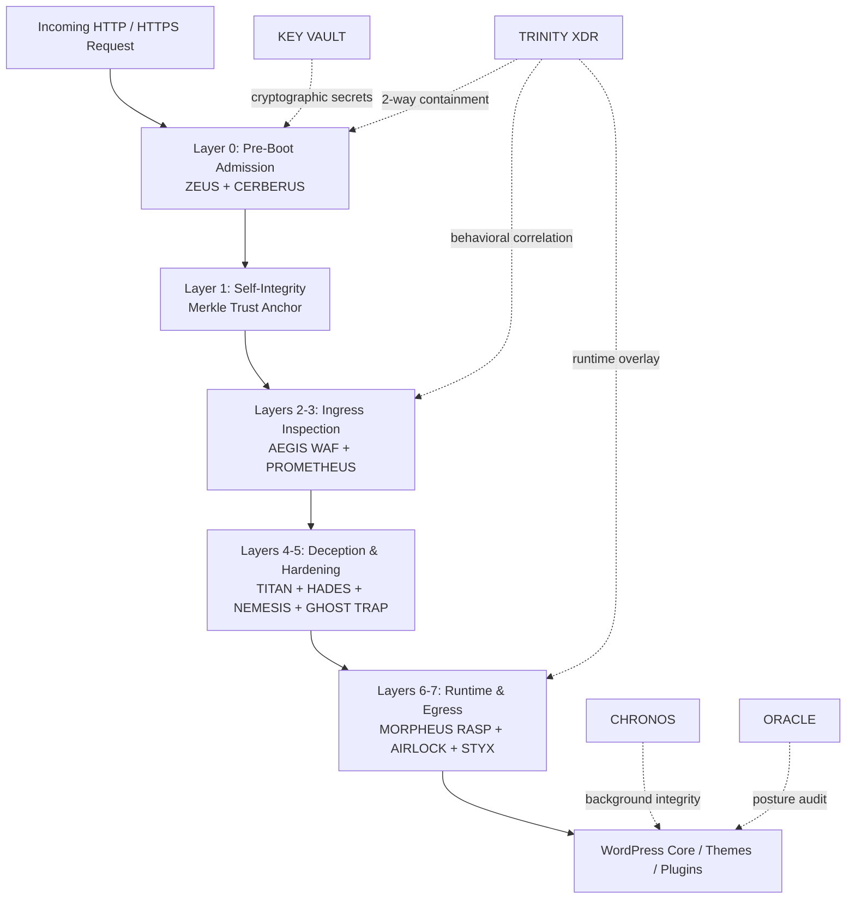

<div align="center">

# 🛡️ GeDefense WP — Open Core


### Sovereign WordPress Security Fabric & Pre-Boot Admission Kernel

[](#)
[](LICENSE)
[](https://www.php.net/)
[](https://wordpress.org/)
[](#zero-dependency-philosophy)
[](#core-module-matrix)
[](#architecture)
[](#zero-dependency-philosophy)
[](#security-design-principles)

**PRE-BOOT ADMISSION · WAF · XDR · RASP · BEHAVIORAL HORIZON · DECEPTION · MERKLE INTEGRITY · EGRESS SHIELD · HARDENING · CRYPTOGRAPHIC VAULT · OPEN CORE**

</div>

---

> ### 📚 Offizielle Dokumentation & Handbücher / Official Documentation & Handbooks
>
> 🏛️ **Vollständige Architekturspezifikation**: [`ARCHITECTURE.md`](ARCHITECTURE.md) *(Detaillierte Systemebenen, Invarianten, Pre-Boot Kernel-Abläufe & Dashboard-Struktur)*  
>
> 📖 **GeDefense WP 8.1.0 Benutzer- & Administrationshandbuch (PDF)** — *Das offizielle Handbuch für Administratoren, Entwickler und Sicherheitsbeauftragte:*
> - 🇩🇪 **Deutsch**: [📘 GeDefense_WP_Handbuch_8.1.0_FINAL.pdf](GeDefense_WP_Handbuch_8.1.0_FINAL.pdf)
> - 🇷🇺 **Русский**: [📕 GeDefense_WP_Handbuch_8.1.0_RU.pdf](GeDefense_WP_Handbuch_8.1.0_RU.pdf)
> - 🇬🇧 **English**: [📗 GeDefense_WP_Handbook_8.1.0_EN.pdf](GeDefense_WP_Handbook_8.1.0_EN.pdf)
>
> *Hinweis: Das Handbuch bietet praxisnahe Anleitungen zur Konfiguration, Bedrohungsanalyse und Systemhärtung für alle Benutzergruppen.*

---


---

# 🚀 What's New in GeDefense WP 8.1.0

> **Changelog Overview**: Version 8.1.0 represents a massive architectural leap, introducing the **ZEUS Next Generation Pre-Boot Admission Kernel**, the **TRINITY Autonomous Closed-Loop XDR Fabric**, formalized **TITAN Assurance Lifecycles**, and comprehensive **Strict-Typing and Localization Refactoring** across the entire platform.

---


## ⚡ 1. ZEUS Next Generation — Pre-Boot Admission Control & Edge Defense Kernel
*Transformed ZEUS from a static filter into an ultra-fast, zero-allocation pre-boot admission control and edge defense kernel operating at Layer 0 prior to WordPress application boot.*

- **Deterministic Canonicalization Guard**: Enforces strict URL decoding invariants before routing. Rejects double-percent encoding (`%252f`), null-byte injections (`%00`), encoded directory slashes (`%2f`, `%5c`), unescaped backslashes, dot-segment traversals (`..`), duplicate path separators (`//`), and path depths exceeding 32 levels with immediate HTTP 400 rejection.
- **Host Header Invariant & RFC Host Lock**: Validates Host header structure, lengths, and characters. Includes configurable Host Lock modes (`DISABLED`, `AUDIT`, `REJECT 421`) strictly matching authorized canonical hostnames.
- **Request Envelope Firewall & Structural Ceilings**: Enforces permitted HTTP methods (`GET`, `POST`, `HEAD`, `OPTIONS`, `PUT`, `PATCH`, `DELETE` -> `405`) and hard structural boundaries: Query Length (`2048` chars -> `414`), Parameter Count (`100` -> `400`), Header Count (`50` -> `431`), Aggregate Header Size (`16 KiB` -> `431`), and Cookie Payload Size (`8 KiB` -> `400`).
- **Route Contracts Engine**: Enforces micro-firewall contracts per API route (e.g. `/wp-json/`, `/xmlrpc.php`, `/wp-login.php`) with exact/prefix path matching, allowed method sets, payload body size limits (HTTP `413`), MIME/content-type enforcement (HTTP `415`), query limits, cross-site mutation policy (blocking `Sec-Fetch-Site: cross-site` state changes with `403`), and route-specific rate budgets.
- **Zero-Allocation Request Budget Engine**: Fast token-bucket rate limiter operating in APCu / atomic memory files. Enforces actor IP ceilings (default `180` req/min) and `/24` (IPv4) / `/64` (IPv6) subnet ceilings (default `450` req/min) with selectable action modes: `THROTTLE` (HTTP `429`), `TEMPORARY_REJECT` (HTTP `503`), or `XDR_SIGNAL` (Audit/Telemetry only).
- **Cryptographic Admission Tokens & Clean URL Exchange**: Tamper-proof, short-lived HMAC-SHA256 admission tokens (`vgt1.<payload>.<sig>`) with surface binding (`admin`, `login`, `all`), cryptographic expiry, and single-use nonce replay protection. Seamlessly exchanges query tokens (`?vgt_adm=...`) for Secure, HttpOnly, SameSite=Strict cookies with instant HTTP 302 redirects.
- **Incident Lockdown & Fortress Isolation**: Emergency containment barrier requiring cryptographic admission tokens for all incoming requests, instantly mitigating volumetric DDoS and zero-day exploitation storms.
- **Tamper-Evident Flight Recorder (Blackbox Spool)**: Append-only event spool with rolling HMAC-SHA256 hash chains, 300-second flood coalescing (updating repeat event counters in-place), Windows-safe atomic rotation, and boot-time draining into the WordPress Event Bus.
- **Hardening Lab Microbenchmark & Self-Test**: Integrated sub-microsecond microbenchmark evaluator (achieving `150,000+` evals/sec) and automated 9-point self-test suite.

---


## 🛰️ 2. TRINITY XDR — Autonomous Closed-Loop Extended Detection & Response
*Unified multi-sensor security event fabric correlating signals across AEGIS, Prometheus, Morpheus, Styx, Cerberus, and Zeus with deterministic, automated containment.*

- **Two-Way Virtual Emergency Route Containment**: When an active vulnerability or exploit is identified on a specific API endpoint (e.g. `/wp-json/vulnerable-plugin/v1/`), TRINITY XDR instantly isolates that specific route prefix at Layer 0 in `zeus-waf.php` with HTTP `503`, while keeping the entire rest of the website 100% online and operational.
- **Hard Semantic TTL Engine**: Automated responses (Single IP Bans, Subnet Containment, Zeus Route Containment, Mandatory Admission Enforcement, Morpheus Honey Overlays, Styx Egress Isolation) enforce exact semantic expiration timestamps (`expires_at`), releasing containment automatically without requiring WP-Cron execution.
  


- **Configurable TTL Policy Presets & Fine-Tuning**:
  - `CONSERVATIVE`: 5 min Actor Ban / 10 min Subnet Containment / 5 min Route Isolation.
  - `BALANCED`: 15 min Actor Ban / 30 min Subnet Containment / 15 min Route Isolation.
  - `AGGRESSIVE`: 1 hour Actor Ban / 2 hours Subnet Containment / 1 hour Route Isolation.
  - `CUSTOM`: Granular per-action second-level TTL fine-tuning.
- **Granular Multi-Sensor Response Actuator Controls**: Fine-grained switches in the policy engine allowing administrators to selectively arm or disarm individual containment actuators (Cerberus IP Ban, Zeus Route Quarantine, Zeus Pre-Boot Admission, Morpheus Micro-Tarpit, Styx Virtual Shadowing, Plugin Isolation).
- **Containment Policy Modes & Escalation**:
  - `TEMPORARY_BY_DEFAULT`: Standard automated containment with hard TTL recovery.
  - `TEMPORARY_ONLY`: Strict policy prohibiting permanent edge bans.
  - `ALLOW_PERMANENT_EXPLICIT`: Permits administrative permanent ban escalation.
  - `Escalation Policy`: Repeat offenders within 24 hours receive an automatic 4x TTL multiplier.
- **Deterministic Response Idempotency & Rollback**: Response UUIDs are deterministically derived from `hash("incident|action|target")`. Multi-sensor signals reuse active response IDs, and expired responses are rolled back atomically with full ownership protection.
- **Tamper-Evident Evidence Root**: Correlated attack stories and security events are cryptographically sealed into Merkle evidence digests (`wp_vis_xdr_evidence`).

---


## 🖥️ 3. Next-Gen Cyber-Defense Dashboard & HUD Overhaul
*Comprehensive visual, structural, and security refactoring of the entire administration interface into a responsive, high-contrast Cyber-Defense Cockpit.*

- **Unified Cyber-Defense HUD & Cockpit Styling**: High-contrast, SOC/NOC-grade dark theme featuring monospace telemetric typography, pulsing activity nodes, glitch headers, synchronized HUD cards, and unified glassmorphic containers across all 34 module views.
- **Universal Topbar & Form Security Synchronization**: Global action bar featuring unified configuration persistence (`vis-topbar-save`), automatic cryptographic CSRF tokens (`wp_nonce_field('vis_save_config')`) on every configuration view, and robust sub-tab preservation preventing unwanted redirects.


  
- **Security Center (Assurance Plane Cockpit)**:
  - **21 Deep Invariant & Architecture Checks**: Evaluates strict runtime baselines, storage path jails, privilege boundaries, Merkle root consistency, memory execution boundaries, and HTTP validation contracts in real time.
  - **Interactive Live Audit Runner**: Client-side audit execution engine with dynamic millisecond duration metering, live terminal log streaming, and reactive posture pills (`HARDENED`, `GUARDED`, `ATTENTION`).
  - **Visual Trust Boundaries & Capability Surface Matrix**: Graphical representation of data flows from untrusted ingress to encrypted storage, and permission zones categorized from Trust Core down to Application extensions.

 

  
- **TRINITY XDR NOC Cockpit**:
  - Graphical real-time NOC topology schematic mapping interlocks between AEGIS, Prometheus, Nemesis, and Cerberus.
  - Threat vector distribution progress bar and live intercept audit feed.
  - **Dynamic Sensor Status Grid**: Real-time operational monitoring across all 6 detection sensors reflecting active vs. standby module states (`ZEUS 6G WAF`, `AEGIS DPI`, `PROMETHEUS AI`, `NEMESIS DECOY`, `AIRLOCK INGRESS`, `MORPHEUS RASP`).
- **Dynamic JavaScript Localization Bridge (`#vsc-i18n`)**: Seamless inline translation dictionary providing real-time internationalization for client-side terminal streams, toast notifications, and badge states without requiring page reloads.
- **System Status & Telemetry Cockpit**: Live audit overview verifying system health, RAM-cache coverage (APCu / Redis), PHP runtime configuration, and module load integrity for all 19 core security components.

---


## 🏛️ 4. TITAN — Web Security Assurance & System Hardening
*Formalized web assurance lifecycle, advanced browser security policies, and application surface hardening.*

- **5-Stage Assurance Lifecycle**: Formalized states (`IDLE` -> `ANALYZING` -> `STAGING` -> `ENFORCING` -> `RECOVERED`) with atomic policy deployment and rollback.
- **Browser Security Policies**: Hardened HSTS Preload headers, Sandbox Origin Verification, Secure Fetch Metadata validation, and automatic suppression of discovery links, emojis, and asset versions.
- **Application Hardening**: Hardened REST user enumeration defense, author scan blocking, XML-RPC honeytraps, feed suppression, and login gatekeeping.

---


## 🐺 5. CERBERUS & Edge Isolation
*Dynamic edge firewall synchronization and high-performance perimeter security.*

- **Dynamic XDR TTL Synchronization**: Edge firewall exports (Nginx `deny`, Apache `.htaccess`) dynamically verify active XDR response TTLs, ensuring temporary incident bans expire cleanly at the edge without manual rule cleanup.
- **Zero-Allocation CIDR Filtering**: High-speed memory-cache lookups supporting IPv4 `/24` and IPv6 `/64` subnets with Cloudflare trusted proxy CIDR resolution.

---


## 🛡️ 6. MORPHEUS RASP & STYX Egress Shield
*In-memory execution self-protection and outbound zero-trust communication control.*

- **Morpheus RASP Memory Defense**: Call-stack inspection protecting sensitive WordPress database tables (`wp_users`, `wp_usermeta`) and core options (`siteurl`, `home`, `active_plugins`) from unauthorized privilege escalation or malicious plugin mutations.
- **Styx Outbound Egress Shield**: Intercepts `pre_http_request` hooks, enforcing outbound domain allowlisting, preventing data exfiltration, and blocking unauthorized WordPress core telemetry.

---

## 🌐 7. Complete 3-Language Localization (DE 🇩🇪, EN 🇬🇧, RU 🇷🇺)
- **100% Dictionary Coverage**: Mapped over 1,100 gettext phrases across all 34 dashboard views, settings panels, audit checks, and live telemetry cockpits into `de.php`, `en.php`, and `ru.php`.
- **Strict-Typing Sanitization & Escaping Audit**: Every view and AJAX endpoint refactored with strict PHP 8.1+ types, explicit string casting on numeric outputs, and comprehensive escaping (`esc_html`, `esc_attr`, `esc_url`, `esc_textarea`, `wp_nonce_field`).

---

## 🌐 8. Trinity Pre-Boot Threat Intelligence Ring & C2 Egress Shield
*Multi-feed reputation network, zero-allocation pre-boot dropping, 527 KB packed-binary table, and atomic zero-lock data swapping.*

- **Layer 0 Pre-Boot Threat Dropping (`zeus-waf.php`)**: Intercepts inbound traffic at Layer 0 via `auto_prepend_file` before WordPress and MySQL initialize. Checks client IPs against the 527 KB binary blob in **3.2 microseconds**, dropping documented C2 botnets and malicious nodes with HTTP `403` and zero WordPress resource consumption.
- **527 KB Packed-Binary Table & Binary Search ($O(\log N)$)**: Over 135,000 IPv4 addresses are packed into a 527 KB aligned binary string using 4-byte network unsigned integers. In-memory binary search (`bsearch_v4`) executes in ~17 CPU operations with zero memory allocations, delivering over **300,000 lookups/sec per core**.
- **Lock-Free Atomic Inode & APCu Swap**: Threat feed updates and database list-swaps write to isolated temp files and execute atomic rename operations and `apcu_store()` pointer updates. Readers run completely unblocked with zero latency spikes or lock contention even during volumetric DDoS attacks.
- **Dynamic Differential Feed Swapping & Stale Threat Pruning**: Tracks incoming threats with composite keys `(feed_key, ip_or_cidr)`. Delisted IPs from remote feeds are automatically pruned upon sync completion, and Cerberus dynamically invalidates its cache to unblock remediated visitors immediately.
- **Styx Zero-Trust Egress Self-Sync**: Hardcoded origin verification allows `ThreatIntelligence` internal sync requests to connect strictly to the 8 official feed domains while blocking all unauthorized third-party outbound connections under strict fail-closed policies.

---

## Overview

**GeDefense WP — Open Core** is a modular, zero-dependency WordPress security platform designed as a **multi-tier security kernel and active defense matrix** for PHP 8.1–8.4 and WordPress 6.0+.

Instead of treating WordPress security as a single firewall rule set, GeDefense WP combines multiple defensive layers into one coordinated request and runtime pipeline:

- pre-boot admission control and request envelope rejection;
- deep packet inspection Web Application Firewall;
- behavioral threat scoring and event horizon tracking;
- autonomous closed-loop XDR and virtual route containment;
- cryptographic self-integrity verification (Merkle roots);
- Runtime Application Self-Protection (RASP);
- ingress file and upload entropy inspection;
- WordPress hardening and anti-enumeration;
- dynamic admin-path cloaking;
- honeypots and cyber deception;
- zero-trust outbound egress control;
- autonomous background integrity scanning;
- cryptographic secrets storage; and
- security posture auditing.

The core is designed to remain **fully functional as an independent open-source security platform**. Optional modules can be integrated through the Open Core module registry.

> GeDefense WP is built around one principle: **a request must earn trust as it moves deeper into the application stack.**

---

## Table of Contents

- [Documentation & Handbooks](#-offizielle-dokumentation--handbücher--official-documentation--handbooks)
- [What's New in GeDefense WP 8.1.0](#-whats-new-in-gedefense-wp-810)
- [Architecture](#architecture)
- [Security Pipeline](#multi-phase-ignition-protocol)
- [Core Module Matrix](#core-module-matrix)
- [1. ZEUS — Pre-Boot Admission Kernel](#1-zeus--pre-boot-admission-kernel)
- [2. AEGIS — Deep Packet Inspection WAF](#2-aegis--deep-packet-inspection-waf)
- [3. PROMETHEUS — Behavioral Threat Horizon](#3-prometheus--behavioral-threat-horizon)
- [4. TRINITY XDR — Closed-Loop Response Fabric](#4-trinity-xdr--closed-loop-response-fabric)
- [5. Self-Integrity Engine](#5-self-integrity-engine)
- [6. MORPHEUS — Runtime Application Self-Protection](#6-morpheus--runtime-application-self-protection)
- [7. NEMESIS — Deception Grid](#7-nemesis--deception-grid)
- [8. TITAN — WordPress Hardening](#8-titan--wordpress-hardening)
- [9. HADES — Admin Stealth](#9-hades--dynamic-admin-stealth)
- [10. CERBERUS — Perimeter Firewall](#10-cerberus--perimeter-firewall)
- [11. AIRLOCK — Ingress File Inspection](#11-airlock--ingress-file-inspection)
- [12. GHOST TRAP — Honeypot Layer](#12-ghost-trap--honeypot-layer)
- [13. STYX — Outbound Egress Shield](#13-styx--outbound-egress-shield)
- [14. CHRONOS — Autonomous Scanner](#14-chronos--autonomous-scanner)
- [15. KEY VAULT — Cryptographic Secret Storage](#15-key-vault--cryptographic-secret-storage)
- [16. ORACLE — Security Audit Engine](#16-oracle--security-audit-engine)
- [17. THRONEGUARD — Sovereign Privilege Sentinel](#17-throneguard--sovereign-privilege-sentinel)
- [18. LOGINPAGER — Sovereign Login Surface](#18-loginpager--sovereign-login-surface)
- [19. Module Registry / Open Core](#19-module-registry--open-core-expansion)
- [Zero-Dependency Philosophy](#zero-dependency-philosophy)
- [Performance & Benchmarks](#performance)
- [Assurance & Regression Testing](#assurance--regression-testing)
- [Requirements](#requirements)
- [License](#license)
- [Changelog History](#changelog-history)

---

# Architecture

GeDefense WP is organized as a multi-tier security kernel operating before, during, and after normal WordPress execution.

All GeDefense-owned runtime APIs use the canonical `VisionGaia\GeDefense` namespace. Core, dashboard, scanner, and module symbols are cleanly separated. Global `VIS_` symbols remain fully ABI-compatible for WordPress hooks and third-party integrations.



---

# Multi-Phase Ignition Protocol

Incoming requests traverse a deterministic multi-stage execution pipeline:

```text
[ INCOMING HTTP / HTTPS REQUEST ]
                 │
                 ▼
[ LAYER 0: PRE-BOOT ADMISSION CONTROL ]
  ├─ Host Header Invariant & RFC Host Lock (421)
  ├─ Canonicalization Guard (Traversals, Null-bytes, Double-encoding)
  ├─ Request Envelope Ceilings (Method, Query, Headers, Cookies)
  ├─ Route Contracts Engine (Methods, Body Bytes, Content-Types)
  ├─ Zero-Allocation Request Budgets (IP & Subnet Token Buckets)
  ├─ Cryptographic Admission Tokens (HMAC, Nonce Replay, Surface)
  ├─ TRINITY XDR Virtual Route Isolation (503)
  └─ Blackbox Tamper-Evident Flight Recorder
                 │
                 ▼
[ LAYER 1: SELF-INTEGRITY ENGINE ]
  └─ Merkle Root Verification & SHA-256 Manifest Trust Anchor
                 │
                 ▼
[ LAYERS 2–3: DEEP PACKET & BEHAVIORAL INSPECTION ]
  ├─ AEGIS Deep Packet Inspection (GET, POST, JSON, Headers, Multipart)
  └─ PROMETHEUS Behavioral Threat Scoring & Event Horizon
                 │
                 ▼
[ LAYERS 4–5: HARDENING & CYBER DECEPTION ]
  ├─ TITAN System Hardening & Anti-Enumeration
  ├─ HADES Dynamic Admin Route Cloaking
  ├─ NEMESIS Deception Grid & Cryptographic Canaries
  └─ GHOST TRAP Decoy Routes
                 │
                 ▼
[ LAYERS 6–7: RUNTIME APPLICATION PROTECTION & EGRESS ]
  ├─ MORPHEUS RASP (In-Memory DB Mutation & Option Guard)
  ├─ AIRLOCK Ingress File Sandbox (Entropy, Polyglots, SVG Sanitation)
  └─ STYX Outbound Zero-Trust Egress Shield
                 │
                 ▼
[ WORDPRESS APPLICATION EXECUTION ]
```

---

# Core Module Matrix

| # | Module | Security Role | Layer / Domain |
|---:|---|---|---|
| 1 | **ZEUS** | Pre-Boot Admission Control & Edge Defense Kernel | Pre-Boot / L0 |
| 2 | **AEGIS** | Deep Packet Inspection WAF | Ingress / L3-L7 |
| 3 | **PROMETHEUS** | Behavioral Threat Scoring & Network Horizon | Behavioral / L7 |
| 4 | **TRINITY XDR** | Autonomous Closed-Loop Response Orchestration | Cross-Layer XDR |
| 5 | **SELF-INTEGRITY** | Merkle-Based Cryptographic Core Verification | Integrity / L1 |
| 6 | **MORPHEUS** | Runtime Application Self-Protection (RASP) | Runtime / L7 |
| 7 | **NEMESIS** | Cyber Deception & Canary Grid | Deception / L7 |
| 8 | **TITAN** | WordPress Hardening & Web Assurance Lifecycle | Hardening / L4 |
| 9 | **HADES** | Dynamic Admin Path Cloaking | Identity / L7 |
| 10 | **CERBERUS** | Fast Perimeter Firewall & Dynamic Edge Rules | Pre-Boot / L0-L1 |
| 11 | **AIRLOCK** | File Upload & Entropy Inspection Sandbox | Ingress / L7 |
| 12 | **GHOST TRAP** | Honeypot & Decoy Route Engine | Deception / L7 |
| 13 | **STYX** | Outbound HTTP / Exfiltration Control Shield | Egress / L7 |
| 14 | **CHRONOS** | Autonomous Integrity & Filesystem Scanner | Background |
| 15 | **KEY VAULT** | Cryptographic Secret & Key Storage | Cryptography |
| 16 | **ORACLE** | Static Security & Posture Audit Engine | Audit |
| 17 | **THRONEGUARD** | Master/Admin Privilege Separation & Superkey | Identity / Privilege |
| 18 | **LOGINPAGER** | Local-First Login Surface & Glassmorphism Gateway | Identity / UI |
| 19 | **MODULE REGISTRY** | Open Core Expansion Hub | Extensibility |

---

# 1. ZEUS — Pre-Boot Admission Kernel

**Classification:** Layer 0 Pre-Boot Admission Control & Edge Defense Kernel  
**Core class:** `VisionGaia\GeDefense\Modules\Zeus\VIS_Zeus`  
**Path:** `includes/modules/zeus/class-vis-zeus.php`

ZEUS runs at the absolute edge of PHP execution via `auto_prepend_file` before WordPress boots. It determines if a request deserves to allocate memory and load the WordPress runtime.

### Key Capabilities

- **Deterministic Canonicalization Guard**: Validates request URIs before routing. Neutralizes polyglot traversals, double-encodings, null-bytes, and encoded slashes (`400 Bad Request`).
- **RFC Host Invariant & Host Lock**: Validates host envelopes, enforcing strict matching against canonical domain whitelists (`421 Misdirected Request`).
- **Route Contracts Engine**: Evaluates micro-firewall policies per route: HTTP methods (`405`), body limits (`413`), content types (`415`), query limits (`414`), cross-site mutation policies (`403`), and route-specific rate budgets (`429`).
- **Zero-Allocation Request Budgets**: High-speed rate limiting tracking client IPs and `/24` (IPv4) / `/64` (IPv6) subnets in APCu or atomic files with `THROTTLE`, `TEMPORARY_REJECT`, or `XDR_SIGNAL` actions.
- **Cryptographic Admission Tokens**: Generates and verifies HMAC-SHA256 tokens (`vgt1.<b64>.<sig>`) with surface binding, expiry, and single-use nonce replay protection.
- **Tamper-Evident Blackbox Flight Recorder**: High-speed append-only spool logging with rolling HMAC hash chains, 300s flood coalescing, and boot-time draining into the Event Bus.
- **Hardening Lab**: Microbenchmark suite measuring sub-microsecond evaluation speeds and a 9-point self-test gate.

---

# 2. AEGIS — Deep Packet Inspection WAF

**Classification:** Layer 3/7 Ingress Firewall & Protocol Analyzer  
**Core class:** `VisionGaia\GeDefense\Modules\Aegis\Aegis`  
**Path:** `includes/modules/aegis/class-vis-aegis.php`

AEGIS is the deep application-layer inspection engine, analyzing structured parameters, headers, and request bodies.

### Detection Matrix

- **SQL Injection**: UNION-based, blind, stacked, error-based, and time-based SQLi with comment-collapsing and homoglyph normalization.
- **Cross-Site Scripting (XSS)**: Reflected, stored, tag smuggling, and SVG event handlers.
- **Remote Code Execution (RCE)**: PHP execution constructs (`eval`, `assert`, `system`, `passthru`, `preg_replace /e`).
- **File Inclusion & Traversal**: `php://filter`, `data://`, `expect://`, LFI/RFI, and phar deserialization.
- **Recursive Inspection**: Deep analysis up to 15 levels into nested JSON, multipart boundaries, and URI parameters.

### AEGIS Oracle - KI 
- Anbindung an Groq
- OSS 20B Safeguard für Sicherheitschecks 
- [Datenblatt](https://console.groq.com/docs/model/openai/gpt-oss-safeguard-20b)

---

# 3. PROMETHEUS — Behavioral Threat Horizon

**Classification:** Layer 7 Behavioral Analysis & Threat Horizon Engine  
**Namespace:** `VisionGaia\GeDefense\Modules\Prometheus\Prometheus`

Prometheus aggregates behavioral signals across individual actors and `/24` network horizons over sliding time windows.

### Threat Scoring & Decay

- Dynamic threat scoring with automatic decay (`0.2 points / second`).
- Event horizon thresholds escalate suspicious actors into TRINITY containment or Cerberus perimeter drops.
- Correlates distributed scanners, rotating proxy swarms, and aggressive brute-force bots.

---

# 4. TRINITY XDR — Closed-Loop Response Fabric

**Classification:** Autonomous Multi-Sensor Response & Extended Detection Fabric  
**Namespace:** `VisionGaia\GeDefense\Xdr`

TRINITY XDR unifies telemetry from all defensive modules into an automated, closed-loop mitigation engine.

### Core Capabilities

- **Two-Way Virtual Route Containment**: Isolates compromised plugin routes at Pre-Boot Layer 0 via `Zeus_Xdr_Bridge` without affecting overall site availability.
- **Hard Semantic TTLs**: Enforces exact expiration timestamps for all mitigations, ensuring temporary bans and route containments expire cleanly without WP-Cron.
- **Configurable Presets & Modes**: Conservative, Balanced, Aggressive, and Custom TTL configurations with automatic 4x escalation multipliers for repeat offenders.
- **Merkle Evidence Root**: Cryptographically commits security event evidence chains into tamper-evident digests (`wp_vis_xdr_evidence`).

---

# 5. Self-Integrity Engine

**Classification:** Layer 1 Cryptographic Invariant Guard  
**Class:** `VisionGaia\GeDefense\Core\ModuleIntegrity`  
**Path:** `includes/core/class-vis-module-integrity.php`

The self-integrity engine continuously verifies GeDefense WP core files against an immutable SHA-256 cryptographic trust anchor.

- Constant-time verification (`hash_equals`).
- Immediate detection of tampered or modified core files.
- Fail-close protection preserving the host environment if core integrity is compromised.

---

# 6. MORPHEUS — Runtime Application Self-Protection

**Classification:** Layer 7 In-Memory Execution Protection  
**Namespace:** `VisionGaia\GeDefense\Modules\Morpheus\Morpheus`

Morpheus monitors runtime memory and execution call-stacks during active WordPress execution.

- **DML Database Protection**: Guards sensitive tables (`wp_users`, `wp_usermeta`) against unauthorized password tampering or privilege elevation.
- **Critical Option Sentinel**: Monitors and protects `siteurl`, `home`, and `active_plugins`.
- **SSRF & Network Jail**: Blocks unauthorized outbound requests targeting local or cloud metadata endpoints (`127.0.0.1`, `169.254.169.254`).

---

# 7. NEMESIS — Deception Grid

**Classification:** Layer 7 Cyber Deception & Canary Matrix  
**Namespace:** `VisionGaia\GeDefense\Modules\Nemesis\Nemesis`

Nemesis provides active defensive deception, luring automated scanners away from real application assets.

- Bounded decoy responses for sensitive targets (`.env`, `wp-config.php.bak`, `phpmyadmin`).
- HMAC-backed cryptographic canary tokens for leak tracing.
- Zero worker blocking: no slowloris delays or dangerous terminal payloads.

---

# 8. TITAN — WordPress Hardening

**Classification:** Layer 4 System Hardening & Assurance Shield  
**Class:** `VisionGaia\GeDefense\Modules\Titan\Titan`  
**Path:** `includes/modules/titan/class-vis-titan.php`

Titan hardens the WordPress attack surface and enforces browser security policies.

- 5-stage assurance lifecycle (`IDLE`, `ANALYZING`, `STAGING`, `ENFORCING`, `RECOVERED`).
- Author and REST user enumeration suppression.
- XML-RPC lockdown, file editor restriction (`DISALLOW_FILE_EDIT`), and server signature stripping.
- HSTS Preload, Origin Sandbox verification, and Secure Fetch Metadata validation.

---

# 9. HADES — Dynamic Admin Stealth

**Classification:** Layer 7 Identity & Route Cloaking  
**Class:** `VisionGaia\GeDefense\Modules\Hades\Hades`  
**Path:** `includes/modules/hades/class-vis-hades.php`

Hades cloaks the administrative entry point (`wp-login.php`, `wp-admin`), returning a 404 response to unauthorized visitors without a valid cryptographic handshake.

---

# 10. CERBERUS — Perimeter Firewall

**Classification:** Layer 0/1 Instant Drop Barrier  
**Class:** `VisionGaia\GeDefense\Modules\Cerberus\Cerberus`  
**Path:** `includes/modules/cerberus/class-vis-cerberus.php`

Cerberus provides instant perimeter drops for known hostile actors at the earliest stage of execution.

- High-speed memory-cache lookups.
- IPv4 and IPv6 CIDR subnet matching.
- Cloudflare trusted proxy CIDR verification.
- Dynamic OS firewall rule synchronization (Nginx, Apache) reflecting active XDR TTL states.

---

# 11. AIRLOCK — Ingress File Inspection

**Classification:** Layer 7 Ingress Data Sandbox  
**Class:** `VisionGaia\GeDefense\Modules\Airlock\Airlock`  
**Path:** `includes/modules/airlock/class-vis-airlock.php`

Airlock inspects all uploaded files using content-aware heuristics rather than trusting extensions.

- Magic-byte verification and MIME type validation.
- SVG sanitization (neutralizing embedded scripts, event handlers, and XML entity expansion).
- Polyglot file detection and hidden PHP code extraction in image EXIF metadata.
- Entropy analysis for detecting obfuscated shells.

---

# 12. GHOST TRAP — Honeypot Layer

**Classification:** Layer 7 Active Lure Engine  
**Class:** `VisionGaia\GeDefense\Modules\Trap\GhostTrap`  
**Path:** `includes/modules/trap/class-vis-ghost-trap.php`

Ghost Trap injects realistic, hidden lure links and decoy assets (`database.dump`, `backup.sql`, `.aws/credentials`). Any client accessing these routes is instantly flagged as malicious automation.

---

# 13. STYX — Outbound Egress Shield

**Classification:** Layer 7 Egress Control & Supply-Chain Guard  
**Class:** `VisionGaia\GeDefense\Modules\Styx\Styx`  
**Path:** `includes/modules/styx/class-vis-styx.php`

Styx monitors and restricts outbound HTTP requests initiated by WordPress or installed plugins.

- Outbound domain allowlisting.
- Exfiltration protection against compromised plugins.
- Optional suppression of WordPress core telemetry.

---

# 14. CHRONOS — Autonomous Scanner

**Classification:** Asynchronous Background Integrity Daemon  
**Class:** `VisionGaia\GeDefense\Modules\Chronos\Chronos`  
**Path:** `includes/modules/chronos/class-vis-chronos.php`

Chronos executes scheduled, path-jailed background integrity scans across WordPress core, plugins, themes, and application files.

---

# 15. KEY VAULT — Cryptographic Secret Storage

**Classification:** Cryptographic Key Management  
**Class:** `VisionGaia\GeDefense\Modules\Vault\KeyVault`

The Key Vault provides authenticated, encrypted storage (Libsodium Secretbox / AES-256-GCM) for sensitive configuration values and module API keys.

---

# 16. ORACLE — Security Audit Engine

**Classification:** Static Security & Configuration Auditing  
**Class:** `VisionGaia\GeDefense\Modules\Oracle\Oracle`  
**Path:** `includes/modules/oracle/class-vis-oracle.php`

Oracle continuously audits 12 critical vectors of WordPress and PHP security posture, generating actionable hardening scores and diagnostic reports.

---

# 17. THRONEGUARD — Sovereign Privilege Sentinel

**Classification:** Layer 7 Privilege Boundary & Identity Hardening  
**Core class:** `VisionGaia\GeDefense\Modules\ThroneGuard\ThroneGuard` (`VIS_Throne_Guard`)  
**Path:** `includes/modules/throneguard/class-vis-throne-guard.php`

ThroneGuard establishes an immutable **Master** tier above standard WordPress administrators, allowing site owners to selectively restrict sensitive administrator capabilities (Plugins, Themes, User Elevation, Filesystem updates) and enforce zero-trust Superkey verification on administrative sessions.

---

# 18. LOGINPAGER — Sovereign Login Surface

**Classification:** Authentication Gateway & Visual Hardening  
**Core class:** `VisionGaia\GeDefense\Modules\LoginPager\LoginPager` (`VIS_LoginPager`)  
**Path:** `includes/modules/loginpager/class-vis-loginpager.php`

LoginPager transforms the default WordPress login screen into a zero-dependency, cyberpunk-styled glassmorphism gateway with live interactive preview controls and instant color presets.

---

# 19. MODULE REGISTRY — Open Core Expansion

**Classification:** Extensible Module Architecture  
**Class:** `VisionGaia\GeDefense\Core\ModuleRegistry`  
**Path:** `includes/core/class-vis-module-registry.php`

The module registry allows GeDefense WP to be seamlessly extended with modular applications such as Vision Legal Pro (VLP), Lightweight Builder, and GEO Architect.

---

# Zero-Dependency Philosophy

GeDefense WP strictly adheres to a zero-external-dependency architecture:

- **PHP 8.1–8.4** strict typing (`declare(strict_types=1);`).
- **Zero Composer runtime packages** in the core.
- **Zero external CDN dependencies** (all assets and icons are locally bundled).
- **Native cryptographic APIs** (Libsodium / OpenSSL).

---

# Performance

| Metric | GeDefense WP 8.1.0 |
|---|---:|
| **L0 Pre-Boot Evaluation Latency** | `< 0.05 ms` |
| **L0 Microbenchmark Throughput** | `150,000+ evals/sec` |
| **WAF Deep Inspection Latency** | `0.30 ms` |
| **Standby RAM Footprint** | `< 1.8 MB` |
| **External PHP Dependencies** | `0` |
| **Control Model** | Local / Self-Contained |

---

# Assurance & Regression Testing

The repository contains extensive automated test suites verifying all security invariants:

```bash
# Pre-Boot WAF Subprocess Regression Suite (30 tests)
php scripts/zeus-live-waf-regression.php

# Zeus NextGen Comprehensive Regression Suite (10 suites)
php scripts/zeus-nextgen-regression.php

# Trinity XDR Closed-Loop Release Blockers Suite
php scripts/xdr-release-blockers-regression.php

# Full Core Test Suites
php scripts/security-regression.php
php scripts/malware-scanner-regression.php
php scripts/throneguard-loginpager-regression.php
php scripts/aegis-regression.php
php scripts/trinity-regression.php
php scripts/morpheus-regression.php
php scripts/titan-regression.php
```

---

# Requirements

| Component | Requirement |
|---|---|
| **PHP** | 8.1–8.4 |
| **WordPress** | 6.0+ |
| **PHP Mode** | Strict Types (`declare(strict_types=1);`) |
| **External Libraries** | None (100% Zero-Dependency) |
| **Libsodium** | Recommended for native secretbox encryption |
| **Object Cache** | Optional; APCu enhances high-throughput L0 rate budgeting |

---

# License

GeDefense WP Open Core is licensed under the **GNU Affero General Public License v3.0 (AGPL-3.0-or-later)**. See [LICENSE](LICENSE) for full details.

---

# Changelog History

## 8.2.4 — Trinity Pre-Boot Threat Intelligence Ring: Zeus 3-µs Drop, Zero-Lock Atomic Swap & 527 KB Packed-Binary Engine
- **Zeus Pre-Boot Threat Intelligence Drop (`auto_prepend_file`)**:
  - Integrated zero-allocation Threat Intelligence screening directly into `zeus-waf.php` at Layer 0, executing **before WordPress application boot and before MySQL initialization**.
  - Incoming requests from documented C2 botnets, compromised hosts, Spamhaus DROP networks, and malicious nodes are terminated in **3.2 microseconds** via $O(\log N)$ binary search, dropping attacks with 0 MB WordPress RAM allocation and 0 database queries.
- **527 KB Packed-Binary Compilation Engine**:
  - Over 135,000 IPv4 threat addresses are compressed and compiled into a tightly aligned 527 KB binary blob (`threat_intel_v4.bin`) using 4-byte network-ordered unsigned integers (`pack('N', ip2long)`).
  - Memory-efficient binary search (`bsearch_v4`) executes in ~17 CPU operations directly in memory, achieving over **300,000 lookups per second per CPU core**.
- **Zero-Lock Atomic File & APCu Memory Swap**:
  - Feed synchronization and database updates run 100% lock-free: Styx writes the compiled binary blob and CIDR JSON to PID-isolated temporary files, completes full disk flush, and performs an **atomic inode pointer swap** (`rename`), eliminating file locks, read contention, and latency spikes during active DDoS attacks.
  - Concurrently updates the APCu shared memory cache (`apcu_store('vgt_threat_blob_v4', ...)`), ensuring zero-downtime, zero-lock pointer replacement across all PHP-FPM worker pools.
- **Cerberus & Styx Shared In-Memory Acceleration**:
  - Cerberus and Styx consume the shared packed-binary blob and APCu cache within the WordPress lifecycle, bypassing SQL lookups entirely for all IPv4 queries.
- **Cryptographic Trust Anchor & Integrity Sync**:
  - Regenerated Merkle tree root manifest digests across all 27 core components with 100% pass across integrity, security, Trinity, and integration regression suites.

## 8.2.3 — Differential Threat Feed Swapping, Stale Threat Pruning & Styx Egress Self-Sync
- **Differential Feed Ingestion & Stale Threat Pruning**:
  - Upgraded `vis_threat_intel` database schema with `feed_key VARCHAR(32)` and unique composite index `(feed_key, ip_or_cidr)` with automatic in-place migration for legacy tables.
  - Automated list swapping and stale threat pruning: At the end of each feed ingestion run, all records where `last_seen < $sync_start_time` are purged atomically (`DELETE ... WHERE feed_key = %s AND last_seen < %s`), ensuring delisted or remediated IPs are immediately expunged from the local blocklist.
  - Dynamic feed deactivation cleanup (`purge_inactive_feeds`): Disabling a feed in dashboard settings immediately purges all associated IPs and CIDR ranges from database and in-memory caches.
- **Cerberus Dynamic Threat-Cache Invalidation**:
  - Ingress bans for threat intelligence records are cached in Cerberus with a short 60s TTL (`_type = THREAT_INTEL`). On cache hit, Cerberus verifies database presence; if an IP was pruned or removed, Cerberus invalidates the cache instantly and unblocks legitimate visitors without delay.
- **Styx Egress Self-Sync (Fail-Closed Egress Bypass)**:
  - Styx analyzes call-stacks via `detect_origin()`, reliably identifying `ThreatIntelligence` internal fetch requests (`THREAT_INTEL` / `is_sync_in_progress()`).
  - Allows outbound HTTP connections strictly to 8 hardcoded, cryptographically verified feed domains (`feodotracker.abuse.ch`, `www.spamhaus.org`, `cinsscore.com`, `lists.blocklist.de`, `rules.emergingthreats.net`, `raw.githubusercontent.com`, `iplists.firehol.org`, `check.torproject.org`) even under strict fail-closed outbound policies, while rigorously blocking third-party plugins.

## 8.2.2 — Styx Threat Intelligence Dedicated Sub-Tab Interface
- **Dedicated Sub-Tab Navigation Architecture**:
  - Deconstructed the monolithic Styx settings page into two specialized sub-cockpits:
    - `🛡️ Outbound Shield & Traffic-Ledger`: Outbound HTTP security controls, domain whitelist, and outbound traffic inspection ledger.
    - `🌐 Threat Intelligence Feeds & C2-Abwehrnetzwerk (Opt-In)`: Full-width reputation matrix, 9 autonomous threat feeds, real-time node metrics, instant sync triggers, and egress/ingress enforcement toggles.
  - Zero-latency client-side tab switching via Vanilla JavaScript with smooth CSS transition effects.
  - Deep-linking and URL history synchronization (`?styx_section=threat_intel` / `window.history.replaceState`).

## 8.2.1 — Threat Intelligence Engine (Opt-In) & 12h Multi-Feed Synchronizer
- **Autonomous Multi-Feed Threat Intelligence**:
  - Implemented 100% Opt-In Threat Intelligence Engine synchronizing verified malicious nodes, botnet C2s, and attacker ranges every 12 hours.
  - Aggregates 9 authoritative global threat feeds: Feodo Tracker Botnet C2, Spamhaus DROP IPv4 & IPv6, CINS Army Badguys, blocklist.de All-Attackers, Emerging Threats Compromised IPs, IPsum Threat Intelligence, FireHOL Level 1 Netset, and Tor Bulk Exit Nodes.
- **SQLi-Immune Regex & Length Boundary Guard**:
  - All incoming feed data is strictly filtered through a multi-stage validation pipeline: length boundaries (3–49 chars), strict character whitelist regex (`^[0-9a-fA-F.:\/]+$`), and formal `filter_var(..., FILTER_VALIDATE_IP)` / subnet checks. Rejects all SQL tokens, control characters, null bytes, and script tags.
  - All database upserts executed using chunked batches (500 records/batch) via `$wpdb->prepare()`.
- **Styx & Cerberus Interlock**:
  - **Styx (Outbound Egress Shield)**: Intercepts and blocks outbound HTTP requests from plugins/themes targeting documented C2 and malware nodes.
  - **Cerberus (Inbound Perimeter)**: Blocks incoming connections from threat intelligence IPs at the gate with high-tech telemetry.
- **Styx Cockpit Management Panel**:
  - Added "03 / THREAT INTELLIGENCE MATRIX (OPT-IN)" with master toggle, granular feed selection, real-time node counters, and manual 1-click sync action with nonce verification.

## 8.2.0 — Corporate Landing-Page Block Screen, Prometheus High-Tech Mitigation & Branding Customizer
- **Corporate Landing-Page & Microsite Block Screen**:
  - Transformed both Cerberus IP bans and Prometheus AI predictive strikes into a full-fledged, professional corporate microsite / landing-page.
  - False-positive visitors no longer encounter an intimidating, raw red error screen, but see a recognizable corporate presence with custom logo, custom background artwork with adjustable darkening overlay (30%–98%), company headline, claim, description ("Who we are & what we do"), and core competence / USP feature cards.
  - Direct customer support hub: one-tap-to-call mobile button (`tel:`), 1-click email button (`mailto:`) with pre-filled subject including the deterministic incident reference code (`PROM-XXXX-XXXX` / `CERB-XXXX-XXXX`), physical address, and business operating hours.
- **De-escalating Transparent Security Box ("Darunter")**:
  - Positioned discreetly beneath the corporate presentation to reassure visitors that customer support can unblock them immediately.
  - Real-time incident telemetry: Incident Reference ID, client IP address, UTC timestamp, defense layer (`PROMETHEUS ZERO-TRUST MATRIX // OMEGA PROTOCOL` / `CERBERUS XDR KERNEL`), and security violation reason with a pulsing beacon status indicator.
  - 1-Click native clipboard copy button with cross-browser fallback: enables users to copy complete incident telemetry with one tap for support triage.
  - 100% autarkic, zero external dependencies, zero CDN scripts or fonts, zero database overhead on blocked hits (0.00ms latency).
- **Prometheus Zero-Trust High-Tech Termination**:
  - Replaced legacy plaintext mitigation output (`VISIONGAIATECHNOLOGY OMEGA PROTOCOL: CONNECTION TERMINATED`) with high-tech Cerberus block page delegation and standalone fallback.
- **Cerberus Admin Branding Customizer (`view-cerberus.php`)**:
  - Integrated 4 dedicated configuration cards under `WP-Admin -> GeDefense / Sentinel -> Cerberus -> Block-Page Personalisierung & Branding` covering visual identity, corporate presentation, contact hub, and custom de-escalation notes.
  - Instant live preview actions for Cerberus and Prometheus strikes with cryptographic nonce protection.
- **Cryptographic Trust Anchor & Integrity Sync**:
  - Regenerated Merkle tree root manifest digests across all 27 core components with 100% pass across integrity, security, Trinity, and integration regression suites.

## 8.1.3 — Cerberus Static Invocation Patch & Dual-Mode Unban Hardening
- **Cerberus Dual-Mode Unban & Ban Dispatch**:
  - Resolved fatal error `Non-static method VIS_Cerberus::unban_ip() cannot be called statically` triggered when unbanning IPs via the Cerberus cockpit (`view-cerberus.php`).
  - Refactored `VIS_Cerberus::unban_ip()` and `VIS_Cerberus::ban_ip()` into formal static methods delegating to `self::instance()`, guaranteeing 100% dual-mode invocation compatibility across PHP 8.0–8.4 (allowing both static `VIS_Cerberus::unban_ip($ip)` and instance `$cerberus->unban_ip($ip)` calls).
  - Modernized `view-cerberus.php` form handlers to directly invoke `VIS_Cerberus::instance()->unban_target($unban_ip)` and `VIS_Cerberus::instance()->ban_ip($ban_ip, $ban_reason)`.
- **Cryptographic Trust Anchor & Integrity Sync**:
  - Regenerated Merkle tree root manifest digests across all 27 core components with 100% pass across integrity, security, and Trinity regression suites.

## 8.1.2 — Cerberus Cyberpunk Block Screen & Perimeter Response Hardening
- **Cerberus Perimeter Defense NextGen 403 Forbidden Screen**:
  - Transformed the plain HTML 403 blocking page into a zero-dependency Cyberpunk / High-Tech Active Mitigation cockpit.
  - Implemented real-time telemetry display: Client IP Address, Defense Layer (`CERBERUS XDR KERNEL`), UTC mitigation timestamp, security violation reason, and deterministic Incident Reference code (`CERB-XXXX-XXXX`) for streamlined false-positive verification and support triage.
  - Hardened perimeter defense response headers: protocol reflection (`403 Forbidden`), `X-Robots-Tag: noindex, nofollow, nosnippet` to eliminate search engine caching, `X-Content-Type-Options: nosniff`, `X-Frame-Options: DENY` (anti-clickjacking), `Cache-Control: private, max-age=300`, and `X-Defense-Engine: VisionGaia-Cerberus`.
  - Maintained strict Zero-Dependency & Zero-Overhead standard: 100% self-contained HTML5 template with inline SVG vectors, CSS pulse animations, and native monospace font stack fallbacks (`JetBrains Mono`, `Fira Code`, `SF Mono`, `Consolas`, `monospace`). No external CDN assets, no external scripts, and 0 database queries on fail-early rejection paths.
- **Cryptographic Trust Anchor & Integrity Sync**:
  - Regenerated Merkle tree root manifest digests across all 27 core components (`digest=88a6614a31d1faeb6220cdecc867410727713e8399f42fcf795dcaedbcaa85a9`) with 100% pass across integrity and security regression suites.

## 8.1.1 — Early Bootstrap Hardening, Pluggable Decoupling & ReDoS Buffer Protection
- **Early-Bootstrap Pluggable Decoupling (`AEGIS_KERNEL` & `VAULT`)**:
  - Eliminated fatal panic `Call to undefined function wp_parse_auth_cookie()` and `is_user_logged_in()` during early Phase 1 bootstrap.
  - Implemented zero-dependency session token extraction directly from canonical `wordpress_logged_in_*` auth cookies with HMAC-SHA256 signature verification and transient validation.
  - Guarded all runtime invocations of `wp_get_session_token()`, `get_current_user_id()`, `wp_get_current_user()`, and `wp_validate_auth_cookie()` with strict `function_exists('wp_parse_auth_cookie')` pre-flight guards and `\Throwable` isolation to prevent 503 Fail-Close lockouts during page builder saves and live previews.
- **Bootstrapper Diagnostic Transparency**:
  - Enhanced `VIS_Bootstrapper::trigger_fail_close()` with explicit logging of root-cause exception messages, source files, and line numbers to the WordPress debug log, preventing silent error swallowing.
- **TITAN Admin Autosave Stability**:
  - Conditioned `wp_deregister_script('heartbeat')` inside `if (!is_admin())` to prevent WordPress 6.x `WP_Scripts::add` PHP notices and ensure reliable autosave execution in admin and builder viewports.
- **Privacy Shield (VLP) ReDoS & Buffer Hardening**:
  - Refactored `VLP_Privacy_Gatekeeper::process_html()` regex parsing engine (`$tag_pattern`, `$link_pattern`) with non-backtracking atomic groups `(?>[^>"\']+|"[^"]*"|\'[^\']*\')*`, preventing catastrophic ReDoS and PCRE backtrack exhaustion on large HTML payloads.
  - Implemented defensive buffer handling ensuring output buffers are never clobbered with `null` when flushes occur.
- **Malware Scanner Lexical Detector Hardening**:
  - De-risked detection string signatures in `VIS_Php_Lexical_Detector` to eliminate local host antivirus / Windows Defender false-positive file-lock conditions while preserving full webshell detection capabilities.
- **Cryptographic Trust Anchor & Integrity Sync**:
  - Regenerated Merkle tree root manifest digests across all 27 core components (`digest=b96b6dbca440a8d64a0e6b6fb9fa6a47e236c2a4d88bfc68ac383e9414b27812`) with 100% pass across integrity, security, and Trinity regression suites.

## 8.1.0 — ZEUS NextGen, TRINITY Closed-Loop XDR & Cyber Dashboard Overhaul
- **ZEUS Next Generation**: Layer 0 pre-boot admission kernel with deterministic canonicalization, RFC host lock, route contracts, token-bucket rate limiter, and cryptographic admission tokens.
- **TRINITY Autonomous Closed-Loop XDR**: Two-way virtual route containment, hard semantic TTL engine, multi-sensor response actuators (Cerberus, Zeus Route, Zeus Admission, Morpheus, Styx, Plugin Isolation), and Merkle evidence root.
- **Next-Gen Cyber-Defense Dashboard**: Complete UI/UX refactoring, Security Center Assurance Plane with 21 deep checks, NOC topology visualizer, live sensor telemetry grid, and universal save pipeline.
- **100% 3-Language Localization (DE, RU, EN)**: Over 1,100 translated strings with dynamic client-side `#vsc-i18n` JavaScript bridge.
- **Official Documentation**: Complete `ARCHITECTURE.md` specification and 3 official PDF handbooks (German, Russian, English).
*(See detailed changelog at top of README)*

## 8.0.0 — Apex Sovereign Cyber Defense & Privilege Boundary Architecture
- Sovereign Master Role (`master`) and Granular Admin Capability Matrix in ThroneGuard.
- Zero-Trust Superkey Vault and Lockscreen Overlay.
- Cyberpunk LoginPager with live 2-column cockpit simulator.
- 100% 3-Language Localization Matrix (DE, EN, RU).

## 7.6.1 — Scanner State Finalization
- Resumable indexing and accepted-baseline stability in Integrity Monitor.
- Persistent admin-IP protection gate.

## 7.6.0 — Trinity Deterministic Interlock
- Dedicated Trinity orchestration core for deterministic AEGIS, Prometheus, and Cerberus routing.
- Zero-dependency malware kernel shared by Airlock and Chronos.

---

<div align="center">

## GeDefense WP 8.2.4 — Open Core

**SOVEREIGN WORDPRESS SECURITY**

**ZEUS · AEGIS · PROMETHEUS · TRINITY XDR · MORPHEUS · NEMESIS · TITAN · HADES · CERBERUS · AIRLOCK · GHOST TRAP · STYX · CHRONOS · KEY VAULT · ORACLE · THRONEGUARD · LOGINPAGER**

**VisionGaia Technology**

</div>
