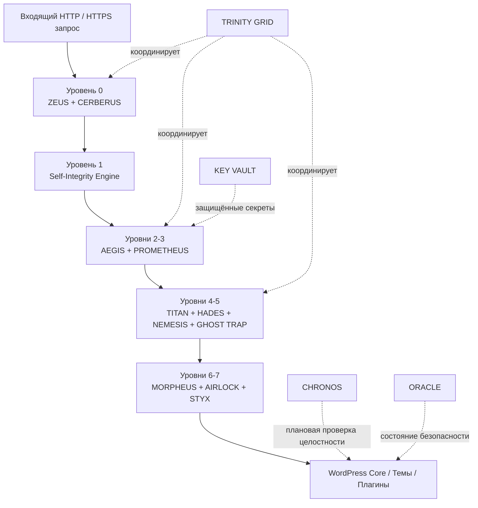

<div align="center">

# 🛡️ GeDefense WP — Open Core

### Суверенная система безопасности WordPress

[](#)
[](LICENSE)
[](https://www.php.net/)
[](https://wordpress.org/)
[](#zero-dependency-philosophy)
[](#core-module-matrix)
[](#architecture)
[](#zero-dependency-philosophy)
[](#security-design-principles)

**WAF · RASP · ПОВЕДЕНЧЕСКАЯ ЗАЩИТА · DECEPTION · ЦЕЛОСТНОСТЬ ФАЙЛОВ · КОНТРОЛЬ ИСХОДЯЩЕГО ТРАФИКА · HARDENING · КРИПТОГРАФИЧЕСКОЕ ХРАНИЛИЩЕ · OPEN CORE**

</div>

---


## Обзор

**GeDefense WP — Open Core** — это модульная платформа безопасности WordPress без внешних зависимостей, разработанная как **многоуровневое ядро безопасности и матрица активной защиты** для PHP 8.1–8.4 и WordPress 6.0+.

Вместо того чтобы рассматривать безопасность WordPress как единый набор правил межсетевого экрана, GeDefense WP объединяет несколько защитных уровней в единый согласованный конвейер обработки запросов и защиты во время выполнения:

- отклонение запросов до основной загрузки;
- инспекция Web Application Firewall;
- поведенческая оценка угроз;
- согласованная оркестрация ответных действий;
- криптографическая проверка собственной целостности;
- Runtime Application Self-Protection;
- проверка загрузок и файлов;
- hardening WordPress;
- сокрытие административных путей;
- honeypot-ловушки и deception;
- zero-trust контроль исходящего трафика;
- фоновое сканирование целостности;
- криптографическое хранение секретов;
- аудит состояния безопасности.

Ядро спроектировано так, чтобы оставаться **полностью функциональной независимой open-source платформой безопасности**. Дополнительные бизнес- и прикладные модули могут подключаться через реестр модулей Open Core.

> GeDefense WP строится вокруг одного принципа: **чем глубже запрос продвигается внутрь стека приложения, тем больше доверия он должен заслужить.**

---

## Содержание

- [Архитектура](#архитектура)
- [Конвейер безопасности](#многофазный-протокол-запуска)
- [Матрица основных модулей](#матрица-основных-модулей)
- [AEGIS — Deep Packet Inspection WAF](#1-aegis--deep-packet-inspection-waf)
- [PROMETHEUS — поведенческий горизонт угроз](#2-prometheus--поведенческий-горизонт-угроз)
- [TRINITY GRID — матрица координации защиты](#3-trinity-grid--матрица-координации-защиты)
- [Self-Integrity Engine](#4-self-integrity-engine)
- [MORPHEUS — RASP](#5-morpheus--runtime-application-self-protection)
- [NEMESIS — Deception Grid](#6-nemesis--deception-grid)
- [TITAN — Hardening WordPress](#7-titan--hardening-wordpress)
- [HADES — сокрытие административной области](#8-hades--динамическое-сокрытие-административной-области)
- [CERBERUS — периметровый межсетевой экран](#9-cerberus--периметровый-межсетевой-экран)
- [ZEUS — фильтр до загрузки WordPress](#10-zeus--фильтр-запросов-до-загрузки)
- [AIRLOCK — инспекция загрузок](#11-airlock--инспекция-входящих-файлов)
- [GHOST TRAP — honeypot-уровень](#12-ghost-trap--honeypot-уровень)
- [STYX — защита исходящего трафика](#13-styx--защита-исходящего-трафика)
- [CHRONOS — автономный сканер](#14-chronos--автономный-сканер)
- [KEY VAULT](#15-key-vault--криптографическое-хранение-секретов)
- [ORACLE — аудит безопасности](#16-oracle--движок-аудита-безопасности)
- [Реестр модулей / Open Core](#17-реестр-модулей--расширение-open-core)
- [Философия Zero Dependency](#философия-zero-dependency)
- [Режимы безопасности](#режимы-безопасности)
- [Производительность](#производительность)
- [Тестирование](#assurance--регрессионное-тестирование)
- [Принципы проектирования безопасности](#принципы-проектирования-безопасности)
- [Модель Open Core](#модель-open-core)
- [Ответственное раскрытие уязвимостей](#ответственное-раскрытие-уязвимостей)
- [Лицензия](#лицензия)
- [Журнал изменений](#журнал-изменений)

---

# Архитектура

GeDefense WP организован как многоуровневая защитная среда, работающая до, во время и после обычного выполнения WordPress.



Архитектура намеренно разделяет:

```text
Фильтрация входящего трафика
       ↓
Поведенческий анализ
       ↓
Проверка целостности
       ↓
Hardening WordPress
       ↓
Deception- и trap-уровни
       ↓
Защита во время выполнения
       ↓
Контроль исходящего трафика
       ↓
Фоновая проверка целостности и аудит
```

---

# Многофазный протокол запуска

Входящие запросы проходят через детерминированный многоэтапный конвейер:

```text
[ ВХОДЯЩИЙ HTTP / HTTPS ЗАПРОС ]
                 │
                 ▼

[ УРОВЕНЬ 0 ]
  ├─ Pre-Boot Invariant Guard
  ├─ CERBERUS L1 Ban Matrix
  └─ ZEUS 6G / Static Fast-Kill Filters
                 │
                 ▼

[ УРОВЕНЬ 1 ]
  └─ Проверка собственной целостности
     └─ Проверка Manifest / Merkle Root
                 │
                 ▼

[ УРОВНИ 2–3 ]
  ├─ AEGIS Deep Packet Inspection
  │   ├─ GET
  │   ├─ POST
  │   ├─ Headers
  │   ├─ JSON
  │   └─ Multipart Metadata
  └─ PROMETHEUS Behavioral Scoring
                 │
                 ▼

[ УРОВНИ 4–5 ]
  ├─ TITAN Hardening
  ├─ HADES Admin Stealth
  ├─ NEMESIS Deception Grid
  └─ GHOST TRAP
                 │
                 ▼

[ УРОВНИ 6–7 ]
  ├─ MORPHEUS RASP
  ├─ AIRLOCK File Inspector
  └─ STYX Outbound Egress Shield
                 │
                 ▼

[ WORDPRESS CORE / ТЕМЫ / ПЛАГИНЫ ]
                 │
                 ▼

[ CHRONOS / ORACLE / TELEMETRY / INTEGRITY ]
```

---

# Матрица основных модулей

| # | Модуль | Роль в безопасности | Уровень / домен |
|---:|---|---|---|
| 1 | **AEGIS** | Deep Packet Inspection WAF | Ingress / L3-L7 |
| 2 | **PROMETHEUS** | Поведенческая оценка угроз | Behavioral / L7 |
| 3 | **TRINITY GRID** | Координация ответных действий | Cross-Layer |
| 4 | **SELF-INTEGRITY ENGINE** | Merkle-проверка ядра | Integrity / L1 |
| 5 | **MORPHEUS** | Runtime Application Self-Protection | Runtime / L7 |
| 6 | **NEMESIS** | Cyber Deception & Canary Grid | Deception / L7 |
| 7 | **TITAN** | Hardening WordPress и Anti-Enumeration | Hardening / L4 |
| 8 | **HADES** | Динамическое сокрытие административного пути | Identity / L7 |
| 9 | **CERBERUS** | Быстрая матрица блокировок периметра | Pre-Boot / L0-L1 |
| 10 | **ZEUS** | Сверхлёгкая фильтрация до загрузки | Pre-Boot / L0 |
| 11 | **AIRLOCK** | Проверка загрузок и энтропии файлов | Ingress / L7 |
| 12 | **GHOST TRAP** | Honeypot и движок ложных маршрутов | Deception / L7 |
| 13 | **STYX** | Контроль исходящего HTTP / защита от эксфильтрации | Egress / L7 |
| 14 | **CHRONOS** | Автономный планировщик проверки целостности | Background |
| 15 | **KEY VAULT** | Зашифрованное хранение секретов | Cryptography |
| 16 | **ORACLE** | Аудит конфигурации безопасности | Audit |
| 17 | **MODULE REGISTRY** | Центр расширения Open Core | Extensibility |

---

# 1. AEGIS — Deep Packet Inspection WAF

**Классификация:** Layer 3/7 Ingress Firewall & Protocol Analyzer  
**Основной класс:** `VIS_Aegis`  
**Путь:** `includes/modules/aegis/class-vis-aegis.php`

AEGIS — основной движок инспекции запросов на уровне приложения.

### Основные механизмы

- двухфазный конвейер инспекции;
- быстрое сопоставление сигнатур до глубокой нормализации;
- сворачивание SQL-комментариев;
- нормализация null-byte;
- нормализация разрезанных кавычек и слешей;
- нормализация Unicode homoglyph;
- рекурсивная инспекция payload;
- анализ вложенного JSON;
- проверка multipart-метаданных загрузок;
- инспекция HTTP-заголовков;
- настраиваемые лимиты тела запроса;
- кэширование скомпилированных шаблонов в памяти.

### Покрытие обнаружения

AEGIS предназначен для обнаружения паттернов запросов, связанных со следующими классами атак:

```text
SQL Injection
├─ Blind
├─ Time-Based
├─ Error-Based
├─ UNION SELECT
└─ Stacked Queries

Cross-Site Scripting
├─ Reflected
├─ Stored
├─ DOM-Oriented Payloads
├─ Tag Smuggling
└─ SVG Event Handlers

Remote Code Execution
├─ eval
├─ assert
├─ system
├─ passthru
├─ preg_replace /e
└─ shell-style execution patterns

File Inclusion
├─ php://filter
├─ data://
├─ expect://
├─ LFI
├─ RFI
└─ directory traversal

Дополнительные классы
├─ PHP object injection
├─ PHAR-oriented payloads
├─ SSRF
├─ host-header poisoning
└─ ingress header smuggling
```

### Границы инспекции

Целевые значения реализации по умолчанию:

```text
Объём инспекции body: 1 MiB
Лимит инспекции заголовков: 64 KiB
Глубина рекурсивного payload: до 15 уровней
```

### Режимы работы

**Learning Mode**

- пассивная инспекция;
- телеметрия безопасности;
- без автоматической блокировки IP;
- подходит для staging-среды и построения baseline.

**Strict Mode**

- завершение запроса;
- ответ HTTP 403;
- событие угрозы передаётся в Prometheus;
- дальнейшая эскалация в Cerberus через координированную матрицу реагирования.

### Опциональный AI Oracle Bridge

AEGIS может опционально передавать ранее неизвестные payload во внешний AI-мост анализа, настроенный через защищённое хранилище ключей.

AI-путь является **дополнительным аналитическим уровнем**, а не заменой детерминированных локальных механизмов безопасности.

---

# 2. PROMETHEUS — поведенческий горизонт угроз

**Классификация:** Layer 7 Behavioral Analysis & Threat Horizon Engine  
**Namespace:** `VisionGaia\Integrity\Modules\Prometheus\VIS_Prometheus`

Prometheus оценивает поведение отдельных клиентов и сетевых диапазонов, а не рассматривает каждый запрос как полностью изолированное событие.

### Оценка угрозы

Каждый клиент может накапливать динамический score на основании наблюдаемого поведения.

Пример матрицы штрафов:

| Сигнал | Примерный вес |
|---|---:|
| Запрещённый HTTP-метод | `+30.0` |
| Null-byte / traversal anomalies | `+50.0` |
| Повторные запросы к чувствительным путям | `+25.0` |
| Burst-частота запросов | `+20.0` |
| AEGIS WAF strike | `+50.0` |

### Затухание угрозы

Затухание score по умолчанию:

```text
0.2 points / second
```

Механизм затухания позволяет временно подозрительным, но легитимным клиентам со временем вернуться к нормальному уровню риска.

### Event horizons

```text
Score 75
   ↓
Pre-Lock Telemetry Threshold

Score 100
   ↓
Cerberus Escalation Threshold
```

### Корреляция подсетей

Prometheus может коррелировать поведение в пределах `/24` сетевого горизонта для выявления паттернов, соответствующих:

- rotating proxies;
- распределённым сканерам;
- координированной bot-активности;
- burst-разведке.

### Конкурентный доступ

Атомарные стратегии блокировок и fallback через блокировки БД применяются для уменьшения race condition при высокой параллельности запросов.

---

# 3. TRINITY GRID — матрица координации защиты

**Классификация:** Cross-Layer Orchestration & Coordinated Response Grid

TRINITY GRID объединяет четыре ключевые защитные системы:

```text
           ┌─────────┐
           │  AEGIS  │
           └────┬────┘
                │
                ▼
        ┌──────────────┐
        │  PROMETHEUS  │
        └──────┬───────┘
               │
        ┌──────┴────────┐
        ▼               ▼
┌──────────┐       ┌──────────┐
│ NEMESIS  │       │ CERBERUS │
└──────────┘       └──────────┘
```

### Модель эскалации

1. AEGIS обнаруживает вредоносный синтаксис.
2. Prometheus увеличивает поведенческий threat score.
3. Повторная активность пересекает порог deception.
4. Nemesis может перевести клиента в tarpit- или decoy-процесс.
5. Устойчивая враждебная активность пересекает event horizon.
6. Cerberus выполняет периметровое отклонение.

Такой подход позволяет не превращать каждый подозрительный запрос в немедленную постоянную блокировку, но при этом быстро эскалировать защиту против устойчиво враждебного поведения.

---

# 4. Self-Integrity Engine

**Классификация:** Layer 1 Cryptographic Invariant Guard  
**Класс:** `VIS_Module_Integrity`  
**Путь:** `includes/core/class-vis-module-integrity.php`

Уровень self-integrity проверяет критические компоненты GeDefense WP относительно криптографического trust anchor.

### Основные механизмы

- SHA-256 digest манифеста;
- trust anchor `VIS_MANIFEST_DIGEST`;
- Merkle-style проверка файлов;
- проверка ключевых компонентов безопасности;
- сравнение в постоянном времени через `hash_equals`;
- немедленное обнаружение несоответствия целостности.

### Модель целостности

```text
Trusted Manifest Digest
          │
          ▼
Component Hashes
          │
          ▼
Merkle / Aggregate Verification
          │
      ┌───┴────┐
      │        │
    MATCH   MISMATCH
      │        │
      ▼        ▼
  Continue  Security Event
```

Механизм проверяет **целостность кода**, а не семантическую корректность внешних данных или сторонних систем.

---

# 5. MORPHEUS — Runtime Application Self-Protection

**Классификация:** Layer 7 In-Memory Execution Protection  
**Namespace:** `VGT\Sentinel\Modules\Morpheus\Vis_Morpheus`

Morpheus защищает критическое состояние WordPress во время выполнения.

### Видимость runtime-контекста

Morpheus может анализировать контекст call stack, чтобы определить, какой плагин или компонент инициировал чувствительную операцию.

### Защита SQL DML

Чувствительные таблицы WordPress могут быть защищены от несанкционированных паттернов изменения, включая:

```text
wp_users
wp_usermeta
```

Цель — обнаруживать или блокировать неожиданные операции, связанные с:

- изменением паролей;
- повышением привилегий;
- несанкционированными изменениями административного состояния.

### SSRF / Network Guard

Morpheus может блокировать несанкционированные исходящие запросы к локальным или чувствительным metadata-адресам, например:

```text
127.0.0.1
localhost
169.254.169.254
```

### Защищённые настройки WordPress

Критические опции могут контролироваться или защищаться, включая:

```text
siteurl
home
active_plugins
```

### Режимы

**Audit Mode**

- наблюдение за внутренним поведением плагинов;
- построение модели разрешённых операций;
- генерация телеметрии.

**Enforcement Mode**

- блокировка операций вне утверждённой матрицы безопасности.

---

# 6. NEMESIS — Deception Grid

**Классификация:** Layer 7 Counterintelligence & Deception Matrix  
**Namespace:** `VisionGaia\Integrity\Modules\Nemesis\VIS_Nemesis`

Nemesis — deception-уровень GeDefense WP.

### Decoy-цели

Примеры имитируемых ценных путей:

```text
.env
wp-config.php.bak
phpmyadmin
```

### Ограниченные deception-ответы

Подозрительные автоматизированные клиенты получают небольшие, конечные decoy-ответы без раскрытия реального состояния приложения и без удержания PHP workers в открытом состоянии.

### Криптографические canary

Canary-значения на базе HMAC-SHA256 могут внедряться в контролируемые области для последующей корреляции утечек.

### Полиморфное искажение данных

При соответствующей настройке данные, видимые scraper-клиентам, уже классифицированным как враждебная автоматизация, могут намеренно изменяться.

### Граница защитного реагирования

Nemesis ограничен защитной телеметрией, canary-механизмами, ограниченными decoy-ответами и content deception. Runtime-пути не генерируют response bombs, cookie bombs, terminal-control payload и не удерживают workers длительными задержками.

---

# 7. TITAN — Hardening WordPress

**Классификация:** Layer 4 System Hardening & Anti-Enumeration Shield  
**Класс:** `VIS_Titan`  
**Путь:** `includes/modules/titan/class-vis-titan.php`

Titan уменьшает ненужную поверхность атаки WordPress.

### Hardening-контроли

- блокировка author enumeration;
- защита от REST user enumeration;
- блокировка XML-RPC;
- блокировка редактора файлов;
- `DISALLOW_FILE_EDIT`;
- скрытие version tag WordPress;
- удаление `X-Powered-By`;
- уменьшение server fingerprint.

Примеры защищённых маршрутов:

```text
/?author=1
/wp-json/wp/v2/users
/xmlrpc.php
```

---

# 8. HADES — динамическое сокрытие административной области

**Классификация:** Layer 7 Identity & Route Cloaking  
**Класс:** `VIS_Hades`  
**Путь:** `includes/modules/hades/class-vis-hades.php`

Hades уменьшает прямую публичную экспозицию административной поверхности входа.

### Модель безопасности

```text
Public Request
      │
      ▼
Standard wp-login.php / wp-admin
      │
      ├─ Authorized Handshake → Admin Session
      │
      └─ No Handshake → 404-style response
```

### Возможности

- динамический admin access handshake;
- подавление прямого login-route;
- имитация 404 для неавторизованных запросов;
- привязка ephemeral session-cookie;
- уменьшение публичной экспозиции административных точек входа.

---

# 9. CERBERUS — периметровый межсетевой экран

**Классификация:** Layer 0/1 Instant Drop Barrier  
**Класс:** `VIS_Cerberus`  
**Путь:** `includes/modules/cerberus/class-vis-cerberus.php`

Cerberus предназначен для максимально раннего отклонения уже известных враждебных клиентов.

### Характеристики

- очень ранний приоритет загрузки;
- in-memory проверка IP там, где она доступна;
- поддержка APCu/shared-cache;
- поддержка IPv4 и IPv6 CIDR;
- Cloudflare-aware проверка client-IP;
- минимальный путь формирования ответа при отклонении.

### Цель

```text
Known Hostile Client
       │
       ▼
Memory Lookup
       │
       ▼
Immediate Reject
       │
       └── No Theme Rendering
           No Normal WordPress Page Flow
```

---

# 10. ZEUS — фильтр запросов до загрузки

**Классификация:** Layer 0 Ultra-Lightweight Request Filter  
**Класс:** `VIS_Zeus`  
**Путь:** `includes/modules/zeus/class-vis-zeus.php`

Zeus выполняет низкозатратную фильтрацию до более глубокой инспекции приложения.

### Возможности

- blacklist-правила в стиле 6G;
- фильтрация вредоносных query string;
- фильтрация плохих user-agent;
- фильтрация аномалий referrer;
- отклонение malformed URI;
- emergency recovery / bypass-механизм при ошибочной конфигурации.

---

# 11. AIRLOCK — инспекция входящих файлов

**Классификация:** Layer 7 Ingress Data Sandbox  
**Класс:** `VIS_Airlock`  
**Путь:** `includes/modules/airlock/class-vis-airlock.php`

Airlock оценивает загруженные файлы на основе содержимого, а не доверяет только расширению имени файла.

### Механизмы инспекции

- проверка magic bytes;
- MIME validation;
- санитизация SVG XML;
- удаление встроенных script/event;
- обнаружение `javascript:` payload;
- защита от XML entity expansion;
- анализ энтропии;
- обнаружение polyglot-файлов;
- выявление скрытых PHP-сигнатур в метаданных изображений.

### Примеры SVG-защиты

Airlock предназначен для отклонения или санитизации конструкций вида:

```html
<script>
onload=
javascript:
```

а также небезопасных паттернов расширения XML entity.

---

# 12. GHOST TRAP — honeypot-уровень

**Классификация:** Layer 7 Active Lure Engine  
**Класс:** `VIS_Ghost_Trap`  
**Путь:** `includes/modules/trap/class-vis-ghost-trap.php`

Ghost Trap создаёт ложные ресурсы, к которым легитимный пользователь обращаться не должен.

Примеры:

```text
backup.sql
config.php.bak
database.dump
.aws/credentials
```

Обращение к decoy-маршруту может рассматриваться как высококонфидентный признак автоматизированной разведки и эскалироваться в общую защитную матрицу.

---

# 13. STYX — защита исходящего трафика

**Классификация:** Layer 7 Egress Control & Supply-Chain Guard  
**Класс:** `VIS_Styx`

Styx контролирует исходящий HTTP-трафик WordPress.

### Основной механизм

Точка интеграции:

```text
pre_http_request
```

### Цели

- контроль исходящих адресатов;
- egress allowlisting;
- устойчивость к эксфильтрации;
- containment скомпрометированного плагина;
- опциональное ограничение WordPress core telemetry;
- сокращение неконтролируемых соединений со сторонними сервисами.

Styx особенно актуален там, где WordPress должен работать в рамках **local-first или restricted-egress policy**.

---

# 14. CHRONOS — автономный сканер

**Классификация:** Asynchronous Background Integrity Daemon  
**Класс:** `VIS_Chronos`  
**Путь:** `includes/modules/chronos/class-vis-chronos.php`

Chronos выполняет плановую проверку целостности и мониторинг файловой системы.

### Настраиваемые интервалы

Примеры интервалов:

```text
15 минут
   ↓
ежечасно
   ↓
каждые несколько часов
   ↓
ежедневно
```

### Контролируемые области

- GeDefense Core;
- WordPress Core;
- плагины;
- темы;
- выбранные прикладные пути.

### Оповещения

Шаблоны уведомлений могут включать переменные:

```text
{site_url}
{timestamp}
{details}
```

---

# 15. KEY VAULT — криптографическое хранение секретов

**Классификация:** Cryptographic Key Management  
**Класс:** `VIS_Key_Vault`

Key Vault защищает чувствительные значения конфигурации, такие как API credentials и токены модулей.

### Криптографические механизмы

Поддерживаемый дизайн включает:

- Libsodium Secretbox;
- AES-256-GCM;
- authenticated encryption;
- AAD-style привязку идентификаторов;
- защищённое хранение API-ключей.

Примеры классов секретов:

```text
AI Provider Keys
Nexus Tokens
Private Integration Secrets
Module Credentials
```

Чувствительные значения никогда не должны попадать в репозиторий.

---

# 16. ORACLE — движок аудита безопасности

**Классификация:** Static Security & Configuration Auditing  
**Класс:** `VIS_Oracle`  
**Путь:** `includes/modules/oracle/class-vis-oracle.php`

Oracle оценивает состояние безопасности WordPress и PHP по двенадцати основным направлениям.

| # | Проверка |
|---:|---|
| 1 | защита `wp-config.php` |
| 2 | недоступность `debug.log` извне |
| 3 | блокировка редактора файлов |
| 4 | энтропия WordPress salts |
| 5 | hardening префикса БД |
| 6 | проверка учётной записи `admin` по умолчанию |
| 7 | защита от enumeration пользовательских ID |
| 8 | принудительное использование HTTPS / TLS |
| 9 | экспозиция server signature |
| 10 | состояние PHP display-errors |
| 11 | защита от directory browsing |
| 12 | корректная передача authentication headers |

---

# 17. РЕЕСТР МОДУЛЕЙ — расширение Open Core

**Классификация:** Extensible Module Architecture  
**Класс:** `VIS_Module_Registry`  
**Путь:** `includes/core/class-vis-module-registry.php`

Реестр модулей предоставляет слой расширения для GeDefense WP Open Core.

Ядро остаётся полностью работоспособным само по себе, а дополнительные модули могут распространяться как подписанные или отдельно упакованные расширения.

### Планируемые / доступные модули экосистемы

#### Vision Legal Pro — VLP

Функциональность, ориентированная на приватность и compliance, включая:

- privacy controls;
- локальное зеркалирование assets;
- consent-oriented workflows;
- local-first обработку данных.

#### Lightweight Builder

Высокопроизводительная визуальная система компоновки и компонентов, предназначенная для отказа от overhead тяжёлых page builder.

#### GEO Architect

Generative Engine Optimization и инструменты семантических сущностей для AI-oriented поиска и discovery-систем.

---

# Философия Zero Dependency

GeDefense WP намеренно минимизирует количество сторонних runtime-зависимостей.

### PHP

```php
<?php

declare(strict_types=1);
```

### Цели проектирования

- PHP 8.1–8.4;
- WordPress 6.0+;
- отсутствие внешних PHP vendor-библиотек в ядре;
- отсутствие обязательной runtime-зависимости от Composer;
- оптимизированная локальная автозагрузка проекта;
- нативные API WordPress / PHP;
- Libsodium при наличии;
- отсутствие обязательного внешнего frontend CDN;
- UI assets, которые могут полностью отрисовываться локально.

### Почему это важно

Каждая сторонняя runtime-зависимость потенциально создаёт:

```text
Supply Chain Risk
Update Risk
Abandonware Risk
Transitive Dependencies
Version Conflicts
Additional Audit Surface
```

Подход zero-dependency не устраняет программные риски полностью, но намеренно сокращает количество внешне контролируемых runtime-компонентов внутри trusted computing base.

---

# Режимы безопасности

Несколько модулей GeDefense предоставляют явные режимы работы вместо принудительного использования одного универсального enforcement-профиля.

## Learning / Audit

Предназначен для первоначального развёртывания и наблюдения.

```text
Inspect
Log
Score
Baseline
Do Not Aggressively Block
```

## Enforcement / Strict

Предназначен для hardened-развёртываний.

```text
Inspect
Normalize
Detect
Score
Enforce
Escalate
```

Перед включением агрессивных policy в production администраторы должны сначала построить baseline легитимного поведения приложения.

---

# Производительность

Текущий технический профиль GeDefense WP 7.6.0 определяет следующие внутренние целевые / измеренные показатели:

| Метрика | GeDefense WP |
|---|---:|
| **L0 rejection latency** | `0.08 ms` |
| **WAF inspection time** | `0.35 ms` |
| **Standby RAM footprint** | `< 1.8 MB` |
| **External PHP dependencies** | `0` |
| **Primary architecture** | Memory-cache first |
| **Control model** | Local / on-premise |

> Показатели производительности зависят от PHP runtime, доступности cache, стека WordPress, hosting environment, формы запроса и включённых модулей безопасности. Перед использованием этих цифр для capacity planning воспроизводите benchmark в собственной среде.

---

# Assurance & регрессионное тестирование

Репозиторий включает отдельные regression- и benchmark-gates.

```bash
php scripts/security-regression.php
php scripts/aegis-regression.php
php scripts/trinity-regression.php
php scripts/morpheus-regression.php
php scripts/integrity-baseline-regression.php
php scripts/sentinel-threat-benchmark.php
```

Эти тесты предназначены для проверки:

- security invariants;
- регрессионных сценариев WAF;
- runtime-контролей Morpheus;
- integrity baselines;
- поведения обнаружения угроз;
- чувствительных к производительности путей безопасности.

Security-релиз не должен считаться проверенным только потому, что плагин успешно активируется в WordPress.

---

# Принципы проектирования безопасности

## 1. Defense in Depth

Ни один отдельный модуль не рассматривается как единственная граница безопасности.

```text
Pre-Boot
   ↓
WAF
   ↓
Behavior
   ↓
Hardening
   ↓
Runtime Protection
   ↓
Egress Control
   ↓
Integrity
```

## 2. Local First

Состояние безопасности и решения по безопасности по возможности должны оставаться локальными.

## 3. Детерминированные контроли до AI

Детерминированная логика безопасности остаётся основным enforcement-уровнем.

Опциональный AI-анализ является дополнительным.

## 4. Минимальная Trusted Computing Base

Ядро избегает ненужных runtime-зависимостей.

## 5. Явное Enforcement

Агрессивные enforcement-режимы должны включаться осознанно и предварительно проверяться.

## 6. Наблюдаемая безопасность

Защитные действия должны создавать пригодную для анализа телеметрию, а не превращаться в невидимое фоновое поведение.

## 7. Deception без зависимости от него

Honeypot и canary-механизмы дополняют традиционную защиту, а не заменяют её.

---

# Модель Open Core

GeDefense WP выпускается как платформа **Open Core**.

### Open Core означает:

- security-core доступен в исходном коде под AGPLv3;
- ядро полностью функционально само по себе;
- ядро содержит основную архитектуру безопасности;
- опциональные ecosystem-модули могут расширять бизнес- или прикладную функциональность;
- развёртывания могут оставаться локальными и полностью контролироваться оператором.

Цель — не публиковать намеренно урезанную демоверсию.

Цель — создать аудитируемую основу безопасности, которую можно расширять, не превращая базовый защитный слой в обязательный облачный сервис.

---

# Ответственное раскрытие уязвимостей

Security software следует тестировать агрессивно, однако уязвимости, затрагивающие реальных пользователей, должны раскрываться ответственно.

Пожалуйста, **не публикуйте немедленно эксплуатируемые уязвимости, действующие учётные данные, приватные ключи или чувствительные production-данные в публичном issue**.

Полезный отчёт об уязвимости должен включать:

```text
Affected Version
Affected Module
Environment
Reproduction Steps
Expected Behavior
Observed Behavior
Security Impact
Relevant Logs
Proof of Concept, where appropriate
```

Если в репозитории существует `SECURITY.md`, следуйте описанному в нём процессу disclosure.

---

# Уведомление о безопасности

GeDefense WP — защитное программное обеспечение.

Некоторые модули включают deception, honeypot и ограниченные decoy-ответы. Эти механизмы остаются локальными, конечными и защитными.

GeDefense WP не гарантирует, что установка WordPress станет неуязвимой.

Безопасность также зависит от:

- WordPress Core;
- сторонних тем и плагинов;
- PHP;
- веб-сервера;
- базы данных;
- операционной системы;
- конфигурации хостинга;
- безопасности администраторов;
- учётных данных;
- резервных копий;
- дисциплины обновлений;
- окружающей сетевой архитектуры.

---

# Требования

| Компонент | Требование |
|---|---|
| **PHP** | 8.1–8.4 |
| **WordPress** | 6.0+ |
| **PHP mode** | Strict Types |
| **External PHP libraries** | Не требуются ядром |
| **Libsodium** | Рекомендуется для нативных криптографических операций |
| **Object cache** | Опционально; APCu / совместимые cache-механизмы могут улучшить fast-path поведение |

---

# Лицензия

GeDefense WP Open Core распространяется под:

## GNU Affero General Public License v3.0

SPDX identifier:

```text
AGPL-3.0-or-later
```

Полные условия лицензии см. в:

[LICENSE](LICENSE)

Если GeDefense WP модифицируется и эксплуатируется через сеть, ознакомьтесь с требованиями AGPLv3 по доступности исходного кода, применимыми к вашему развёртыванию.

Товарные знаки третьих сторон, марки WordPress, брендинг VisionGaia Technology и отдельно распространяемые add-on-модули могут подпадать под собственные уведомления или политики.

---

# Журнал изменений

## 7.6.0 — Trinity Deterministic Interlock

- добавлено отдельное ядро оркестрации Trinity для детерминированной маршрутизации между AEGIS, Prometheus, Cerberus и Nemesis;
- зависимости Trinity инициализируются до синхронного request guard AEGIS;
- централизована логика trusted proxy и разрешения client identity через Cloudflare;
- CIDR-блокировки применяются внутри PHP-периметра, а экспорт правил в OS firewall отложен до единой плановой синхронизации;
- Prometheus отклоняет изменения состояния без полученной блокировки и использует расширенную bounded lock acquisition;
- botanical swarm correlation ограничена общей сетью до применения subnet mitigation;
- блокирующие PHP-tarpit, искусственные response bombs и пятисекундные sleep заменены ограниченными deception-ответами и телеметрией;
- добавлены server-side границы и capability enforcement для конфигурации Trinity и Prometheus;
- добавлен исполняемый regression-suite для Trinity interlock;
- выровнены release metadata и идентификаторы лицензии.

## 7.5.2 — Initial Open-Core Release

- опубликовано первое полное Open Core ядро безопасности, матрица модулей, assurance-suite и архитектурная документация.

---

# Состояние проекта

```text
Продукт:       GeDefense WP
Редакция:      Open Core
Версия:        7.6.0
Архитектура:   Multi-Tier Security Kernel
Runtime:       PHP 8.1–8.4
Платформа:     WordPress 6.0+
Лицензия:      AGPL-3.0-or-later
Модули ядра:   17
Зависимости:   Zero external PHP vendor libraries
```

---

<div align="center">

## GeDefense WP 7.6.0 — Open Core

**СУВЕРЕННАЯ БЕЗОПАСНОСТЬ WORDPRESS**

**AEGIS · PROMETHEUS · TRINITY GRID · MORPHEUS · NEMESIS · TITAN · HADES · CERBERUS · ZEUS · AIRLOCK · GHOST TRAP · STYX · CHRONOS · KEY VAULT · ORACLE**

**VisionGaia Technology**

</div>
